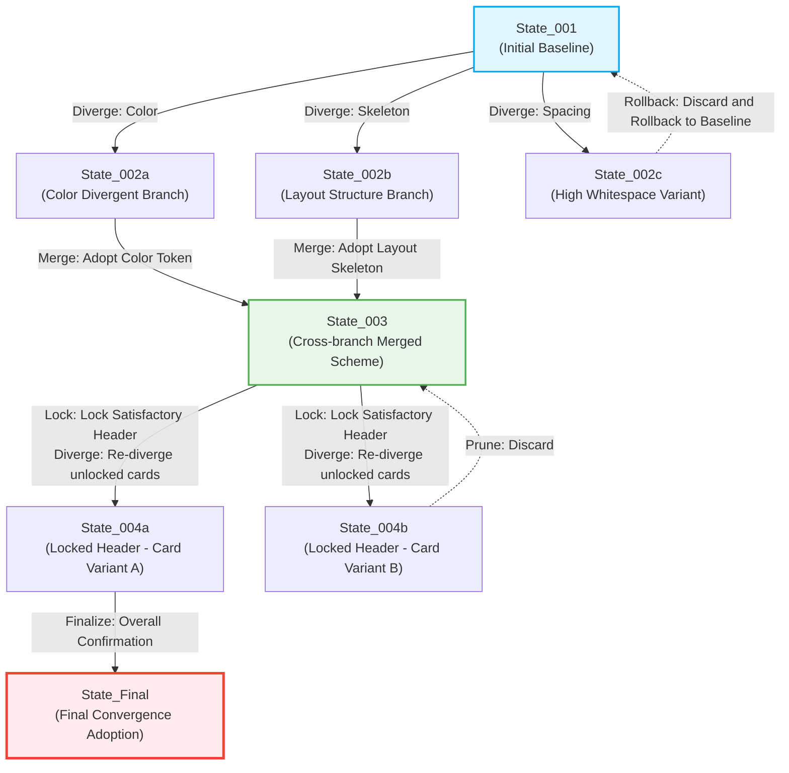
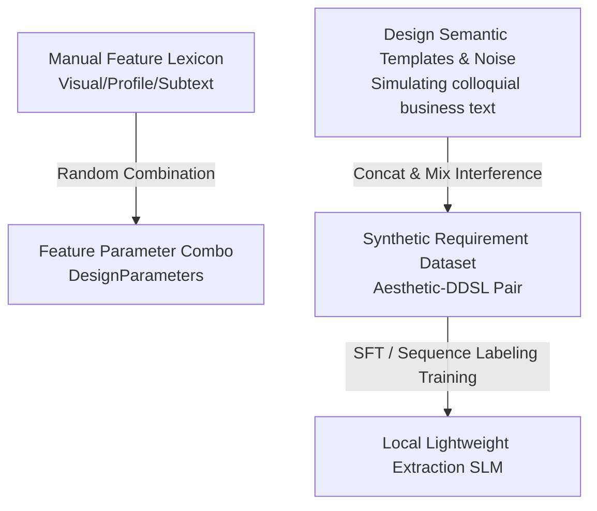

# Research on Divergent & Convergent Interactive Design Workflow

This document records the technical solution research on how to solve the pain point of "frequent alternation between Divergent Thinking and Convergent Thinking" during the interface design reasoning process within the regular design workflow of the transpilation system, and how to reduce the time and computational cost of high-frequency interactions.

---

## 1. Context & Pain Points

In traditional human-computer interaction scenarios, requirement parsing tasks are usually handed directly to general semantic understanding models, but this approach is not suitable for interface design iteration:

1. **The emergence of inspiration is divergent**: Design is not achieved overnight. For the same product requirement, designers often need to generate multiple completely different visual metaphors, layout skeletons, and color harmony schemes (i.e., generating variations / Alternatives).
2. **The anchoring of decision-making is convergent**: After evaluating multiple divergent schemes, designers need to filter out the most satisfactory parts (e.g., "I like the card layout of scheme A, but the global color scheme of scheme B"), fix them (converge), and unfold the next round of local divergence based on this.
3. **Pain points of traditional semantic large models**:
   - **Massive information redundancy**: The user's raw requirement contains a large amount of irrelevant business logic description, which has nothing to do with visual layout and Gestalt whitespace. Attempting to "understand everything" using a complex general semantic large model not only causes massive compute waste but also generates severe semantic interference.
   - **Globalized modifications (Over-divergence)**: Due to the lack of an "Anchor" mechanism, if the user tells the model "make this button more prominent," the general model might also reconstruct the overall structure, spacing, or even other copy that the user was originally satisfied with, making "local divergence, global convergence" impossible.
   - **High interaction latency (Time cost)**: Every re-request to a cloud large model incurs network latency of seconds to tens of seconds. If continuously retried in dozens of "divergence-convergence" loops, the design time cost will increase exponentially.

---

## 2. Recommended Solution: Non-linear Exploration Network Based on Design Lineage Graph

To resolve this pain point, we recommend abandoning unidirectional linear or simple single-loop workflows and abstracting the design process as a topological evolution on a **"Design Lineage Graph"**.

**Core Idea**: Actual design exploration is a non-linear state evolution network. We establish a design starting point through "local feature extraction," instantly derive multiple variant branches (Diverge) on the local Rust engine side, and allow the user or Client Agent to perform cross-branch feature fusion (Merge), local state anchoring (Lock), and non-linear historical Rollback, ultimately converging to the optimal design state.



### 2.1 Stage Responsibility Division

1. **Stage 1: Local small model extracts core features (Converging Requirement)**:
   The local extraction small model acts as a **lightweight information filter**, filtering out most irrelevant business descriptions and accurately capturing only visual descriptions, audience psychological profiles, and "design subtext" to map them into the baseline `DesignParameters`.
2. **Stage 2: Local Rust engine executes micro-divergence and incremental composition (Local Exploration)**:
   The local Rust engines (`DDSLCompositionService` and `AssetMatchingService`), without the involvement of complex semantic models, apply controlled perturbations to the baseline parameters to instantly output multiple sets of DDSL variants within 100ms.
3. **Stage 3: Interactive confirmation and locking (Convergence Decision)**:
   The designer or Client Agent evaluates multiple sets of variants, extracts satisfactory nodes, and sets them to a "Locked" state. The next round of divergent generation will automatically protect these locked areas.

---

## 3. Model Selection: Local Fine-Tuned Small Extraction Model Route

In the **Loop Engineering** scenario, we must find the optimal engineering balance among **"Inference Latency", "Structural Compliance Rate", and "Key Feature Extraction Accuracy"**. The system has determined to adopt the **"Local Fine-Tuned SLM / Token Classifier"** as the core route for the parameter extraction engine. The following is the technical argumentation and support system for this decision:

### 3.1 Core Concept: Focus on effective design information, filter business redundancy

Users' raw requirements typically contain extensive text concerning business logic, technical background, and interface details that are entirely irrelevant to visual design. Traditional LLMs trying to "understand the whole semantic" create massive latency and are susceptible to business logic interference.
In reality, the parameters used to guide Gestalt layout generation only need to capture three types of **effective design features**:
1. **Visual Description**: e.g., "high whitespace, cool colors, card grid skeleton" that directly guide layout.
2. **Audience Psychological Profile**: e.g., "Target audience is executives, needs dignity and restraint" or "For children, needs liveliness and strong affinity."
3. **Design Subtext**: e.g., "Emphasize data urgency" implies "Applying strong contrast principle."

Thus, we employ a local lightweight small model focused solely on Information Extraction of key feature words and psychological profiles, skipping redundant semantic analysis to vastly simplify task complexity.

### 3.2 Core Barrier: Structural Compliance & Low Latency

In scenarios like DDSL with multi-layered nesting and strong Schema constraints, structural integrity dictates system viability.
* **Small Model Structural Determinism**: Lightweight models (like Qwen-1.5B or dedicated sequence labeling models), after overfitting or Supervised Fine-Tuning (SFT) on DDSL data in a controlled design domain, firmly memorize the DDSL structural skeleton. Their **structural compliance rate approaches 100% absolute determinism**, forming the system's core barrier.
* **Millisecond Ultra-fast Inference**: Locally deployed small model inference takes only a dozen milliseconds, perfectly aligning with the real-time feedback needs of the high-frequency "divergence-convergence" loop.

### 3.3 Data Cold Start: Template-based Data Augmentation

Since we no longer use general LLMs, we don't need "teacher-student" distillation. For feature extraction tasks, we can perform data cold starts using local deterministic rules:



* **Lexicon and Noise Mixing**: Manually compile a lexicon containing various visual descriptions, audience profiles, and subtexts. Simultaneously, create a template library rich with redundant business interference text.
* **Synthetic Data Inflation**: Algorithmic combinations splice these words with business noise, instantly generating hundreds of thousands of "Synthetic Requirement $\rightarrow$ Design Parameter" alignment datasets locally as the cold start baseline for fine-tuning, entirely independent of external large model services.

### 3.4 Training Pipeline: Auto-Iterative Pipe via Colab CLI & Drive

To continuously improve extraction effects in the loop, we designed an automated incremental training and release pipeline using **"Colab CLI Elastic Compute + Google Drive Unified Storage"**:

* **Unified Storage Hub (Google Drive)**:
  Locally, daily interactions collect satisfactory "divergent-convergent" Traces. These are automatically synced to Google Drive via `rclone`.
* **Colab CLI Automated Fine-tuning**:
  Once a Colab instance starts, it mounts Google Drive, reads recent interactive Traces, rapidly completes incremental fine-tuning on a cloud GPU, and writes the updated weights back to Drive.
* **Seamless Update Deployment**:
  When the local DSP Server detects changed weight files in Drive, it automatically pulls and performs an in-memory hot swap, achieving incremental evolution of model weights.

---

## 4. Technical Approaches

### 4.1 Partial Lock & Incremental Composition

To achieve "local tweaking without breaking the whole," we expand `ddsl.schema.json` to introduce **Lock and Evolution Metadata** within the `layout_tree` nodes:

```json
{
  "layout_tree": {
    "type": "object",
    "properties": {
      "id": { "type": "string" },
      "type": { "type": "string" },
      "_lock_state": {
        "type": "object",
        "properties": {
          "locked": { "type": "boolean", "description": "Whether to lock structure and properties" },
          "lock_scope": { 
            "type": "string", 
            "enum": ["all", "style_only", "structure_only"],
            "description": "Lock scope: all, style(Tokens) only, or structure(Layout) only" 
          }
        }
      }
    }
  }
}
```

* **Incremental Composition Mechanism**:
  1. During iteration, when a node is deemed satisfactory, its `_lock_state.locked` is set to `true`.
  2. For a new "divergence," `DDSLCompositionService` receives the partially locked DDSL.
  3. The algorithm **forcibly retains the topology and attributes of locked nodes** during tree restructuring, exclusively applying asset retrieval and Gestalt ratio calculations to unlocked branches.

### 4.2 Parametric Inspiration Variation

To escape multi-frequency network calls to external semantic models, we utilize the algebraic properties of `DesignParameters` locally for "inspiration divergence":

* **Local Variation Strategies**:
  The application orchestrator introduces a `DivergenceGenerator` for fine-tuning based on user direction:
  - **Color Divergence**: Derives combinations within preset aesthetic steps (e.g., Hue $\Delta H \pm 15^\circ$) centered on baseline HSL.
  - **Spacing Density Divergence**: Derives schemes from Airy to Compact by adjusting `spacing.base` and scales.
  - **Gestalt Focus Divergence**: Dynamically adjusts Gestalt calculation weights (e.g., boosting proximity or figure-ground).
* **Parallel & Second-level Generation**:
  `DDSLCompositionService` utilizes Rust concurrency to generate multiple Schema-compliant DDSL variants instantly, eliminating LLM network response latency.

### 4.3 Design Lineage Graph and Branch Management

Introduce the `DesignLineage` aggregate root to manage the non-linear process:

* **Design Node (DesignState)**: Contains `state_id`, current `DDSL`, generative `DesignParameters`, and `parent_id`.
* **Lineage Operations**:
  - **Branching**: Each divergence yields multiple variants recorded as child states.
  - **Backtracking**: One-click rollback to any historical state.
  - **Crossbreeding (Merging)**: Support `merge_states(state_a, state_b, merge_rules)`. E.g., combining branch A's color tokens with branch B's layout tree to render a novel branch C.

---

## 5. DSP Server Protocol Extension

To support low-latency interaction for Client Agents and editor plugins, we suggest extending the DSP Server (JSON-RPC over Stdio) with:

1. **`design/diverge` (Request Divergent Variants)**
2. **`design/converge` (Select and Converge)**
3. **`design/merge` (Cross-branch Merge)**

### 5.1 Runtime Interaction Sequence Diagram

When a user requests "re-tweak the cards," the system executes a millisecond-level loop without invoking LLMs:
1. User requests divergence targeting `card_group_01`.
2. Rust engine applies Gestalt rules to generate variants exclusively for the unlocked region, returning 3 DDSL variants in under 100ms.
3. User confirms a variant, locks its structure, and converges it back to the main lineage branch.

---

## 6. Roadmap

1. **Phase 1: Metadata Contract Definition (DDSL Schema & Entities)**
2. **Phase 2: Local Incremental Composition Algorithm (Rust Engine Refactoring)**
3. **Phase 3: DSP Server Protocol Implementation & Integration**
