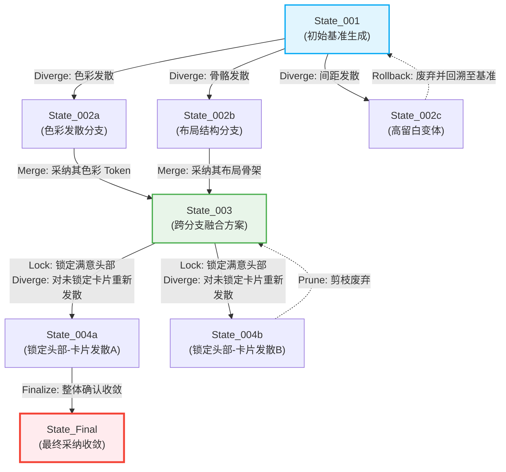
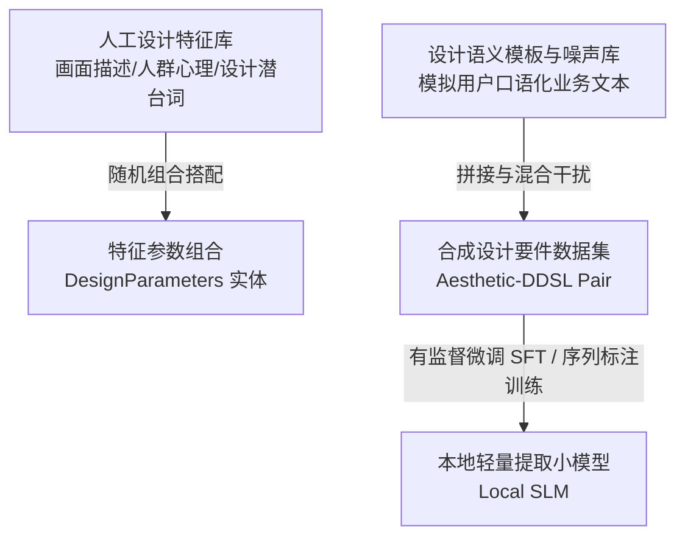
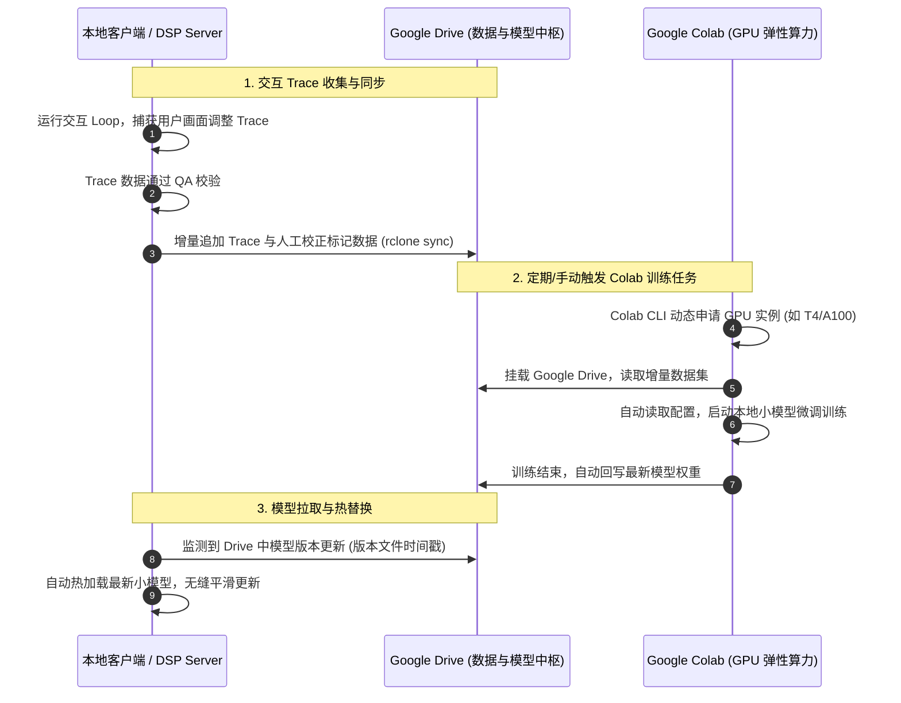
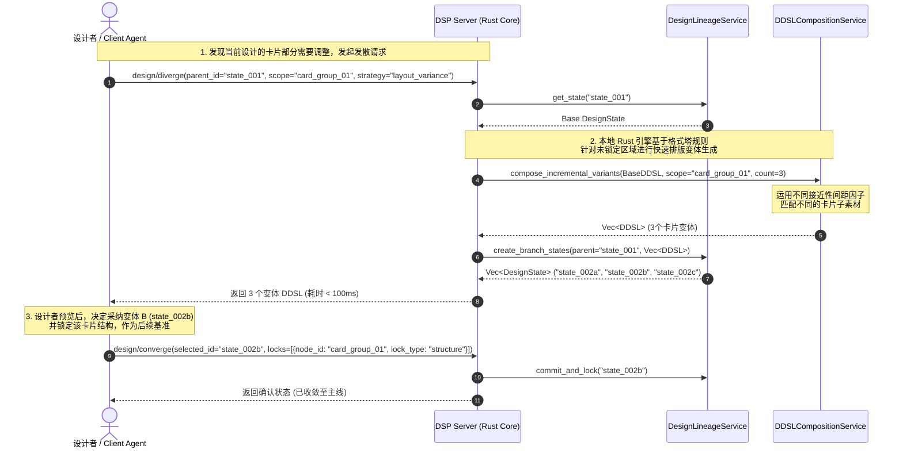

---

> [!NOTE]
> この記事の本文は現在翻訳中です。以下は原文です。


# "发散-收敛" 交互式设计工作流课题研究 (Research on Divergent & Convergent Interactive Design Workflow)

本篇文档记录了关于在画面设计转译系统常规设计工作流中，如何解决界面设计推理过程中“发散探索（Divergent Thinking）与决策收敛（Convergent Thinking）频繁交替”的痛点，以及如何降低高频交互中的时间与算力成本的技术方案研究。


## 1. 背景与痛点分析 (Context & Pain Points)

在传统人机交互场景下，要件解析任务通常直接交给通用语义理解模型，但这种方式并不适合界面设计的迭代：

1. **灵感的涌现是发散的**：设计不是一蹴而就的。针对同一个产品要件，设计者往往需要产生多种截然不同的视觉隐喻、排版骨骼、色彩调和方案（即产生变体 / Alternatives）。
2. **决策的锚定是收敛的**：在评估多种发散的方案后，设计者需要筛选出其中最满意的局部（例如：“我喜欢 A 方案的卡片排版，但喜欢 B 方案的全局配色”），将其固定（收敛），并在该基础上展开下一轮的局部发散。
3. **传统语义大模型的痛点**：
   - **大而无当的信息冗余**：用户提供的原始要件中包含大量无关的业务逻辑描述，这部分信息与视觉布局、格式塔留白完全无关。使用复杂的通用语义大模型试图去“理解一切”，不仅带来巨大的算力浪费，还会产生大量的语义干扰。
   - **改动全局化（发散过度）**：由于缺乏“锚定（Anchor）”机制，如果对模型说“让这个按钮更显眼一点”，通用模型可能会把原本用户很满意的整体结构、间距甚至其他文案也一并重构，无法做到“局部发散，全局收敛”。
   - **交互延迟高（时间成本）**：每一次重新请求云端大模型都会带来数秒甚至数十秒的网络延迟，若在“发散-收敛”的数十次循环中不断重试，设计的时间成本将呈指数级上升。

---

## 2. 推荐解决方案：基于设计谱系图 (Design Lineage Graph) 的非线性探索网络

为了解决这一痛点，我们建议摒弃单向线性或简单单环的工作流，将设计过程抽象为**“设计谱系图 (Design Lineage Graph)”**的拓扑上演进。

**核心思想**：实际的设计探索是一个非线性的状态演进网络。我们通过“本地特征提取”确立设计起点，在本地 Rust 引擎侧瞬时衍生出多个变体分支（Diverge），允许用户或 Client Agent 进行跨分支的特征融合（Merge）、局部状态锚定（Lock）以及非线性的历史回溯（Rollback），最终收敛至最佳设计状态。



### 2.1 阶段职责划分

1. **第一阶段：本地小模型提取核心特征（收敛要件）**：
   本地提取小模型作为**轻量级信息过滤器**，过滤掉大部分无关的业务描述，只精确捕获画面视觉描述、特定人群（如客户或用户）的心理侧写，以及要件中的“设计潜台词”，将其映射为基准 `DesignParameters`。
2. **第二阶段：本地 Rust 引擎执行微观发散与增量合成（局部探索）**：
   本地 Rust 引擎（`DDSLCompositionService` 与 `AssetMatchingService`）在没有复杂语义模型参与的情况下，对基准参数进行受控扰动，在 100ms 内瞬间输出多套 DDSL 变体。
3. **第三阶段：交互式确认与锁定（收敛决策）**：
   设计者或 Client Agent 评估多套变体，提取满意的节点并置为“锁定”状态。下一轮发散生成将自动保护这些已锁定区域。

---

## 3. 模型选型决策：本地轻量信息提取小模型路线 (Model Selection: Local Fine-Tuned Small Extraction Model Route)

在 **Loop Engineering (环路工程)** 场景下，我们必须在**“推理延迟”、“结构合规率”与“关键特征抽取精度”**之间寻找最佳工程平衡。系统确定采用**“本地自训练/微调提取小模型 (Local Fine-Tuned SLM / Token Classifier)”**作为参数提取引擎的核心路线。以下是该决策的技术论证及支撑体系：

### 3.1 核心理念：聚焦有效设计信息，过滤业务描述冗余

用户的原始要件通常包含大量关于业务逻辑、技术背景、接口细节等与画面设计完全无关的文本。传统的通用大模型试图去“理解整篇语义”，不仅产生巨大延迟，还容易受到业务逻辑文本的干扰。
实际上，用于指导格式塔布局生成的参数只需要捕捉要件中的三类**有效设计特征**：
1. **画面（视觉）描述**：例如“大留白、冷色系、卡片式网格骨骼”等直接指导排版的词汇。
2. **人群心理侧写**：例如“目标用户是高管客户，需要端庄、克制”或“面向儿童，需要活泼与强亲和力”。
3. **要件的设计潜台词**：例如“强调某数据的紧急性”暗含“需要对该区域组件应用强对比原则”。

因此，我们采用本地轻量小模型，专注于进行关键特征词与心理侧写的实体抽取（Information Extraction），直接跳过冗余的语义分析，极大简化了任务复杂度。

### 3.2 核心壁垒：结构合规性与超低延迟 (Structural Compliance & Low Latency)

在 DDSL 这种具有多层嵌套和强 Schema 约束的场景下，输出结构的完整性直接决定了系统能否正常运转。
* **小模型的结构确定性**：轻量级小模型（如 Qwen-1.5B 或专用的序列标注/实体抽取模型）在经过受控设计领域的 DDSL 数据过拟合或有监督微调（SFT）后，能够牢固记住 DDSL 的结构骨架，其**结构合规率能达到近乎 100% 的绝对确定性**，构成系统的核心壁垒。
* **毫秒级的超快推理**：本地部署的小模型推理仅需十几毫秒，完美契合高频“发散-收敛”循环的实时反馈要求。

### 3.3 数据冷启动：基于设计特征模板的合成数据膨胀 (Template-based Data Augmentation)

由于不再使用通用大模型，我们不需要进行“教师-学生”的大模型蒸馏。针对特征抽取任务，我们可以通过本地确定性规则进行数据冷启动：



* **特征库与噪声混合**：人工编写一组包含各类画面描述（如“极简”、“高密度”）、人群侧写（如“极客用户”、“老年人”）及潜台词的关键词典。同时编写一套包含丰富业务冗余干扰文本的模板库。
* **合成数据膨胀**：通过算法将这些词汇与业务冗余干扰文本随机组合拼接，在本地秒级膨胀生成数十万条“合成要件 $\rightarrow$ 设计参数对”对齐数据集，作为微调的冷启动基准，完全不依赖外部大模型的生成服务。

### 3.4 训练管线：基于 Colab CLI 与 Google Drive 的自动化迭代 (Auto-Iterative Pipe via Colab CLI & Drive)

为了在 Loop 环路中持续改进提取效果，我们设计了**“Colab CLI 弹性算力 + Google Drive 统一存储”**的自动化增量训练发布管道：



* **统一存储中枢 (Google Drive)**：
  本地在日常交互中收集用户满意的“发散-收敛”Trace（记录用户输入的画面要求与最终锁定 DDSL 所对应的参数特征）。通过 `rclone` 自动同步至 Google Drive 中。
* **Colab CLI 自动化微调**：
  Colab 实例启动后，挂载 Google Drive 读取这些最新的真实交互 Trace，在云端 GPU 上快速跑完增量微调，将更新后的提取模型权重写回 Drive。
* **无缝更新部署**：
  本地的 DSP Server 检测到 Drive 内权重文件发生变更时，自动拉取并执行内存热替换，实现模型权重的增量演进。

---

## 4. 具体技术实现方案 (Technical Approaches)

### 4.1 局部锁定与增量合成 (Partial Lock & Incremental Composition)

为了实现“局部微调而不破坏整体”，我们建议扩展 `ddsl.schema.json`，在 `layout_tree` 节点中引入**锁定与演进元数据**：

```json
{
  "layout_tree": {
    "type": "object",
    "properties": {
      "id": { "type": "string" },
      "type": { "type": "string" },
      "_lock_state": {
        "type": "object",
        "properties": {
          "locked": { "type": "boolean", "description": "是否锁定该节点的结构与属性" },
          "lock_scope": { 
            "type": "string", 
            "enum": ["all", "style_only", "structure_only"],
            "description": "锁定范围：全部锁定、仅锁定样式(Tokens)、仅锁定结构(Layout)" 
          }
        }
      }
    }
  }
}
```

* **增量合成机制**：
  1. 在迭代过程中，当用户或 Client Agent 确认某个“接近性分组 (Proximity Group)”或卡片组件符合预期时，系统将该节点的 `_lock_state.locked` 设为 `true`。
  2. 当发起新一轮“发散”时，`DDSLCompositionService` 接收已部分锁定的 DDSL 作为输入。
  3. 算法在重组布局树时，**强制保留锁定节点的拓扑位置 and 属性**，仅对未锁定的分支重新进行素材检索和格式塔比例计算。

### 4.2 参数级灵感微调与变体生成 (Parametric Inspiration Variation)

为了摆脱对外部语义模型的多频段网络调用，我们在本地利用 `DesignParameters` 的代数特性进行“灵感发散”：

* **本地变体生成策略 (Variation Strategies)**：
  在应用层编排器引入本地扰动生成器（`DivergenceGenerator`），根据用户指定的发散方向进行微调：
  - **色彩发散（Color Divergence）**：以基准 HSL 配色为中心，在预设美学步长内（例如色相 $\Delta H \pm 15^\circ$，饱和度 $\Delta S \pm 10\%$）派生出多组搭配。
  - **间距发散（Spacing Density Divergence）**：通过调整 `spacing.base` 和尺度阶梯，派生出极简开阔（Airy）到紧凑高密（Compact）的方案。
  - **格式塔侧重发散（Gestalt Focus Divergence）**：动态调整格式塔原则的计算权重（如增强“接近性 `proximity`”或突出“主体-背景 `figure-ground`”对比）。
* **并行与秒级生成**：
  由 `DDSLCompositionService` 利用 Rust 的并发能力进行多路径计算，在一瞬间生成多套符合 Schema 的 DDSL 变体，彻底消除等待大模型网络响应带来的延迟。

### 4.3 设计状态图谱与分支管理 (Design Lineage Graph)

在领域模型层引入 `DesignLineage`（设计谱系）聚合根，以管理非线性的探索过程：

* **设计节点 (DesignState)**：包含 `state_id`、当前 `DDSL`、用于生成它的 `DesignParameters` 以及父节点 ID (`parent_id`)。
* **谱系操作**：
  - **分支 (Branching)**：每一次发散产生多套变体，分别记录为当前节点下的子状态节点。
  - **回溯 (Backtracking)**：随时支持一键回退到任何历史状态节点，提供完整的设计历史悔药。
  - **交叉融合 (Merging / Crossbreeding)**：支持合并操作 `merge_states(state_a, state_b, merge_rules)`。例如，提取 A 分支的配色 Tokens，配合 B 分支的布局拓扑树，通过本地引擎渲染出全新的 C 分支。

---

## 5. DSP Server 协议扩展 (DSP Server Protocol Extension)

为支持 Client Agent 和编辑器插件的低延迟交互，我们建议对 DSP Server（基于 JSON-RPC over Stdio）扩展以下协议方法：

1. **`design/diverge` (请求发散变体)**
   - **输入**：`{ parent_state_id: String, scope_node_id: Option<String>, variation_strategy: DivergenceStrategy }`
   - **输出**：`Vec<DesignState>` (返回多套在指定范围或策略下发散的变体)
2. **`design/converge` (选择并收敛)**
   - **输入**：`{ selected_state_id: String, locks: Vec<NodeLockInstruction> }`
   - **输出**：更新后的 `DesignState` (锁定特定节点，合并至当前主线分支)
3. **`design/merge` (跨分支合并)**
   - **输入**：`{ state_id_1: String, state_id_2: String, override_layout_source: String }`
   - **输出**：融合后的新 `DesignState`

### 5.1 运行时交互时序图

以下展示了当用户提出“重新微调卡片”时，系统如何在不调用大模型的前提下，进行毫秒级“发散-收敛”循环的时序：



---

## 6. 落地步骤建议 (Roadmap)

1. **第一阶段：元数据契约定义 (DDSL Schema & Entities)**
   - 修改 `ddsl.schema.json`，补充锁定机制和设计溯源字段。
   - 在 Rust 的领域模型层 (`DomainModel`) 实现 `DesignState` 和 `DesignLineage` 结构体。
2. **第二阶段：本地增量合成算法实现 (Rust Engine Refactoring)**
   - 重构 `DDSLCompositionService`。使其在合成 DDSL 树时，能够优先识别并保护已被标记为 `locked` 的子树。
   - 实现本地的参数扰动生成器，测试在 HSL 配色和网格间距上的规则级发散算法，确保变体在数学上符合格式塔美学。
3. **第三阶段：DSP Server 协议实现与联调 (Integration)**
   - 在接入层（DSP Server）注册上述新增的 JSON-RPC 方法。
   - 编写 CLI 对接命令（如 `gestalt-resonator diverge` / `gestalt-resonator merge`）以支持命令行环境的增量调用。
