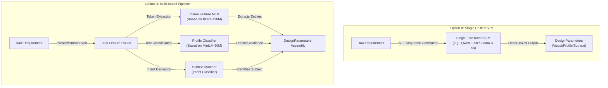

# Model Strategy Research: Single vs. Multi-Model Pipeline

This document records the technical argument comparing the **"Single Unified Model (Single SLM)"** approach with the **"Multi-Model Pipeline"** approach for the first stage of the regular workflow—"effective design feature extraction"—under the confirmed route of using "local self-trained/fine-tuned small models."

---

## 1. Background and Scheme Definition

The primary task of the regular design workflow is to parse the inputted colloquial requirements (mixed with heavy business redundancies) and accurately extract three types of flat control parameters:
1.  **Visual Description** (`visual_description`);
2.  **Target Audience Profile** (`user_profile`);
3.  **Design Subtext** (`design_subtext`).

To achieve this, the system established two optional self-trained architectural models:



---

## 2. System Model Resource Inventory

To clarify the resource boundaries and training costs of the entire Loop Engineering bidirectional workflow when executed locally, we quantified all self-trained/fine-tuned models (including feature extraction, dynamic physics, sound synthesis, DDSL validation, and asset compilation):

| Model Name | Core Function | Neural Network Structure | Input Data | Output Data | Est. Latency | Recommended Samples | Est. Train Time (T4) |
| :--- | :--- | :--- | :--- | :--- | :--- | :--- | :--- |
| **Visual NER Extractor** | Extracts visual layout keywords (e.g., spacing, whitespace). | `BERT-Base` + `CRF Layer`<br/>(~110M params) | Raw Req Text<br/>(Max 512 Tokens) | BIO tagged sequence | **~15ms**<br/>(CPU) | **1,500 ~ 2,000** | **~15 mins** |
| **Psychological Classifier** | Analyzes audience mindset and matching interface tone. | `MiniLM` + `Classifier Head`<br/>(~22M params) | Profile segments<br/>(Max 256 Tokens) | Preset profile probability vector | **~5ms**<br/>(CPU) | **1,000 ~ 1,500** | **~8 mins** |
| **Design Intent Classifier** | Captures implicit design subtext mapped to Gestalt principles. | `TextCNN` / `MiniLM`<br/>(~15M-22M params) | Action/Modifier snippets<br/>(Max 128 Tokens) | Activation distribution of Gestalt principles | **~3ms**<br/>(CPU) | **1,200 ~ 1,800** | **~10 mins** |
| **Motion Synthesizer** | Predicts physical damping coefficients and curves for UI motion. | Micro `MLP`<br/>(~20K params) | Profile label & movement distance | Easing parameters (damping $k$, Bezier) | **~1ms**<br/>(CPU) | **500 ~ 800** | **~3 mins** |
| **Local Sound Synthesizer** | Predicts FM synthesis parameters for UI acoustic feedback. | Mapping `MLP`<br/>(~50K params) | Profile label & urgency level | FM parameters (base freq $f_0$, ADSR envelope) | **~1ms**<br/>(CPU) | **800 ~ 1,200** | **~5 mins** |
| **Gestalt Aesthetic Critic** | Evaluates geometric and physical compliance of assembled DDSL. | `GNN` or `MLP`<br/>(~500K params) | Adjacency matrix and attributes of DDSL | Static compliance score (0.0~1.0) | **~2ms**<br/>(CPU) | **3,000 ~ 5,000** | **~5 mins** |
| **Local Diffusion Gen** | Offline generation of themed illustrations matching global HSL. | `SDXL-Tiny` / `LCM-Lora`<br/>(~300M-600M) | Prompt with HSL color and style | Physical `.png` asset | **~1.5s ~ 3s**<br/>(GPU) | **Zero-Shot** | **~30 mins** (LoRA) |

### 2.1 Core Conclusions from the Inventory
*   **Extreme Offline Execution Capability**: Aside from the image generation model, the total inference latency of all other self-trained models combined is controlled around the **30ms level**, with total memory consumption **under 300MB**. They can be embedded and run directly in any standard client CPU environment.
*   **Low-Cost Automated Iteration Loop**: Under the Colab CLI elastic architecture, a single incremental model iteration takes only **10~20 minutes**, vastly reducing long-term maintenance and data costs.

---

## 3. Technical Route Argumentation and Recommendation

Considering the core demands of **"Loop Engineering high-frequency real-time divergence-convergence"**, **"cold-start template inflation"**, and **"ultimate full-local offline experience"**, we recommend adopting **"Option B: Multi-Model Pipeline"** as the final route.

### 3.1 Technical Basis for the Decision

1.  **Extremely Compressed Cold Start Resistance**: In Option B, the profile classifier is essentially a multi-class classifier, and the visual feature extractor is a sequence labeling (NER) model. Data required for these subtasks can be synthesized simply via "visual feature lexicons + audience profile templates." Compared to Option A requiring SLM adaptation to strict JSON strings, Option B lowers the data scale requirement by an order of magnitude.
2.  **Interaction Latency is the Lifeline**: When users click "Diverge/Tweak", waiting 200~500ms for a large or autoregressive model (Option A) creates a noticeable lag. Option B extracts parameters in just 10ms, leaving the rest of the time for the local Rust engine's Gestalt geometric calculations, ensuring an "action-response" ultimate experience.
3.  **Optimal Trade-off for Dev & Maintenance**: The multi-model approach allows system assembly like building blocks. To optimize "visual description" extraction, we only append synthetic lexicons for that dimension and fine-tune its NER node, leaving the profile classifier entirely unaffected. This provides the safest incremental upgrade guarantee.

---

## 4. DDSL Generation & Validation Mechanisms

How do we robustly assemble flat feature parameters into a high-fidelity DDSL tree without structural collapse? We designed a closed-loop mechanism of a **"Deterministic Assembly Engine + Dual Validation Gateway"**:

### 4.1 Generation Pipeline
1.  **Parameter-guided Grid Geometry**: Upon receiving `DesignParameters` (e.g., "ample whitespace"), the local Rust layout algebra automatically calculates global Spacings and Grid center of gravity, generating the DDSL skeleton root node.
2.  **DDSL Fragment Assembly**: Based on profile tags, the system queries the local asset repository for similarly tagged DDSL fragments (e.g., lists complying with proximity), cloning and nesting them dynamically into slots within the main layout tree.

### 4.2 Validation Pipeline
1.  **First Gateway: Schema Static Validation**: The candidate DDSL is fed into the local Rust JSON Schema validator to strictly check node types, required fields, and state machine reachability. Failures trigger regeneration.
2.  **Second Gateway: Gestalt Aesthetic Critic Classifier**: To prevent "valid but ugly" schemes, a lightweight critic model evaluates dimensional conflicts, spacing ratio imbalances, or WCAG contrast violations. Only schemes passing this score proceed.
3.  **Final Assurance**: Automates the generation of `design_qa_checklist.json` containing assertion constraints for dynamic states, ensuring downstream Agents pass E2E regressions.

---

## 5. Image Generation & Compatibility in DDSL

We realize seamless image compatibility via a **"Design Semantic Declaration $\rightarrow$ Image Parameter Mapping $\rightarrow$ Auto-Gen/Retrieval"** physical transmission model:

### 5.1 Semantic Specification of Image Nodes
We introduced `image_meta` in `Image` nodes to guide asset processing during transpilation:
```json
{
  "id": "hero_banner",
  "type": "Image",
  "image_meta": {
    "style": "flat-vector",
    "subject": "A geek programming under starry sky",
    "aspect_ratio": "16:9",
    "palette_match": "primary"
  }
}
```
*   `palette_match` binds to the global `primary` key in `design_tokens.colors`, mandating the image color system aligns perfectly with the global aesthetic tone.

### 5.2 Image Matching and Generation Pipeline
1.  **Smart Retrieval**: Searches the local repository for assets matching the style and palette. Hits are copied as physical assets.
2.  **Local Lightweight Model Generation**: If no match, the transpiler mixes `subject`, `style`, and exact HSL configurations into precise prompts, invoking local diffusion models (e.g., SDXL-Tiny) to offline-generate a perfectly color-coordinated `.png` asset.

---

## 6. System Capability Audit: Motion & Audio Integration

To achieve Multi-Dimensional UX transpilation, we must address the system's gaps in handling Motion/Easing and Auditory Feedback.

### 6.1 Motion / Dynamic Visuals
* **Gap**: Gestalt "Common Fate" relies heavily on physical trajectories and elastic damping.
* **Extension: Local Motion Parameter Synthesizer**: A micro `MLP` (~20K params) takes profile tags and movement distances to output physical damping coefficients ($k$, $c$) and Bezier curves. The transpiler maps these into the Web Animations API for millisecond-smooth physical inertia effects.

### 6.2 Audio / Sound FX
* **Gap**: Exquisite experiences require micro acoustic feedback (e.g., bubble clicks).
* **Extension: Local UI Sound Synthesizer**: A mapping `MLP` (~50K params) inputs profile tags and urgency levels to output FM synthesis physical parameters (base freq $f_0$, ADSR envelope). The transpiler embeds these directly into JS scripts using the **Web Audio API** for file-less, compute-level high-fidelity sound synthesis directly in the browser.
