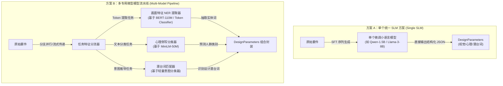
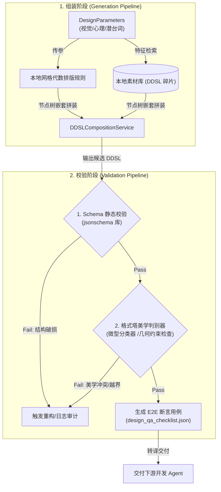
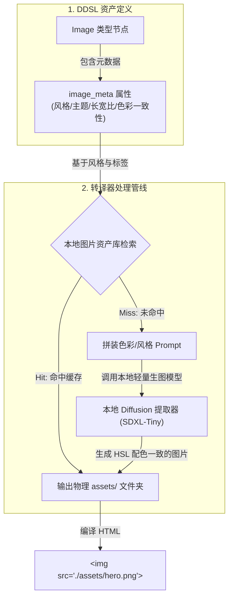

# 自训练模型策略：单模型与多模型方案对比研究 (Model Strategy Research: Single vs. Multi-Model Pipeline)

本篇文档记录了关于系统常规工作流中第一阶段“有效设计特征提取”任务，在确定采用“本地自训练/微调小模型”路线下，针对**“单个统一大/小语言模型方案 (Single Unified Model)”**与**“多个专用微型模型流水线方案 (Multi-Model Pipeline)”**的技术方案对比论证。

---

## 1. 背景与方案定义

常规设计工作流的首要任务是将输入的口语化要件（混杂大量业务冗余描述）解析，并精确提取出三类扁平控制参数：
1.  **画面（视觉）描述**（`visual_description`）；
2.  **目标人群心理侧写**（`user_profile`）；
3.  **要件设计潜台词**（`design_subtext`）。

为了实现此特征提取，系统确立了以下两种可选的自训练架构模型：



---

## 2. 系统模型资源清单 (System Model Resource Inventory)

为了明确整个 Loop Engineering 双向工作流在本地执行时的资源边界及训练成本，我们将系统中所涉及的所有自训练/微调模型（包含特征抽取、动态物理、声音合成、DDSL 校验与资产编译）进行量化汇总：

| 模型名称 | 核心功能 | 神经网络结构 | 输入数据 (Input) | 输出数据 (Output) | 单次推理时间 (Est. Latency) | 建议训练样本量 | 预计训练耗时 (Colab T4) |
| :--- | :--- | :--- | :--- | :--- | :--- | :--- | :--- |
| **画面特征 NER 提取器**<br/>*(Visual NER Extractor)* | 从要件中提取视觉排版相关的特征词词组（如间距、留白等）。 | `BERT-Base-Chinese` + `CRF Layer`<br/>(约 110M 参数) | 原始用户要件长文本<br/>(Max 512 Token) | BIO 标注特征词序列<br/>(如 `[("留白", "SPACING")]`) | **~15ms**<br/>(CPU 离线) | **1,500 ~ 2,000**<br/>条特征标注样本 | **~15 分钟**<br/>(增量 LoRA / SFT) |
| **心理侧写分类器**<br/>*(Psychological Classifier)* | 分析要件中所描绘的人群心智及与之契合的界面气质类型。 | `MiniLM-L6-H384` + `Classifier Head`<br/>(约 22M 参数) | 要件中人群/侧写相关句段<br/>(Max 256 Token) | 预设心理类型概率向量<br/>(如 `[极客: 0.9, 活泼: 0.05]`) | **~5ms**<br/>(CPU 离线) | **1,000 ~ 1,500**<br/>条单标签分类样本 | **~8 分钟**<br/>(SFT 分类头) |
| **设计意图匹配器**<br/>*(Design Intent Classifier)* | 捕捉要件的隐含设计潜台词，映射至具体格式塔原则。 | `TextCNN` 级多标签网络 / `MiniLM`<br/>(约 15M ~ 22M 参数) | 要件动作/修饰词切片<br/>(Max 128 Token) | 格式塔六大原则的激活分布<br/>(如 `figure-ground: 1.0`) | **~3ms**<br/>(CPU 离线) | **1,200 ~ 1,800**<br/>条多标签标注样本 | **~10 分钟**<br/>(SFT) |
| **物理阻尼动效合成器**<br/>*(Motion Synthesizer)* | 预测 UI 动态交互动效的物理阻尼控制系数与过渡曲线。 | 极微型回归网络 `MLP`<br/>(约 20K 参数) | 心理侧写标签与组件运动距离 | 物理缓动参数<br/>(如阻尼 $k$、$c$、贝塞尔控制点) | **~1ms**<br/>(CPU 离线) | **500 ~ 800**<br/>组物理模拟缓动样本 | **~3 分钟**<br/>(CPU / GPU 微调) |
| **本地 UI 声音特征合成器**<br/>*(Sound Synthesizer)* | 预测 UI 交互声学反馈的 FM 调频合成物理控制参数。 | 参数映射网络 `MLP`<br/>(约 50K 参数) | 心理侧写标签与要件紧急度级别 | FM 调频合成物理参数<br/>(如基频 $f_0$, 振幅 ADSR 包络) | **~1ms**<br/>(CPU 离线) | **800 ~ 1,200**<br/>组物理声音特征数据 | **~5 分钟**<br/>(CPU / GPU 微调) |
| **格式塔美学判别器**<br/>*(Gestalt Aesthetic Critic)* | 对拼装合成的 DDSL 进行几何与物理合规性合理打分。 | 图神经网络 `GNN` 或多层感知机 `MLP`<br/>(约 500K 参数) | DDSL 树转换后的图邻接矩阵及属性特征 | 静态合规评分 Scalar<br/>(0.0 ~ 1.0) | **~2ms**<br/>(CPU 离线) | **3,000 ~ 5,000**<br/>组正/负 DDSL 结构样本 | **~5 分钟**<br/>(可通过规则自动膨胀) |
| **本地轻量级图像扩散模型**<br/>*(Local Diffusion Generator)* | 在编译阶段离线生成与全局色彩绝对调和的主题配图。 | `SDXL-Tiny` / `LCM-Lora` 蒸馏模型<br/>(约 300M ~ 600M 参数) | 带有全局 HSL 配色和预设风格的 Prompt | 渲染所需的物理 `.png` 配图资产 | **~1.5s ~ 3s**<br/>(GPU 推理) | **零样本 (Zero-Shot)**<br/>/ 如需固定画风可用 50 张图微调 LoRA | **~30 分钟**<br/>(画风 LoRA 微调) |

### 2.1 清单核心结论
*   **全离线极速运行可能性**：除了生图模型外，其他所有自训练特征提取、动态与声音参数合成及 GNN 校验模型的推理总延迟控制在 **30ms 级别**，总内存占用 **不超过 300MB**，可以直接嵌入任何普通客户端的 CPU 环境下运行。
*   **低成本自动迭代环路**：由于所有模型的训练算力消耗均呈数量级下降，在 Colab CLI 弹性架构下，单次发布增量迭代模型仅需 **10~20 分钟** 即可跑完，配合 Google Drive 统一中枢，极大地降低了系统长期的维护与数据成本。

---

## 3. 技术路线论证与选择建议

综合考虑本系统的**“Loop Engineering 高频实时发散收敛”、“冷启动模板膨胀”与“全本地离线极致体验”**的核心需求，我们推荐采用 **“方案 B：多专用微型模型流水线 (Multi-Model Pipeline)”** 作为最终路线。

### 3.1 方案选择的核心技术依据

1.  **极度压缩冷启动阻力**：
    方案 B 中，心理侧写器本质是一个多分类分类器，画面特征提取器是一个序列标注（NER）模型。这两个子任务所需的数据可以直接通过简单的“画面特征词典 + 人群倾向模板”进行组合合成。相比方案 A 需要 SLM 去适应并生成严格的 JSON 字符串，方案 B 对数据规模的要求低了一个数量级。
2.  **交互延迟是 Loop Engineering 的生命线**：
    当用户或 Client Agent 点击“发散/微调”分支时，如果需要等待大模型或自回归小模型（方案 A）生成 200~500 毫秒，这会在交互中造成明显的迟滞感；而方案 B 仅需 10 毫秒即可提取完参数，剩下的时间全部留给本地 Rust 引擎做格式塔几何计算，保证了“操作即响应”的极致体验。
3.  **开发与维护成本的最佳权衡**：
    多模型方案让系统可以像积木一样组装。当我们需要优化“画面描述”的抽取精度时，只需要在本地追加这一维度的合成词库并微调对应的 NER 节点即可，完全不影响其他如状态机或心理分类的表现。这为本地自动化迭代（Colab CLI + Google Drive）提供了最安全的分段升级保障。

---

## 4. DDSL 自动生成与双重校验机制 (DDSL Generation & Validation Mechanisms)

利用多微型模型流水线提取出扁平的特征参数后，如何将这些参数稳健地“组装”为高保真的 DDSL 树，并确保其不发生结构崩溃，我们设计了**“确定性组装引擎 + 双重校验网关”**的闭环机制：



### 4.1 自动生成路径 (Generation Pipeline)
1.  **参数引导网格几何**：`DDSLCompositionService` 接收到 `DesignParameters`（例如“大留白、黄金分割”）后，本地 Rust 排版代数规则自动计算出全局的 Spacing Spacings 和 Grid 网格重心，生成 DDSL 的骨架根节点。
2.  **DDSL 碎片级素材装配**：系统根据心理侧写标签（例如“老年人 $\rightarrow$ 大图标、粗间距”），在本地素材仓储中检索已标记为相似格式塔特征装配的 DDSL 组件碎片（如已设计好的符合接近性原则的列表卡片），直接将其以子树的形式克隆并动态嵌套到主布局树的对应插槽（Slot）中。

### 4.2 双重校验网关 (Validation Pipeline)
1.  **第一重：Schema 硬约束静态校验**：
    生成的候选 DDSL 文件将被直接送入 Rust 本地的 JSON Schema 校验器中，强制检查其节点类型、必填字段（`id`、`type`）及行为状态机的可达性。若发生校验失败，说明结构破损，系统抛出异常并触发重构。
2.  **第二重：格式塔美学与物理约束判别分类器 (Critic Classifier)**：
    为了防范“符合格式但不美观”的坏方案，我们在本地训练一个极轻量的判别小模型（或编写确定性几何约束评估脚本），评估各节点之间是否存在尺寸冲突、相邻间距比例是否失衡、或者色彩搭配是否违反 WCAG 无障碍对比度规范。只有通过此项判别器打分的设计才会进入下一步。
3.  **最终保障：自动化断言清单生成**：
    通过校验的 DDSL 自动提取其行为状态机，编译生成 `design_qa_checklist.json`。该清单包含针对动态状态（如“警告状态下的共同命运抖动”）的断言约束。下游开发 Agent 在编写代码时必须通过此自动化回归校验，实现设计意图的安全闭环。

---

## 5. DDSL 图片生成与兼容方案 (Image Generation & Compatibility in DDSL)

图片资产（UI 界面中的配图、插画、图标）是构造完整、高保真画面的关键组成部分。我们通过**“设计语义声明 $\rightarrow$ 图像参数映射 $\rightarrow$ 自动生图/检索”**的物理传导模型实现 DDSL 对图片的无缝兼容：



### 5.1 图像节点的语义化规范定义 (Image Node Specification)
我们在 `layout_tree` 的 `Image` 节点属性中，设计了专门的 `image_meta` 用于指导转译阶段的资产处理，避免传统方法中用硬编码 URL 导致的脆弱性：
```json
{
  "id": "hero_banner",
  "type": "Image",
  "gestalt_principle": "figure-ground",
  "image_meta": {
    "style": "flat-vector",
    "subject": "一个极客程序员在星空下进行键盘编程",
    "aspect_ratio": "16:9",
    "palette_match": "primary"
  }
}
```
*   `style`：定义插画或图片的艺术流派（如扁平矢量、极简线条等），与心理侧写保持调和。
*   `palette_match`：绑定至全局 `design_tokens.colors` 的主色键（`primary`）。这要求图片的色系必须与界面全局美学色调保持绝对一致。

### 5.2 图片匹配与生成管线
转译编译器在解析到 `Image` 类型的节点时，启动以下双轨制处理：
1.  **本地图片资产库匹配（智能检索）**：
    转译器读取 `image_meta`，优先在本地的 `AssetRepository` 中根据 `style` 和 `palette_match` 标签检索已沉淀的 SVG 图标或高保真插画。如果找到匹配项，直接将文件复制并命名为 `assets/hero_banner.svg`。
2.  **本地轻量模型生图（算力合成）**：
    若本地库未命中，转译器自动将 `image_meta.subject`、`style` 以及从全局 Tokens 中解析出的具体 HSL 颜色配置（如 `value: "hsl(215, 60%, 45%)"`)，混合拼接为精密的生图 Prompts。
    系统通过调用**本地的轻量级扩散生图模型 (如 SDXL-Tiny / Latent Consistency Models)** 离线生成一张配色绝对调和的 `.png` 图片，并输出到交付包的 `assets/` 文件夹中。
3.  **转译渲染闭环**：
    最终编译输出的 HTML 资源中，该节点被输出为 ``，使得最终编译的画面资源包完全包含了所有必要且配色一致的图片资产，构成了独立的完整界面。

---

## 6. 系统设计缺漏审计：动态视觉与音效交互方案 (System Capability Audit: Motion & Audio Integration)

为了实现完整的多维用户体验（Multi-Dimensional UX）转译，系统必须审计现有 5 模型系统在处理**动态视觉（Motion / Easing）**与**声音反馈（Auditory Feedback）**维度的能力缺漏，并制定相应的物理映射与合成模型扩充方案。

### 6.1 动态视觉 (Motion / Dynamic Visuals)
* **能力缺漏**：格式塔的 **“共同命运 (Common Fate)”** 和 **“连续性 (Continuity)”** 原则高度依赖组件在交互时的物理运动轨迹与弹性阻尼过渡。目前的 DDSL 合成器只有静态网格逻辑，缺乏对物理运动时间轴与阻尼曲线的量化生成机制。
* **扩充方案：物理阻尼缓动参数合成器 (Local Motion Parameter Synthesizer)**：
  - **设计定位**：我们**不需要复杂的视觉生成模型**。动效本质是数学插值，应当通过“特征输入 $\rightarrow$ 物理参数 $\rightarrow$ CSS/JS 动画渲染”的数学映射实现。
  - **新增微型模型**：
    - **网络结构**：极微型回归网络 `MLP`（约 20K 参数）。
    - **输入**：人群心理侧写标签（如“活泼”映射高弹力、“端庄”映射平滑减速）、组件运动距离。
    - **输出**：物理缓动控制系数（如弹性阻尼常数 $k$, 摩擦力阻尼 $c$, CSS 贝塞尔控制点 `cubic-bezier(x1, y1, x2, y2)`）。
  - **编译转译**：转译器在编译 DDSL 的 `behavioral_state_machine` 时，直接将这组缓动系数代入 Web Animations API，渲染为毫秒级平滑的物理惯性动效。

### 6.2 声音与音效反馈 (Audio / Sound FX)
* **能力缺漏**：现代极致体验的界面需要精细的“微型声学反馈”（如点击确认的气泡音、异常警告的机械碰撞声）。目前的 DDSL Schema 完全缺失了听觉维度的声明与生成管线。
* **扩充方案：本地 UI 声音特征合成器 (Local UI Sound Synthesizer)**：
  - **设计定位**：用户界面的反馈音效极短（通常 $< 500\text{ms}$）且结构纯净。我们**不需要臃肿的音频生成大模型**，而是可以通过 FM (调频) 声音合成算法在本地动态演算渲染。
  - **在 DDSL 中增加音频 Token 规约**：
    ```json
    "design_tokens": {
      "audio": {
        "feedback_click": "bubble_crisp",
        "feedback_success": "chime_airy",
        "feedback_error": "mechanical_thud"
      }
    }
    ```
  - **新增微型模型与合成算法**：
    - **网络结构**：参数映射网络 `MLP`（约 50K 参数）。
    - **输入**：人群心理侧写标签（如“复古机械键音”或“现代扁平电子音”）、要件潜台词的紧急度级别。
    - **输出**：FM 合成的物理参数（如基频 $f_0$, 谐波比例因子, ADSR 振幅包络时间 `[Attack, Decay, Sustain, Release]`）。
  - **编译转译**：转译器将输出参数直接写入交付包的 JS 脚本中，利用前端的 **Web Audio API** 进行无文件的算力级物理声音合成。这意味着不需要下载任何物理音频素材包，即时在浏览器端运行演算出极高保真的声音反馈。
