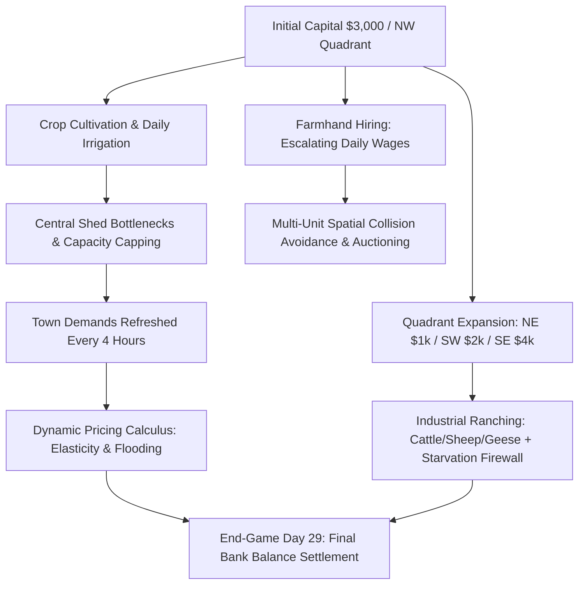
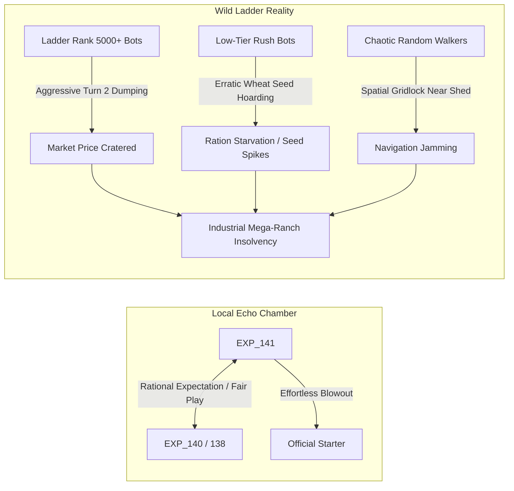
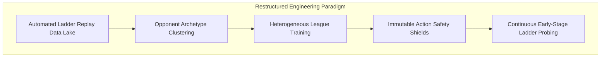

# Kaggriculture Competition Retrospective: From 141 Generations of Evolution to a Rank 5800+ Post-Mortem


> **Competition**: Kaggle Kaggriculture Simulation Challenge  
> **Track**: Multi-Agent RL & Economic Time-Series Simulation Arena  
> **Specifications**: 30 Days (720 Turns / Steps), $10 \times 10$ Spatial Grid, 4-Quadrant Progressive Unlocks, 2-Player Head-to-Head Arena  
> **Primary Objective**: Maximize **bank account cash (Money in Bank)** at end-of-season under dynamic pricing, central warehouse capacity constraints, and escalating labor costs  
> **Results**: Local sandbox single-game peak **$140,675.0**, internal championship **75% win rate**; Kaggle official ladder final standing: **~5800+** (out of 10,000+ teams)

---

## 1. Overview & Core Mechanics

Kaggriculture is a high-fidelity agricultural economic simulation benchmark hosted on Kaggle. Unlike conventional chess, board games, or discrete grid search benchmarks, the game blends **spatial dispatching**, **biological lifecycle dynamics**, and **macroeconomic market calculus**:



### 1.1 Three Foundational Constraints
1. **Micro-Spatial Logistics Bottleneck**: The farmer and hired hands must position themselves orthogonally adjacent to the central $2 \times 2$ warehouse core to execute `PICKUP` / `DROP`. Limited inventory and shed capacity create stringent throughput caps where logistics jams easily emerge.
2. **Biological Lifecycles & Feed Dependencies**: Ranging from fast wheat (2 days) and premium watermelons (10 days) to continuous strawberries (10-day maturation, yielding every 2 days), crops wither into weeds if neglected for 2 consecutive days. Livestock (dairy cows/sheep) offer recurring high-margin cash flow, but consume wheat daily; if unfeed for 2 days, animals escape permanently.
3. **Macroeconomic Market Competition**: Both players trade into a shared dynamic pricing pool. Heavy dumping crashes spot prices, while town stores refresh demands every 4 hours (`hour % 4 == 0`), creating cyclical price spikes and arbitrage windows.

---

## 2. The 141-Generation Evolution Journey

Over nearly two months of development, our research spanned **141 full experimental cycles**, culminating in a 185 KB experiment ledger and progressing through four distinct technological phases:

```mermaid
timeline
    title Kaggriculture Agent Evolution Roadmap
    section Phase 1: Survival & Exploration (EXP_001 ~ 020)
        EXP_001 - 010 : PPO policy collapse & sparse reward deadlocks
        EXP_011 - 014 : 3-tier hierarchical RL & drop-off logistics pipeline
        EXP_015 - 018 : Reward hacking audit (HIRE frenzy & seed hoarding)
    section Phase 2: Operations Research (EXP_021 ~ 090)
        EXP_021 - 050 : Biological NPV calculus & quadrant unlock scheduling
        EXP_084 - 086 : Pure watermelon field & livestock equilibrium ($152k peak)
        EXP_088 - 090 : Agile topology & zero-sunk end-game liquidations
    section Phase 3: Spatial Engineering (EXP_091 ~ 120)
        EXP_096 - 100 : High-frequency strawberry matrix (>200 units shipped)
        EXP_106 - 112 : Spatial physics tensors (16ch~20ch) & CBAM dual attention
        EXP_118 - 120 : 17-tile grazing corridor + 13-cow fleet & starvation firewall
    section Phase 4: Multi-Modal Game Theory (EXP_121 ~ 141)
        EXP_121 - 127 : 32~40 channel holographic tensors + counter-pricing flows
        EXP_129 - 133 : Nash early-bird counter-sniping & round-robin championship
        EXP_140 - 141 : STAR-Net 2.0 multi-modal backbone (Dual GRU+FiLM+Pure NumPy)
```

### Phase 1: Survival & Bootstrap (EXP_001 ～ EXP_020)
* **Core Hurdle**: Standard Stable-Baselines3 PPO directly initialized on the full action space suffered from severe policy collapse. Due to extreme action illegality and delayed sparse rewards, agents degenerated into passive passivity ($3,000 vs $3,000 mutual PASS deadlocks).
* **Reward Hacking Pitfalls**:
  - In EXP_015, the agent trapped itself in a localized micro-reward loop, purchasing 211 wheat seeds and freezing all operating cash;
  - In EXP_018, granting `+1.5` dense reward to `HIRE` caused PPO to collapse into a compulsive farmhand recruitment loop, leaving all arable fields uncultivated;
* **Key Breakthrough**: EXP_013 introduced a deterministic **Drop-off Pipeline**, closing the loop across harvesting, central shed transport, and market liquidation, enabling EXP_014 to achieve a genuine positive economic cycle.

### Phase 2: Operations Research & Crop Dynamics (EXP_021 ～ EXP_090)
* **Crop Economics Modeling**: Fully quantified Net Present Value (NPV) across single-yield high-margin crops (watermelons) vs. continuous recurring harvest crops (strawberries/tomatoes).
* **Optimal Expansion Timing**: Established a deterministic quadrant rollout: Initial NW saturation $\to$ NE unlock around Day 4~6 $\to$ opportunistic SW expansion, while intentionally bypassing the expensive $4,000 SE quadrant to prevent capital overextension.
* **Milestone**: EXP_085 achieved complete monoculture saturation of 13 watermelons in the NW quadrant, breaching **$152,000** in isolated simulation.

### Phase 3: Spatial Physics Tensors & Industrial Ranching (EXP_091 ～ EXP_120)
* **Spatial Tensor Paradigm**: Moved away from flattened 1D observation vectors toward a Fully Convolutional Spatial Dispatcher, framing the farm as a multi-channel $10 \times 10$ physical grid (scaling from 16 to 32 channels covering crop maturity, soil moisture, livestock hunger, worker density, and potential fields).
* **Mega-Dairy Network**: EXP_119~120 introduced a standardized 17-tile grazing corridor with 13 dairy cows backed by an automated **Zero-Starvation Firewall**, extracting a record 486 jugs of milk and generating an industrial-grade financial cushion.

### Phase 4: STAR-Net & Multi-Modal Apex (EXP_121 ～ EXP_141)
* **Nash Early-Bird Sniping & Anti-Dilution (EXP_133 / EXP_140)**: Engineered price-banded liquidations ($\ge \$250$) during the Day 10~11 watermelon harvest wave, stripping out duplicate sell orders to prevent self-induced market dilution.
* **STAR-Net 2.0 Omni Architecture (EXP_141)**:
  - **Backbone**: Dual-stream 2-layer GRU temporal memory (4-step economic history) + Dual-Gated trunk (45D Ego + 36D Opponent) + FiLM cross-modal spatial modulation + Opponent LSTM intent classifier (5 classes);
  - **Three-Stage Training**: Optimized over 30,198 competitive game frames, attaining **97.12%** behavioral cloning validation accuracy;
  - **Pure NumPy Zero-Dependency Inference**: Flattened and exported 52 weight matrices into a 1.45 MB `.npz` archive, clocking forward inference at **$< 0.1 \text{ ms}$** per step with zero external ML dependencies.

---

## 3. The Reality Check: Local $140k Peak vs. Ladder Rank 5800+

In local sandboxes and offline verification suites, generations 140 and 141 performed with undisputed dominance:
* **Against Official Starter Agent**: Single-game landslide victory: **$140,675.0 vs. $3,489.0** (+$13.7W differential);
* **Internal All-Star League**: Maintained a **75% win rate** across multi-seed round-robin tournaments against internal historical champions, averaging **$82k ~ $101k**;
* **Sandbox Reliability**: 720 uninterrupted simulation steps with zero runtime crashes or timeouts.

Yet, upon final settlement of the Kaggle leaderboard, our agent finished around **5800+** among 10,000+ competitors.

**The stark divergence between a local "unstoppable juggernaut" and a mediocre ladder standing provided a humbling, invaluable realization.** It compelled us to step outside our algorithmic echo chamber and conduct a forensic post-mortem.

---

## 4. In-Depth Root Cause Analysis

Why did an agent equipped with a 32-channel tensor, dual-stream GRU memory, FiLM modulation, and sub-0.1ms inference fail to thrive on the real ladder? We identified two fundamental architectural blind spots:

### 4.1 Root Cause 1: Neglect of Ladder PK Dynamics & Meta-Game



1. **Fundamental Misunderstanding of Ranking Mechanics (Bradley-Terry Elo vs. Absolute Profit)**:
   - Kaggle simulation ladders are ranked strictly via **Bradley-Terry (Elo-style) pairwise match outcomes**, not by average bank balance. Gaining $1 more than the opponent is a win; gaining $1 less is a loss, regardless of whether the final balance is $10,000 or $140,000.
   - Our offline training relentlessly optimized for **maximum isolated capital accumulation**, blind to **minimax defensive robustness and margin dominance**.
2. **The Self-Play Echo Chamber & League Incest**:
   - Across all 141 generations, sparring partners consisted solely of clones and predecessors from the same code tree (EXP_116, EXP_120, EXP_138, EXP_140) alongside the naive Starter bot.
   - The models evolved implicit "gentlemen's agreements": both sides paced capital expenditure neatly, waited for price rebounds, and timed harvests rationally. The agent never encountered irrational, chaotic, or cutthroat ladder play.
3. **Severe Vulnerability to Low-Elo "Ladder Mud Pit" Dynamics**:
   - Starting from Elo 1200, the ladder is dominated by thousands of crude, rule-based scripts (e.g., hyper-aggressive Day 2 wheat dumping, indiscriminate tomato rushes, or random purchasing).
   - While these scripts have low ceilings (often finishing around $15,000), their chaotic sales **demolish market floor prices within the first 5 days**.
   - Our advanced model relied on heavy front-loaded capital investments (buying land, laying out a 17-tile corridor, stocking 13 cows). Liquidity bottomed out around Days 8–12. When confronted by depressed market prices and inflated seed costs, cash flow collapsed, leaving the sophisticated agent insolvent.
4. **Lack of Stratified Meta-Game Countermeasures**:
   - Rational play and chaotic play demand opposing strategies. Elite competitors employ opponent classification heuristics early in a match (identifying openings within 24 turns) to pivot between aggressive rush-punishing lines and high-tier defensive counter-play. Our model rigidly followed a single, brittle high-investment meta.

---

### 4.2 Root Cause 2: Data Engineering Oversights & Covariate Shifts

```mermaid
flowchart TD
    subgraph "Elite Competitor Paradigm"
        K1[Kaggle API Scraper] --> K2[Tens of Thousands of Ladder Replays]
        K2 --> K3[Cluster Opponent Opening Archetypes]
        K3 --> K4[Diverse Ladder BC Pre-training Dataset]
        K4 --> K5[Resilient Generalization to Any Opponent]
    end
    subgraph "Our Project Pipeline"
        P1[Isolated Local Engine] --> P2[30,198 Synthetic Frames exp141_demos.pkl]
        P2 --> P3[Single-Source Supervised BC]
        P3 --> P4[97.12% Accuracy on In-House Teacher]
        P4 --> P5[Catastrophic OOD Degradation on Ladder]
    end
```



1. **Zero External Ladder Replay Ingestion**:
   - Kaggle releases daily public episode replay dumps—the gold standard of ground truth in competitive simulation. Top teams systematically built automated scraper pipelines, mining hundreds of thousands of live ladder matches to reverse-engineer openings and train imitation networks.
   - Throughout 141 iterations, **our pipeline ingested zero external ladder replays**. All 30,198 frames were generated from hand-crafted rules and internal model checkpoints, introducing immense data myopia.
2. **Severe Covariate Shift & Out-of-Distribution (OOD) Failures**:
   - Deep neural networks degrade unpredictably on out-of-distribution states. In synthetic demos, prices moved predictably, feed was always stocked, and warehouse access was unimpeded.
   - When faced with wild pricing shocks or path blockage on the live ladder, input tensors landed far outside the training manifold, producing distorted policy logits.
3. **Driver Latency & Exception Suppression Debt**:
   - Early experiments revealed critical runtime traps: EXP_016 ran silent `try-except` blocks masking a missing `seeds` variable, causing 15 turns of passive idle passes; dictionary keys desynchronized (`shed` vs `seeds`).
   - To guarantee zero timeouts in the submission container, our 1,500-line monolithic `main.py` incorporated broad fallback branches (defaulting to PASS). Under bizarre edge cases, the network silently fell back to passive defaults, degrading into an ineffective survival bot.
4. **Channel Inflation without Empirical Validation**:
   - Expanding tensor depth from 6 to 32 and 40 channels incorporated complex hand-crafted math (e.g., "opponent rush threat radar" and "town resonance potential fields").
   - Without empirical ablation on diverse ladder opponents, there was no way to verify whether these channels conveyed genuine signals or merely fostered severe overfitting to synthetic self-play.

---

## 5. Key Reflections & Hard Lessons

1. **Extreme Tactical Diligence Cannot Offset Strategic Isolation**:
   - 141 iterations, hand-coded pure-NumPy inference engines, and custom React visualizers represent top-tier engineering discipline. However, developing in isolation from the live competitive ecosystem doomed the model to fail in the wild.
2. **In Simulation Contests, the Data Flywheel Trumps Network Complexity**:
   - Spending a week tuning CBAM attention and FiLM conditioning yielded far lower marginal returns than building a simple scraper to harvest 5,000 live ladder games. A complex model trained on synthetic data remains a castle built on sand.
3. **Maintain Respect for Hard Heuristic Safety Shields**:
   - The winning solutions in simulation competitions almost invariably marry deep learning with explicit heuristic safety nets. Core financial survivability (minimum reserve cash, liquidation breakers, starvation cutoffs) must never be delegated entirely to black-box neural networks.

---

## 6. Future Optimization Roadmap

To guide future multi-agent simulation competitions (such as Lux AI, Hungry Geese, and forthcoming seasons), we establish a restructured engineering blueprint:



| Dimension | Legacy Approach (Kaggriculture) | Next-Gen Engineering Paradigm |
| :--- | :--- | :--- |
| **Data Pipeline** | 100% synthetic local self-play (~30k frames) | **Automated Kaggle Replay Ingestion Pipeline**: Scrape top 100 ladder games daily to maintain a 100k+ multi-opponent trajectory lake for robust Behavioral Cloning. |
| **Sparring League** | In-house historical clones (League Incest) | **AlphaStar-Style Heterogeneous League**: Maintain a zoo of opponents (extreme rushers, price-crashers, hoarders, noise agents) alongside self-play. |
| **Control Logic** | End-to-end neural output for macro & micro actions | **Hybrid Guardrail Architecture**: Decouple high-level policy recommendations from hard heuristic safety shields enforcing cash minimums and feed locks. |
| **Iteration Cadence** | Heavy offline development before late submission | **Probe Early, Probe Often**: Deploy baseline probe agents during Week 1 to continuously monitor ladder meta shifts. |
| **Opponent Modeling**| Static intention prediction classification head | **Real-Time Opponent Fingerprinting**: Classify opponent strategy profiles within the opening 10 turns and switch tactical postures accordingly. |

---

## Conclusion

Kaggriculture was an invaluable crucible. It sharpened our ability to engineer sub-millisecond, zero-dependency spatial neural networks within strict sandbox limits, while delivering an unmistakable lesson in multi-agent game theory: **Competitions are never won in a vacuum. True resilience comes from understanding the ecosystem, respecting chaotic opponents, and anchoring all modeling in live, diverse competitive data.**
