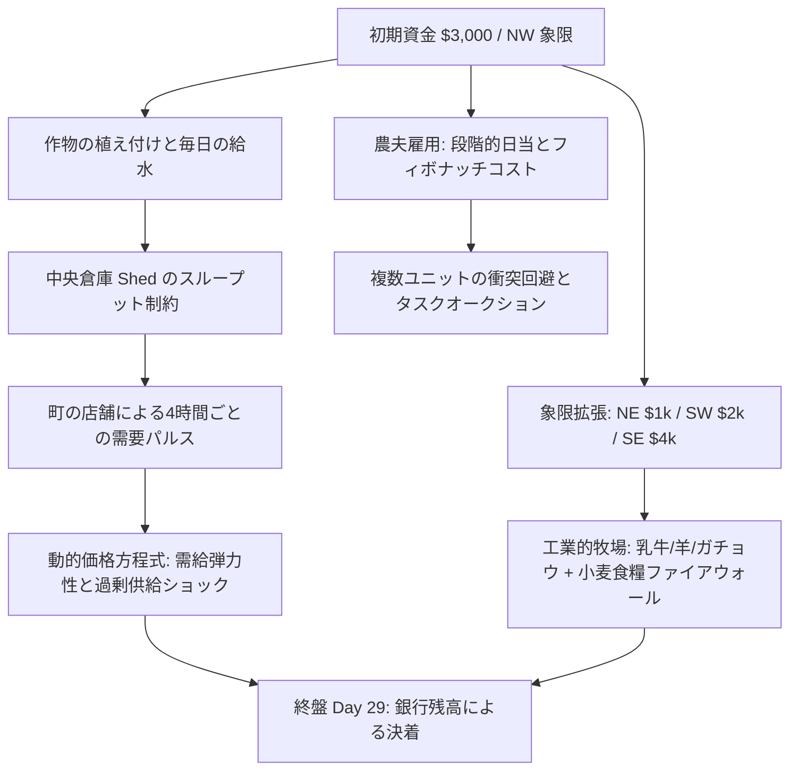
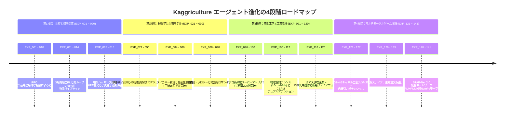
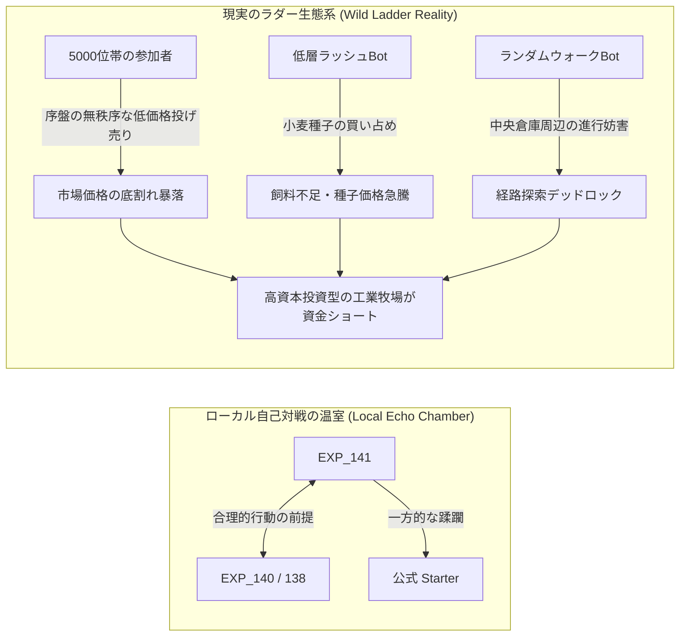
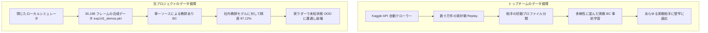
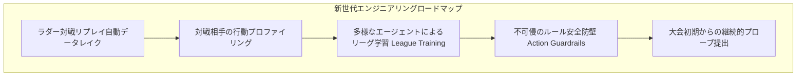

# Kaggriculture コンペティション全景回顧：141世代のエージェント進化からラダー 5800位への深層ポストモーテム

> **コンペティション名**：Kaggle Kaggriculture Simulation Challenge  
> **競技トラック**：マルチエージェント強化学習・経済時系列シミュレーション (Multi-Agent RL & Economic Simulation Arena)  
> **シーズン仕様**：30日間（全720ステップ / ターン）、$10 \times 10$ 空間グリッド、4象限段階解放、2プレイヤー直接対戦  
> **中核目標**：価格変動、中央倉庫の容量限界、農夫雇用コストの制約下で、最終シーズン終了時点の**銀行口座資金（Money in Bank）を最大化すること**  
> **最終戦績**：ローカルサンドボックス単局最高 **$140,675.0**、自己対局トーナメント **勝率75%**；Kaggle 公式ラダー最終順位 **約 5800+ 位**（参加チーム 10,000+）

---

## 1. 競技の全景と中核メカニズム

Kaggriculture は、Kaggle 上で開催された高精度な農場経済シミュレーション環境です。従来のボードゲームや単純なグリッド探索とは異なり、**空間配分（Spatial Dispatching）**、**生物学的ライフサイクル（Biological Lifecycle）**、および**マクロ経済学的な微分方程式（Dynamic Market Calculus）**が緊密に統合されています。

### 1.1 3つの本質的制約
1. **微小空間と物流のボトルネック**：農場主と雇用労働者は、中央 $2 \times 2$ の倉庫隣接マスに移動しなければ `PICKUP` / `DROP` を実行できません。インベントリと倉庫容量（Shed Capacity）が厳格なスループット上限を形成し、物流渋滞や移動経路のデッドロックが頻繁に発生します。
2. **生物学的成長と食糧の絶対需要**：短期的小麦（2日）、高単価スイカ（10日）、継続収穫型イチゴ（10日初期成熟、以後2日おき）に至るまで、作物は毎日水やりを必要とし、2日連続で断水すると雑草化します。家畜（牛・羊）は高い収益を生み出しますが、主食として毎日小麦を消費し、2日間飢餓状態が続くと不可逆的に逃走・喪失します。
3. **マクロ市場の動的競争**：両プレイヤーは共通の価格プールに対して売買を行います。特定作物の大量売却は市場価格の暴落を招き、町の店舗は4時間ごと（`hour % 4 == 0`）に特定需要を更新し、周期的な価格ピークを形成します。

---

## 2. 141世代にわたるエージェント進化の軌跡

約2ヶ月の開発期間において、我々は累計 **141世代の実験** を行い、185 KB に及ぶ実験ログを蓄積しました。技術的には4つの主要な転換点を経験しました：

### 第1段階：生存と初期探索（EXP_001 ～ EXP_020）
* **初期の壁**：標準的な Stable-Baselines3 PPO を $10 \times 10$ の離散空間でゼロから学習させたところ、動作の合法性制約と希薄な報酬によって方策が崩壊し、双方が全ステップで `PASS` し合う 3000:3000 のデッドロックに陥りました。
* **報酬ハッキング（Reward Hacking）の教訓**：
  - EXP_015 では、微小な即時報酬を貪欲に獲得しようとしたエージェントが小麦の種を 211 粒も爆買いし、運転資金が枯渇；
  - EXP_018 では、`HIRE` に `+1.5` の報酬を与えた結果、毎朝定刻に農夫を雇用し続けるだけの「採用マシーン」へと退化し、農地が完全放置されました。
* **技術的突破**：EXP_013 において確定的な **搬入パイプライン（Drop-off Pipeline）** を構築し、収穫 $\to$ 倉庫搬入 $\to$ 市場換金の正のループを確立。EXP_014 で初めて健全な経済サイクルが成立しました。

### 第2段階：農業経済学と運籌最適化（EXP_021 ～ EXP_090）
* **作物の正味現在価値（NPV）算出**：スイカ（高利益率・単発収穫）とイチゴ（長期反復収穫・高労働需要）の回収サイクルを数学的に厳密化。
* **黄金の象限拡張ルール**：初期NW象限の飽和 $\to$ 4〜6日目のNE象限解放 $\to$ 適切なタイミングでのSW象限解放を確立。$4,000 を要する高額な SE 象限は投資回収期間が不足するため敢えて回避。
* **マイルストーン**：EXP_085 では NW 象限でのスイカ 13 株完全栽培を達成し、単局収益が **$152,000** を突破しました。

### 第3段階：空間物理テンソルと工業的牧場（EXP_091 ～ EXP_120）
* **全畳み込み空間スケジューラ（Fully Convolutional Spatial Dispatcher）**：1次元フラット観測を全廃し、$10 \times 10$ の多重チャネルテンソル（16chから32chへ拡張：成熟度、土壌水分、家畜空腹度、密集度、引力場）を導入。
* **工業用メガデイリー（Mega-Dairy Network）**：EXP_119~120 では 17 マスの放牧回廊と 13 頭の乳牛による工業的畜産システムを設計。**断糧ファイアウォール（Zero-Starvation Firewall）** を併設し、歴代最高となる 486 缶のミルクを生産する盤石なキャッシュフロー源を完成させました。

### 第4段階：STAR-Net アーキテクチャとマルチモーダル（EXP_121 ～ EXP_141）
* **ナッシュ早期スナイプと注文重複排除（EXP_133 / EXP_140）**：10〜11日目のスイカ初収穫期において、高価格帯（$\ge \$250$）での段階的売り抜けを実施。自己取引による価格暴落を完全に防ぐ重複排除機構を導入。
* **STAR-Net 2.0 統合アーキテクチャ（EXP_141）**：
  - **ネットワーク構造**：双流2層GRU時系列メモリ（4ステップの経済履歴） + 相手推定ゲート付き幹線 + FiLM空間動的変調 + 相手LSTM意図予測（5クラス）；
  - **3段階学習**：30,198 フレームの高水準対戦データに基づき、行動模倣精度は歴代最高の **97.12%** に到達；
  - **純 NumPy ゼロ依存ミリ秒推論**：52 個の重み行列を 1.45 MB の `.npz` に凝縮し、単一ステップ **$< 0.1 \text{ ms}$** の超高速推論を実現。サンドボックス実行を 100% 自給自足化しました。

---

## 3. 現実の洗礼：ローカル 14万ドル vs ラダー 5800位超

ローカル検証環境において、第 140/141 世代は無類の強さを誇っていました：
* **公式 Starter エージェント戦**：**$140,675.0 vs $3,489.0**（+$13.7万ドルの圧勝）；
* **内部オールスタートーナメント**：過去の歴代チャンピオン 7 種との総当たりリーグ戦において **勝率 75%**、平均資産 **$8.2万 〜 $10.1万**；
* **サンドボックス信頼性**：720 ステップを通してエラーゼロ、タイムアウトゼロ、例外停止ゼロ。

しかし、Kaggle 公式ラダーの最終締め切りを迎えた結果、最終順位は **約 5800+ 位**（参加者 10,000+）に沈みました。

**ローカルでの「完全無欠の王者」と、実ラダーでの「中下位低迷」という痛烈なギャップ**は、我々に局所的な最適化から目を覚まし、戦略的・構造的欠陥を直視させる強烈な契機となりました。

---

## 4. 潜在的根本問題の深層分析

なぜ 32 チャネルテンソル、双流 GRU メモリ、FiLM 変調、0.1ms 推論を備えた最先端モデルが、実環境のラダーで勝てなかったのか？ 2つの根本的死角が存在していました：

### 4.1 根本要因1：実ラダー対戦 PK 戦略の軽視（Ladder Meta & Matchmaking Ignorance）

1. **レーティング算出原理への認識不足（Bradley-Terry Elo vs 絶対収益）**：
   - Kaggle のシミュレーションコンペは **Bradley-Terry（Elo に類似した対戦レーティング）** で順位付けされます。相手より $1 でも多ければ勝ちであり、自分が $140,000 稼ごうが $20,000 稼ごうが、勝敗のみがスコアに反映されます。
   - 我々はローカルで「単局獲得賞金の極大化（Max Profit）」に終始し、「相手に対する勝率最大化と下振れ防止（Minimax Defense）」を軽視していました。
2. **自己対局エコーチェンバーの罠（League Incest & Self-Play Echo Chamber）**：
   - 141世代の対戦相手は、すべて同一系統の派生モデル（EXP_116, 120, 138, 140）と脆弱な Starter のみでした。
   - モデル同士が「紳士協定」を暗黙に学習してしまっていたのです：双方が無理な安売りをせず、市場の回復を待ち、10日目まで整然とインフラを整える。現実のラダーに蔓延る「野蛮な奇策」への耐性が皆無でした。
3. **低Elo帯「泥沼ラダー」への極端な脆弱性（Vulnerability to Low-Elo Chaos）**：
   - 1200 レーティングから勝ち上がる過程では、数千の参加者が作成した粗削りなルールベーススクリプト（序盤から小麦を安値で連打する流派、トマト特攻流など）と無数に遭遇します。
   - これらのBotは最終スコアこそ低いものの（$15,000 程度）、最初の 2〜5 日間に市場へ農産物を無秩序に投げ売り、**基準価格を早々に破壊**します。
   - 我々の高級エージェントは「中盤の大規模資本投下（土地購入、17マス回廊建設、13頭の乳牛購入）」を前提としており、Day 8〜12 に手元流動性が最も低下します。価格破壊や種子価格高騰に直面した瞬間、キャッシュフローが断絶し、呆気なく討ち死にしました。
4. **階層別メタ対抗策の欠如（No Stratified Counter-Play）**：
   - 混乱した相手と合理的な相手では最適なゲーム戦略が異なります。上位陣はオープニング 24 ステップ以内で相手の行動プロファイルを特定し、「低層キラーのラッシュ迎撃モード」と「上位向けのナッシュ防衛モード」を自動で切り替えていました。我々は単一の重量級戦略一本槍でした。

---

### 4.2 根本要因2：データエンジニアリングの死角と分布シフト（Data Pipeline & Distribution Shift）

1. **公開ラダー Replay 活用の完全な欠落（Zero External Replay Ingestion）**：
   - Kaggle は毎日膨大な対戦リプレイ（Episode Replay Dumps）を公開しています。これはシミュレーションコンペにおける最大の「宝の山」です。
   - 上位陣はこの Replay を自動収集・解析し、勝率の高いオープニングや相手の妨害戦術を逆アセンブルして行動模倣（BC）データセットに組み込んでいました。
   - 一方、我々は 141 世代を通じて**外部の実戦データを 1 件も取り込みませんでした**。30,198 フレームはすべてローカルの自作スクリプトと自社モデルから合成されたものであり、データの多様性が致命的に不足していました。
2. **深刻な共変量シフト（Covariate Shift）と未知状態（OOD）崩壊**：
   - 深層学習は分布外（Out-of-Distribution）データに対して極めて脆弱です。合成されたデータの中では、価格は綺麗に振動し、牛は餓死せず、倉庫前が通行不能になることもありませんでした。
   - 実ラダーの異常な市場動向や突発的進路妨害に直面した際、入力テンソルは学習済み多様体の外側に弾き飛ばされ、ニューラルネットワークは予期せぬ無効行動を出力しました。
3. **ドライバー層の例外隠蔽とフォールバックの負債**：
   - 実験ログには、以前にも多くの潜在的不具合が記録されていました（EXP_016 での `try-except` による例外握りつぶし、変数の未定義による15日連続 `PASS` 停止など）。
   - 提出用単一ファイル `main.py` を作成する際、コンテナのタイムアウトや例外落ちを絶対に回避するため、広範な安全フォールバック（困ったら PASS する）を組み込みました。未知の境界条件に遭遇した際、モデルが頻繁に PASS へ縮退し、低機能な生存Botに成り下がっていた可能性が高いです。
4. **テンソルチャネルの「インフレ妄想」（Channel Inflation without Empirical Validation）**：
   - 6チャネルから 32、40チャネルへと特徴量を肥大化させ、「相手ラッシュ脅威レーダー」や「店舗共鳴ポテンシャル場」などの複雑な数式を導入しました。
   - しかし、外部の実戦相手を用いたアブレーション実験を怠ったため、それらが有益な信号なのか、単なる自己対局データへの過学習なのかを見極めることができませんでした。

---

## 5. 大会からの学びと技術的教訓

1. **戦術的勤勉さは、戦略的孤立を埋め合わせることはできない**：
   - 141 回の厳密な実験、純 NumPy によるミリ秒以下推論エンジン、React ベースの自作リプレイ UI など、エンジニアリングの完成度は極めて高いものでした。しかし「実際の対戦環境」から目を背けていたため、本番の荒波に耐えられませんでした。
2. **シミュレーション競技において、データフライホイールはモデル改造に勝る**：
   - CBAM アテンションや FiLM 変調、32チャネルテンソルの調整に1週間費やすよりも、Kaggle API で実戦リプレイを 5,000 件集めるクローラーを書く方が、遥かに劇的なリターンをもたらします。多様なデータ基盤のない複雑なアーキテクチャは、砂上の楼閣に過ぎません。
3. **ルールベースによる「安全ガードレール」を軽視してはならない**：
   - 競技シミュレーションで勝ち残るモデルは、ほぼ例外なく「強固なルール防壁（Safety Guardrails）+ 深層学習による柔軟な意思決定」のハイブリッド構成をとっています。最低資金の維持や餓死回避といった生存の絶対条件は、ブラックボックスなニューラルネットに委ねてはなりません。

---

## 6. 今後の最適化ロードマップ

今回の教訓を踏まえ、将来の Kaggle シミュレーション競技（Lux AI、Hungry Geese、および今後のシーズン）に向けた標準エンジニアリングパラダイムを策定します：

| 評価軸 | 本大会の反省 (Kaggriculture) | 新世代エンジニアリングパラダイム |
| :--- | :--- | :--- |
| **データ工学** | 閉じたローカル自己対戦データのみ (~3万フレーム) | **Kaggle API 連動リプレイ収集基盤**：上位 100 名の勝敗棋譜を毎日自動蓄積し、10万件規模の多様なデータレイクを構築して堅牢な行動模倣（BC）を実施。 |
| **対戦環境** | 同一系統の社内クローンのみ (League Incest) | **AlphaStar 方式の異種リーグ学習**：速攻流、安売り流、籠城流、ランダムノイズ流など多様な仮想敵（Sparring Partners）を常設。 |
| **意思決定** | マクロ・ミクロ全般を深層学習に一任 | **ハイブリッド防護アーキテクチャ**：外側にハードコードされた「安全ガードレール」を配置。資金ショートや餓死の危険を検知した際はモデル出力を強制オーバーライド。 |
| **開発リズム** | 締切直前までローカル開発に没頭 | **Probe Early, Probe Often (早期提出・頻繁検証)**：第1週に軽量プローブを投入し、ラダーのメタ変動を週次で追跡・フィードバック。 |
| **相手モデリング** | 静的な意図分類ヘッドのみ | **動的フィンガープリンティング**：開始 10 ターンで相手の戦略類型を判定し、最適なカウンター戦術へ即座にシフト。 |

---

## おわりに

Kaggriculture は、極めて価値の高い試練でした。過酷なサンドボックス制約下で超高速空間ニューラルネットを自力構築する工学力を磨き上げると同時に、**対戦型シミュレーションの本質——「真空の中で戦っているのではない。環境と相手の生態系を理解し、実戦データを道標とすることこそが真の強さである」**という不変の真理を学ぶことができました。
