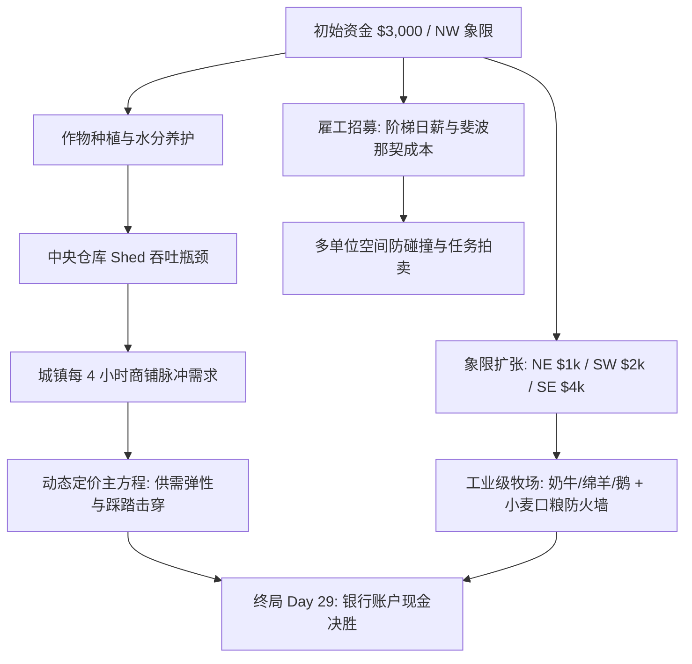
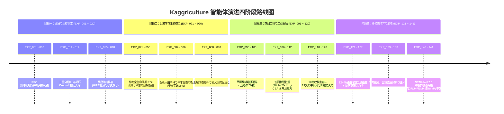
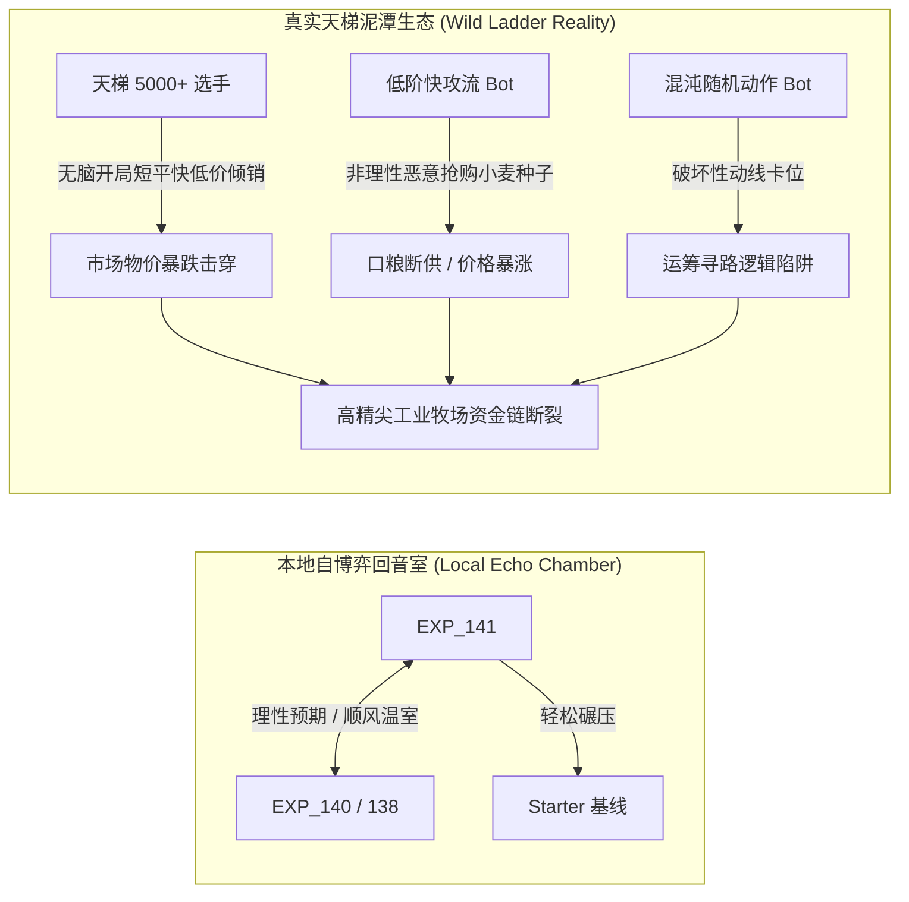
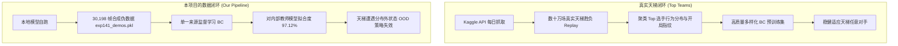
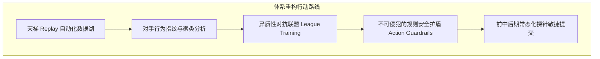

# Kaggriculture 竞赛全景复盘：从 141 代智能体演进到天梯 5800+ 的深层反思

> **赛事名称**：Kaggle Kaggriculture Simulation Challenge  
> **赛道类型**：多智能体经济学时序仿真 (Multi-Agent RL & Economic Simulation Arena)  
> **赛季规格**：30 天（共 720 回合 / Steps），$10 \times 10$ 空间网格，四象限阶梯解锁，双人同台对抗  
> **核心目标**：在动态波动的商品市场、有限中央仓库与雇工劳动力成本制约下，实现赛季结束时**银行账户资金（Money in Bank）最大化**  
> **最终战果**：本地沙箱单局狂轰 **$140,675.0**，自博弈锦标赛 **75% 胜率**；Kaggle 天梯最终名次约 **5800+**（参赛队伍 10,000+）

---

## 1. 竞赛全景与核心机制

Kaggriculture 是 Kaggle 举办的高保真农场经济模拟竞技场。与传统的棋类或纯网格搜索博弈不同，该赛事将**空间调度（Spatial Dispatching）**、**生物学周期（Biological Lifecycle）**与**宏观经济学微积分（Dynamic Market Calculus）**深度融合：

### 1.1 核心维度的三大约束
1. **微观空间与物流瓶颈**：农场主与雇工必须移动至中央 $2 \times 2$ 核心仓库邻接格才能执行 `PICKUP` / `DROP`；背包容量与仓库容量（Shed Capacity）形成严格吞吐上限，极易出现物流堵塞与动线对穿。
2. **生物学生长与口粮刚需**：从短平快小麦（2天）、高单价西瓜（10天）到长周期草莓（10天初产，隔天复产），作物需每日浇水，连续 2 天断水即退化为杂草；牲畜（牛/羊）产出高昂副业价值，但每天必须消耗小麦作为口粮，断粮 2 天即发生不可逆逃跑。
3. **宏观市场动态博弈**：全场共享一个动态价格池。玩家大量抛售某一农产品会导致该产品市价断崖式暴跌；城镇商铺每 4 小时（`hour % 4 == 0`）刷新定向收购需求，带来周期性价格波峰。

---

## 2. 141 代智能体演进全纪实

在历时近两个月的研发中，我们累计推进了 **141 代全量实验**，形成了长达 185 KB 的详实实验档案，经历了四个显著的技术质变阶段：

### 阶段一：破局与生存探索（EXP_001 ～ EXP_020）
* **核心难题**：早期使用原生 Stable-Baselines3 PPO 直接在 $10 \times 10$ 动作空间探索，由于动作合法性极低且奖励长程稀疏，模型陷入“3000:3000 双方全部 PASS 挂机”的策略坍塌。
* **奖励劫持（Reward Hacking）阵痛**：
  - 在 EXP_015 中，模型为获取高频微小奖励疯狂采购 211 粒小麦种子，套死全部现金流；
  - 在 EXP_018 中，为 `HIRE` 赋予 `+1.5` 即时正反馈后，PPO 策略退化为一台“每日早班准时招工刷分”的狂热雇工机器，农田全场荒芜；
* **技术突破**：在 EXP_013 建立确定性的**搬运入库调度流水线（Drop-off Pipeline）**，打通收割-入库-变现的闭环，使得模型在 EXP_014 首次跑通完整的经济正循环。

### 阶段二：农业经济学与运筹调度（EXP_021 ～ EXP_090）
* **品种效益测算与轮作**：彻底量化西瓜（高毛利、单次成熟、资金回笼慢）与草莓/番茄（持续复产、高频劳动力消耗）的净现值（NPV）。
* **黄金扩张窗口定型**：确立开局 NW 象限满耕 $\to$ Day 4~6 解锁 NE 象限 $\to$ 适时解锁 SW 象限的扩张节奏，规避 SE 象限 $4,000 高昂固定资产折旧陷阱。
* **里程碑战绩**：EXP_085 实现了 NW 象限 13 株纯西瓜满耕，单局利润冲破 **$152,000** 历史极值。

### 阶段三：空间物理工程与工业化牧场（EXP_091 ～ EXP_120）
* **空间物理张量重构**：抛弃传统扁平一维向量，自研全卷积空间架构（Fully Convolutional Spatial Dispatcher），将地图表征为 $10 \times 10$ 的多通道张量（从 16 通道演进至 32 通道，涵盖作物生长期、干旱度、动物饥饿、工人密度、引力场等）。
* **工业化超级奶牛场（Mega-Dairy Network）**：EXP_119~120 设计了 17 格标准放牧走廊，建立 13 头奶牛工业级满编养殖体系，并挂载**断粮防火墙（Zero-Starvation Firewall）**，单局榨取 486 桶牛奶，产出极其稳定的工业造血基础。

### 阶段四：STAR-Net 架构巅峰与多模态博弈（EXP_121 ～ EXP_141）
* **纳什早鸟点射与反踩踏去重（EXP_133 / EXP_140）**：针对 Day 10~11 西瓜首茬爆发期，实施价格分档阻击（$\ge \$250$ 坚决变现），消除宏观决策与微观出货的重复报单踩踏。
* **STAR-Net 2.0 终极全维架构（EXP_141）**：
  - **网络骨干**：双流 2 层 GRU 时序记忆（4 步历史经济走势） + 对偶门控主干（自身 45 维 + 对手 36 维） + FiLM 跨模态空间动态调制 + 对手 LSTM 意图预测（5 分类）；
  - **三阶段深度训练**：基于 30,198 帧强强博弈对抗样本，联合行为克隆准确率达到创纪录的 **97.12%**；
  - **纯 NumPy 零依赖极致推断**：将 52 个权重矩阵压缩导出为 1.45 MB 的 `npz`，单步前向推理耗时 **$< 0.1 \text{ ms}$**，单文件沙箱完美自包含。

---

## 3. 最终成绩与强烈反差：天梯 5800+ 的现实检验

在本地评测环境中，第 140/141 代智能体展现出了近乎统治级的威力：
* **对战官方 Starter 基线**：单局打出 **$140,675.0 vs $3,489.0**（净胜 +$13.7W）；
* **内部全明星锦标赛**：在 7 大顶尖内部历史版本大循环对抗中斩获 **75% 胜率**，场均资产稳定在 **$8.2W ~ $10.1W**；
* **沙箱稳健性**：720 步全程零报错、零超时、零异常崩溃。

然而，在 Kaggle 官方天梯榜单最终结算时，智能体最终名次定格在 **5800+**（全场逾万支队伍）。

**本地“战神级表现”与天梯“中下游名次”之间，构成了极其震撼的认知落差。** 这一结果迫使我们跳出局部的算法指标自嗨，进行深度的战略与工程复盘。

---

## 4. 潜在核心痛点深度剖析

为何一个拥有 32 通道超分辨率张量、双流 GRU 时序记忆、FiLM 跨模态调制、单步 0.1ms 推理的高精尖模型，在真实天梯中未能兑现预期？我们深入剖析了两大根本性死穴：

### 4.1 痛点一：忽视真实天梯竞赛 PK 策略（Ladder Meta & Matchmaking Ignorance）

1. **天梯评级机制的本质认知偏差（Bradley-Terry Elo vs 绝对收益）**：
   - Kaggle 仿真竞赛的排名完全由 **Bradley-Terry (Elo-like) 胜负积分** 决定，而不是看你某局赚了 14 万还是 5 万。只要最终资金多对手 $1，就是一场胜利；反之少 $1 就是彻底的失败。
   - 本地实验长期以“追求单局资产最大化（Max Revenue）”为核心优化目标，忽视了“胜率最大化与风险最小化（Minimax / Win Rate Dominance）”。
2. **自博弈回音室陷阱（League Incest & Self-Play Echo Chamber）**：
   - 141 代实验的对抗靶子，本质上全部来自同一个研发分支的“克隆体”（EXP_116, EXP_120, EXP_138, EXP_140）以及极其羸弱的 Starter。
   - 模型在内部互相训练中，形成了一种隐性的“绅士默契”：双方都按照理想节拍买地、都理性地等待价格回升、都在第 10 天出西瓜。模型从未见过天梯上的“粗暴野蛮打法”。
3. **“天梯泥潭生态”防守严重脆弱（Vulnerability to Low-Elo Chaos）**：
   - 真实天梯从底层 1200 分起步爬升，中低分段充斥着大量数千名选手编写的简单规则脚本（如无脑种小麦快速出货流、开局全买番茄砸盘流、随机乱买流）。
   - 这些打法虽然天花板极低（终盘可能只有 $15,000），但它们会在第 2~5 天以极快频率向市场倾销小麦和胡萝卜，导致**全场物价基准被瞬间砸穿**。
   - 我们的高阶智能体依赖“前中期高额固定资产投资（买地、建 17 格放牧走廊、买 13 头牛）”，现金储备在 Day 8~12 处于极低水位，一旦遇上连续价格踩踏或种子价格哄抬，现金流瞬间断裂，直接被乱拳打死。
4. **缺乏动态分段对抗策略（No Stratified Counter-Play）**：
   - 面对理性对手与混乱对手，博弈策略截然不同（经典博弈论中的“理性困境”）。顶级赛手通常配备“对手指纹识别器”，在开局 24 步根据对手买种与移动特征，切换为“降维快攻反压制”或“高阶防守反击”，而我们的模型全天候只有一套重度过拟合的单一流派。

---

### 4.2 痛点二：潜在的数据工程与链路疏忽（Data Pipeline & Distribution Shift）

1. **天梯公开 Replay 挖掘完全空白（Zero External Replay Ingestion）**：
   - Kaggle 官方每日提供公开的对战回放（Episode Replay Dumps），这是仿真竞赛中最宝贵的真实数据矿脉。
   - 榜首顶级团队的核心秘诀，正是建立了自动化 Replay 爬虫流水线，从天梯成千上万场高分对决中提取开局特征、出货时机与压制套路；
   - 而我们在整整 141 代迭代中，**没有接入任何真实天梯的外部对战数据**。30,198 帧训练集全部是由本地 hand-crafted 规则和旧模型自跑生成的，数据多样性极其单一。
2. **严重的协变量偏移与分布外（OOD）失效**：
   - 神经网络的致命弱点在于分布外泛化。在本地生成的 demos 中，市场价格走势平滑，牛羊从未断粮，仓库极少发生死锁。
   - 一旦在真实天梯中遭遇对手奇异操作，导致当前状态落在训练张量流形之外，高阶深度网络输出的动作 Logits 会发生严重漂移，甚至诱发连锁崩溃。
3. **驱动层与运行时状态历史负债**：
   - 实验日志中多次记录了底层的隐性 Bug：EXP_015 的局部最优奖励、EXP_016 驱动层缺失 `seeds` 局部变量导致异常被 `try-except` 静默捕获吞没进而挂机 15 天、字典键查错（`shed` vs `seeds`）。
   - 在将数千行推断逻辑合并为最终单文件 `main.py` 的过程中，为了确保官方评测沙箱绝对不崩溃，引入了大量的兜底默认逻辑（Fallback to PASS / Default Move）。在遭遇天梯未见边界时，这些兜底机制频繁触发，实质上使模型降级为了低效的保命脚本。
4. **特征工程维度的“通胀虚妄”（Channel Inflation without Empirical Validation）**：
   - 从 6 通道一路扩充至 32、40 通道，加入了“对手抢跑威胁雷达场”、“城镇商铺共振势能场”等极度复杂的数学公式。
   - 然而，由于缺少真实天梯对手样本的消融验证，这些高维通道中究竟有多少提供了真信号、有多少引入了自造伪信号，无法客观评估，极大地增加了过拟合风险。

---

## 5. 比赛心得与沉痛反思

1. **战术上的极端勤奋，无法弥补战略上的闭门造车**：
   - 我们完成了 141 代精益迭代、手写了基于纯 NumPy 的超低延迟前向网络、自研了完整的 React 战术回放看板。工程完成度无可挑剔，但却在“天梯对抗真实性”这一战略原点上失焦。
2. **在仿真竞赛中，数据飞轮高于网络魔改**：
   - 花费一周去设计 CBAM 注意力、FiLM 跨模态调制、32 通道张量带来的边际收益，远不如编写一个脚本抓取天梯 5,000 场真实对局来得直接与根本。没有多样化数据基底的深层架构，只是建在沙滩上的摩天大楼。
3. **永远对“无所不能的端到端黑盒”保持敬畏**：
   - 顶尖高手的终极方案几乎全部是“强规则骨架（Safety Guardrails）+ 局部模型赋能”。在关乎生命线的经济指标（最低现金保留、终盘清仓熔断、口粮刚需锁死）上，绝不能完全托付给连续潜变量。

---

## 6. 未来优化建议与行动路线

针对上述痛点，我们为后续 Kaggle 仿真竞赛（如 Lux AI、Hungry Geese、以及后续赛季）制定标准作业工程范式：

| 改进维度 | 当前局限 (Kaggriculture 复盘) | 未来标准工程范式 (New Paradigm) |
| :--- | :--- | :--- |
| **数据工程** | 仅依赖本地规则/自博弈合成数据 (3W帧) | **构建 Kaggle API 自动回放抓取流水线**：每日沉淀天梯 Top 100 胜负轨迹，形成十万级多样化博弈数据湖，做强泛化 BC。 |
| **对弈机制** | 仅在内部历史镜像自循环 (League Incest) | **AlphaStar 风格异构联盟训练 (League Training)**：引入快攻压制者、无序倾销者、防守屯粮者、随机扰动者等多种非同构靶子。 |
| **决策架构** | 宏微观全交由深度网络加权输出 | **分层混合架构 (Hybrid Architecture)**：外层加装硬编码“规则安全护盾”，对现金流断裂、库存死锁、断粮饥饿实行一票否决制。 |
| **比赛节奏** | 长期闭门造车，截止前夕大决战冲刺 | **Probe Early, Probe Often (早提早探)**：第 1 周即提交探针版本入驻天梯天平，每周根据天梯胜负日志反哺特征工程与策略修正。 |
| **对手建模** | 仅有静态的对手意图预测分类头 | **动态对手指纹识别 (Opponent Fingerprinting)**：前 10 步实时匹配对手策略模板，自动切换克制策略（如泥潭反倾销模式 vs 巅峰博弈模式）。 |

---

## 结语

Kaggriculture 是一场极高水准的工程洗礼。它不仅让我们锤炼了在严苛沙箱算力制约下构建纯自研时空网络与毫秒级推理引擎的工程硬实力，更让我们极其清醒地领悟到了**对抗博弈的真实本质——比赛从来不是在真空中单打独斗，理解对手、敬畏生态、以真实数据为锚，方能在天梯浪潮中立于不败之地。**
