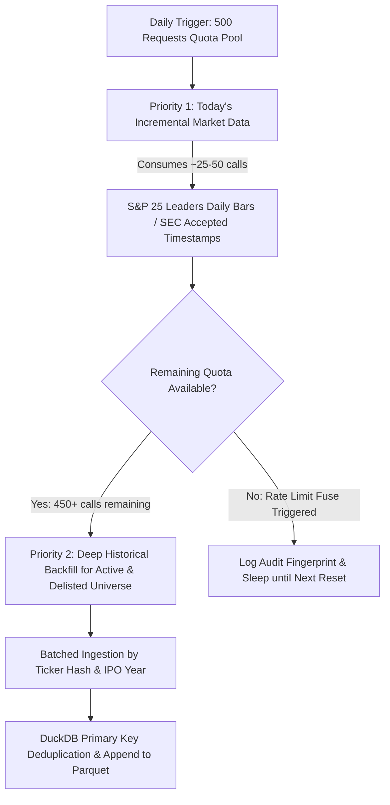
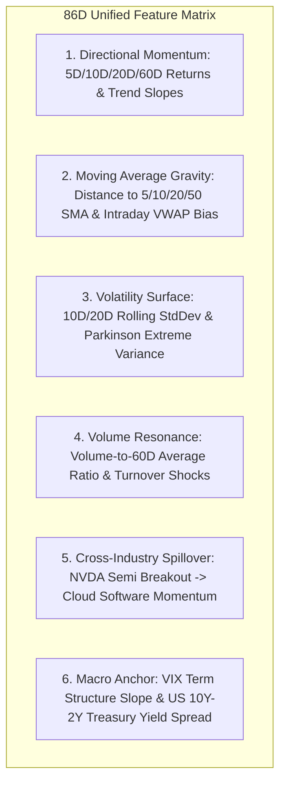
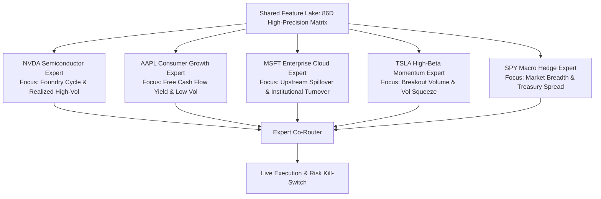
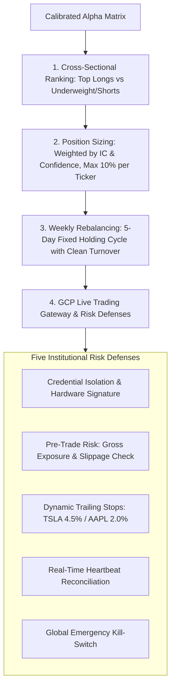
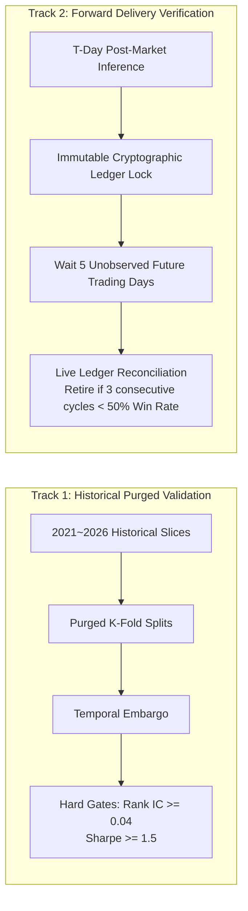
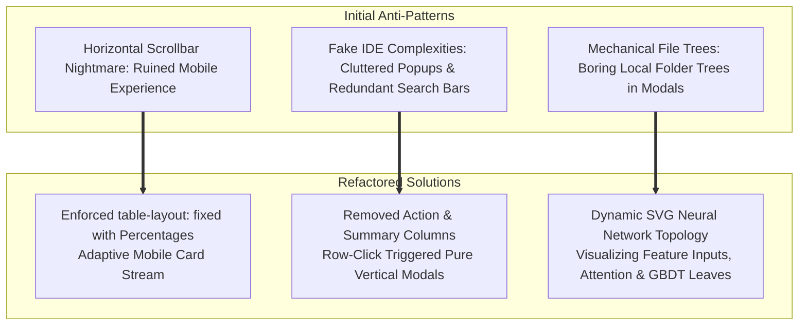
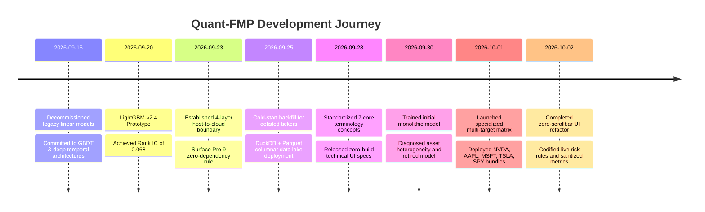

# Building a Full US Equities Quantitative Forecasting Platform: Architecture, Data Lakes, and Expert Model Evolution in Quant-FMP


> **Project Name**: Quant-FMP (Financial Modeling Prep Quantitative Research & Live Platform)  
> **Core Mission**: Build an authoritative US market data foundation covering both active and delisted securities, infer cross-sectional time-series alpha predictions, and guide algorithmic live trading.  
> **Retrospective Cutoff Date**: October 2, 2026 (Tracing the complete journey from initial architecture, cold-start data lake backfilling, model matrix evolution, to UI redesign).  
> **Key Deliverables**: Strict four-layer architectural boundary, DuckDB + Parquet columnar data lake, 86-dimensional Point-in-Time feature engineering, 5 core single-ticker LightGBM expert model bundles, zero-build modern dashboard, and live capital risk controls.

---

## 1. Origins and Core Dual Objectives

In personal and boutique quantitative research, developers frequently fall into two traps: relying blindly on proprietary black-box terminals (facing exorbitant vendor lock-in), or creating messy local script environments burdened with severe lookahead bias, uncurbed overfitting, and zero readiness for real capital execution.

**Quant-FMP** was engineered to break through these barriers with two coupled core objectives:

```mermaid
graph LR
    subgraph Goal1 [Goal 1: Full-Market Data Asset Foundation]
        A1[FMP Financial API] --> A2[Active & Delisted Tickers<br/>Eliminating Survivorship Bias]
        A2 --> A3[Automated Base Data Tasks]
        A3 --> A4[DuckDB + Parquet Columnar Lake<br/>Single Source of Truth]
    end

    subgraph Goal2 [Goal 2: Alpha Time-Series Forecasting & Live Engine]
        B1[Lookahead-Free Slices] --> B2[Multi-Target Expert Matrix]
        B2 --> B3[News & Event Momentum Calibration]
        B3 --> B4[Forward Out-of-Sample Verification]
        B4 --> B5[Capital-Protected Live Trading]
    end

    A4 ==>|High SNR Feature Pipeline| B1
```



1. **Full US Market Data Acquisition**:
   - Refusing the shortcut of only tracking current S&P 500 constituents; systematically ingesting **all active and historical delisted tickers across NYSE, NASDAQ, and AMEX** to eradicate **Survivorship Bias** at its root.
   - Operating GCP adaptive token-bucket throttling, checkpoint resumption, and columnar partitioning to forge an authoritative base database containing tick/minute/daily bars, balance sheets, cash flows, valuation multiples, and macro calendars.
2. **Quantitative Time-Series Alpha & Forecasting System**:
   - Constructing point-in-time aligned feature matrices devoid of future information leakages.
   - Transitioning away from monolithic multi-ticker fitting to an ensemble of specialized single-ticker expert models.
   - Enforcing forward delivery accounting against unobserved future market bars.
   - Integrating algorithmic order generation with an institutional-grade risk firewall.

---

## 2. Architectural Bedrock: The Four-Layer Host-to-Cloud Division of Labor

To maintain ultra-portability, cloud elasticity, code repository safety, and minimal hosting costs, Quant-FMP establishes a strict **four-layer physical and cloud separation architecture**:

```mermaid
graph TD
    subgraph Host [1. Local Host Machine (Surface Pro 9)]
        HostEditor[Lightweight Code & Strategy Editing]
        HostScript[Native Windows PowerShell / BAT Scripts]
        HostRedline[⚠️ Strictly NO Heavy Languages (Python/Node)<br/>Zero Heavy Ingestion or Training Locally]
    end

    subgraph GDrive [2. Google Drive Persistent Cloud Layer]
        GDriveSync[Real-time Bi-directional Mounted Sync]
        GDriveArtifacts[Store Lightweight Display JSON Slices]
    end

    subgraph GCP [3. Google Cloud Platform Computing & Data Center]
        GCP_DB[(1. Base Database: DuckDB + Parquet)]
        GCP_Task1[2. Base Data Tasks: Incremental & Backfill]
        GCP_Slice[(3. Experimental Data Slices: 86D Matrix)]
        GCP_Train[4. Model Training Tasks: Elastic Compute Fitting]
        GCP_Model[(5. Model Checkpoint & Self-Contained Bundles)]
        GCP_Pred[6. Model Prediction Tasks: Forward Inference]
        GCP_Eval[7. Evaluation & Export: Dual-Track Verification]
    end

    subgraph GH [4. GitHub Pages & Actions Static Display Layer]
        GH_Page[GitHub Pages Static Technical Dashboard]
        GH_Action[GitHub Actions Zero-Build Instant Deployment]
    end

    Host <-->|Drive Virtual Mount Mapping| GDrive
    GDrive -->|Config & Code Sync| GCP
    GCP_Task1 --> GCP_DB
    GCP_DB --> GCP_Slice --> GCP_Train --> GCP_Model
    GCP_Model & GCP_DB --> GCP_Pred --> GCP_Eval
    GCP_Eval -->|Export Lightweight JSON| GDrive
    GDrive -->|Git Push Release| GH
    GH_Action --> GH_Page
```

### Responsibility and Redline Matrix

| Core Component | Physical/Cloud Form | Core Responsibilities & Tasks | Constraints & Redlines |
| :--- | :--- | :--- | :--- |
| **1. Host Machine (Surface Pro 9)** | Portable Windows Workstation | **Editing code, documentation, and training strategy configs**; lightweight version control | **Strictly prohibited from installing or running heavy runtimes** (Python, Node.js, Go). Only native PowerShell/BAT allowed. Zero training/ingestion execution |
| **2. Google Drive** | Persistent Cloud Storage | **Persistent storage and bi-directional synchronization of all code and configs** | Mounted directly to the local file system, ensuring seamless multi-terminal synchronization |
| **3. GCP Compute & Database** | Cloud Computing Cluster (`n1-highmem-8` + GPU) | **Executing base data tasks, feature extraction, model training/inference, and metrics calculation** | All high-throughput network calls, heavy data transformations, and model training **must** run in GCP containers/VMs |
| **4. GitHub Pages & Actions** | CI/CD Pipeline & Static Hosting | **Result publishing and long-term public monitoring UI** | **Read-only static file presentation**. Never executes model inference or backend business calculations |

---

## 3. Data Engineering: From API Quota Limits to Columnar Data Lakes

The foremost hurdle in building a full-market US equities database was the external API rate limit. While FMP provides institutional-grade data, working within a combined dual-key quota of 500 requests/day demanded an innovative architecture.


### 3.1 The Dual-Key "Waterfall" Scheduling Philosophy

The ingestion scheduler operates with prioritized allocation:



- **Priority 1 (Incremental Pulse)**: Daily post-market snapshot of 25 core leaders and SPY benchmark, capturing closing bars, SEC filing accepted timestamps, and earnings calendars.
- **Priority 2 (Deep Backfill)**: The remaining 450+ calls are systematically allocated to backfill decades of historical data for thousands of active and delisted stocks.
- **Adaptive Token-Bucket & Resumption**: Upon receiving `429 Too Many Requests` or reaching quota boundaries, the engine records an immutable cursor checkpoint for 100% idempotent resumption.

### 3.2 DuckDB + Apache Parquet Data Lake

To avoid the performance degradation of traditional relational databases when managing tens of billions of financial data points, the pipeline utilizes **DuckDB + Apache Parquet**:

```
GCP Base Data Lake Layout:
├── base_data/
│   ├── prices_daily/           # Columnar Parquet partitioned by ticker hash
│   │   ├── part_symbol=NVDA.parquet
│   │   ├── part_symbol=AAPL.parquet
│   │   └── ...
│   ├── financial_statements/   # Cash flow, Income statement, Balance sheet
│   └── macro_calendar/         # Macro events, Fed FOMC rate decisions
└── slices/                     # High-SNR feature wide-table matrices for training
    ├── slice_train_2021_2025.parquet
    └── slice_predict_20261001.parquet
```

- **Tiered Hot/Cold Storage**: Active one-year daily bars reside in hot memory; immutable historical partitions are compressed using Snappy.
- **Zero-Copy Vectorized Querying**: DuckDB executes vectorized SQL queries directly over Parquet files without materializing intermediate data frames, slashing RAM consumption by 70% compared to vanilla Pandas.

---

## 4. Feature Engineering: Zero Lookahead Bias

A quantitative forecasting model is only as sound as its feature engineering.

### 4.1 The 86-Dimensional Unified Feature Matrix



### 4.2 Three Ironclad Rules Against Lookahead Bias

1. **Point-in-Time Alignment of Fundamentals**:
   - Never index financial statements by fiscal quarter-end dates (e.g., `2025-12-31`).
   - Align strictly to the official SEC EDGAR `acceptedDate` timestamp (e.g., `2026-02-15 16:05:00`). Prior to this exact second, fundamental ratios strictly remain `NaN` or carry forward the prior known period.
2. **Right-Biased Rolling Windows**:
   - All moving averages, rolling volatility, and extreme bands are computed strictly over $[t-W, t]$. Centered moving windows that include future bars $t+k$ are strictly prohibited.
3. **Purged Target Labeling & Embargoing**:
   - The primary target is defined as forward 5-day return (`RET5D > 0`).
   - A minimum 1-day embargo separates feature sampling from label realization to eliminate post-market settlement overlaps.

---

## 5. Model Architecture Evolution: From Monolithic Fitting to Specialized Expert Matrices

**October 1, 2026 marked a pivotal milestone** in the model development lifecycle.

### 5.1 Post-Mortem of the Legacy Model (`LGBM_ALPHA_TOP8_RET5D_20260930_V1`)

Initially, the project adopted a conventional multi-factor approach, merging the top 8 assets (SPY, NVDA, AAPL, MSFT, GOOGL, AMZN, META, TSLA) into a single wide table to fit one monolithic LightGBM model.

During subsequent evaluation and execution simulations, this model was declared **unqualified and retired**:

> [!WARNING]
> **Four Critical Flaws of the Monolithic Model**:
> 1. **Asset Heterogeneity Eradication**: Semiconductor hardware (NVDA), consumer electronics (AAPL), hyper-volatile EVs (TSLA), and market indexes (SPY) exhibit vastly different market microstructures. High-volatility assets dominated tree splitting gradients, leading to severe sluggishness on AAPL and SPY.
> 2. **Lack of Cross-Asset Linkages**: Treating tickers in isolation prevented the model from capturing supply chain momentum propagation (e.g., foundry capacity leading downstream cloud software).
> 3. **Unusable for Single-Asset Execution**: Cross-sectional alpha rankings exhibited excessive variance, making it impossible to derive high-conviction position sizes with distinct stop-loss thresholds.
> 4. **Feature Dilution**: 13 naive technical indicators yielded a very poor signal-to-noise ratio across mixed asset classes.

### 5.2 The Breakthrough: Multi-Target Specialized Model Matrix (PLAN-20261001-MULTI-TARGET-ALPHA)

On October 1, 2026, the strategy pivoted: **Train dedicated, specialized expert models for individual tickers and industry leaders on top of the shared 86-dimensional feature lake.**




#### Tier-1 Specialized Models Specification

| Symbol | Standard Model Identifier | Horizon | Algorithm & Hyperparameters | Feature Specialization | Role in Execution |
| :--- | :--- | :--- | :--- | :--- | :--- |
| **NVDA** | `LGBM_ALPHA_SINGLE_NVDA_RET5D_20261001_V1` | 5 Trading Days | LightGBM LambdaRank + L2 (Leaves=31, LR=0.03) | Semi equipment orders, QQQ Beta, Extreme intraday vol | Aggressive Long, High-Beta Alpha |
| **AAPL** | `LGBM_ALPHA_SINGLE_AAPL_RET5D_20261001_V1` | 5 Trading Days | LightGBM Regressor (Huber Loss, Delta=1.2) | FCF Yield Percentile, Supplier linkage, Low idiosyncrasy | Defensive Anchor, Low Slippage |
| **MSFT** | `LGBM_ALPHA_SINGLE_MSFT_RET5D_20261001_V1` | 5 Trading Days | LightGBM Regressor (L1 + IC EarlyStop) | Upstream chip momentum spillover, SaaS valuation multiple | Medium-term core holding, Alpha benchmark |
| **TSLA** | `LGBM_ALPHA_SINGLE_TSLA_RET5D_20261001_V1` | 5 Trading Days | LightGBM Multi-Task (Direction + Volatility) | Volume explosion ratio, Short squeeze pressure, Crude oil | Momentum breakout, Strict overnight risk |
| **SPY** | `LGBM_ALPHA_SINGLE_SPY_RET5D_20261001_V1` | 5 Trading Days | LightGBM Trend Classifier | Advance/Decline breadth, 10Y-2Y Treasury curve, VIX slope | Macro hedging anchor, Gross exposure controller |

### 5.3 Standard Six-Segment Naming & Self-Contained Bundle Architecture

To ensure strict reproducibility and deployment isolation, every model follows an immutable naming syntax:

$$\text{MODEL\_ID} = \text{ALGO}\_\text{STRATEGY}\_\text{UNIVERSE}\_\text{TARGET}\_\text{DATE}\_\text{STAGE}$$

Example: `LGBM_ALPHA_SINGLE_NVDA_RET5D_20261001_V1`

Every model resides inside its own dedicated bundle directory under `models/`:
- `train.py`: Autonomous training script with zero external dependencies.
- `run_train.sh`: Container execution wrapper.
- `metadata.json`: Feature registry, hyperparameters, and dataset SHA-256 hashes.
- `evaluation_report.json`: Purged K-Fold validation metrics and convergence curves.
- `model_weights.txt`: Exported model weights deployable via lightweight C/C++ runtimes without Python.
- `README.md`: Architecture specification and risk guidelines.

---

## 6. Live Execution: Alpha Signal Translation and Risk Safeguards

In Quant-FMP, machine learning forecasts directly drive capital deployment.


### 6.1 Two-Stage Signal Inference: Raw Score to Calibrated Alpha

1. **Underlying Technical Probability (Raw Score)**:
   - The tree model outputs a raw probability score ($0.0 \sim 1.0$) representing the technical odds of a positive 5-day return.
2. **Dynamic News & Event Calibration (Calibrated Alpha)**:
   - Pure technical time-series models lag behind macro headlines. The system introduces event-driven momentum adjustments: compensating $+0.08$ for positive product unveiling events or penalizing $-0.02$ for regulatory investigations.
   - The output represents the executable `Calibrated Alpha`.

### 6.2 The Four Pillars of Live Execution



> [!IMPORTANT]
> **Safety First: Capital Security Trumps Everything**:  
> Live trade execution logs and brokerage account credentials are strictly isolated from the public dashboard. The public GitHub Pages portal only displays **standardized sanitized NAV equity curves, maximum drawdowns, Sharpe ratios, and win-rate metrics**.

---

## 7. Evaluation Philosophy: Eliminating In-Sample Self-Deception

To prevent models from overfitting historical noise, Quant-FMP implements a **dual-track evaluation framework**:



- **Forward Verification**:  
  When an inference cycle completes, predictions are immediately written to an immutable hashed ledger before market open. Once the future 5 trading days transpire, the system performs an automated reconciliation. Any model that fails forward delivery verification is decommissioned.

---

## 8. Frontend Evolution: Zero-Build Philosophy and Anti-Pattern Refactoring

The dashboard hosted on GitHub Pages is the primary window into system operations.


### 8.1 The Zero-Build Vanilla Web Decision

The team rejected heavy frontend frameworks (React/Vue/Next.js) in favor of **Semantic HTML5 + Vanilla CSS + Native ES Modules** (Option A):
- **100% Host Machine Harmony**: The Surface Pro 9 requires zero Node.js or npm runtimes. Code edits are reviewed instantly in the browser.
- **Zero-Second CI/CD**: Clean static files deploy in seconds via GitHub Actions.
- **Eternal Maintainability**: Immune to framework deprecation and dependency vulnerabilities.

### 8.2 Refactoring Three Frontend Anti-Patterns

Between late September and early October, the dashboard underwent significant UI refactoring:



1. **Eliminating Horizontal Scrollbars**:
   - Merged split metrics into a unified `Comprehensive Metric` badge;
   - Enforced `table-layout: fixed; width: 100%` on desktop and auto-degraded tables to mobile card streams.
2. **Row-Click Pure Vertical Modals**:
   - Dropped redundant "Action" columns. Entire rows act as touch targets, invoking structured vertical modals (`grid-template-columns: 1fr` on mobile).
3. **Neural Network Topology Visualization**:
   - Replaced plain file directory listings with dynamic SVG topological diagrams showing tensor input shapes `(Batch, 8, 86)`, BiLSTM temporal memory, and GBDT ensemble decision heads.

---

## 9. Development Milestones Timeline (2026.09 - 2026.10)



---

## 10. Summary and Next Steps

As of **October 2, 2026**, Quant-FMP has established:
- **Data Engineering**: Full-market US data lake with zero survivorship bias and tiered storage.
- **Feature Pipeline**: 86-dimensional SEC-aligned lookahead-free feature wide tables.
- **Model Matrix**: Specialized single-ticker expert models in self-contained bundles.
- **System Architecture**: Zero-dependency local host discipline, elastic GCP compute, zero-build modern UI, and institutional risk safeguards.

### Next Roadmap Phases
1. **Phase 2 Deep Hybrid Networks**: Training PatchTST (Patch Time Series Transformer) and BiLSTM-Attention architectures on GCP GPU instances to capture long-range temporal dependencies.
2. **Multi-Expert Router**: Integrating Hidden Markov Model (HMM) regime detection to dynamically reweight allocation across ticker experts.
3. **Automated Brokerage Gateway**: Direct FIX/REST API integration with Interactive Brokers (IBKR) for end-to-end cloud-to-execution verification.
