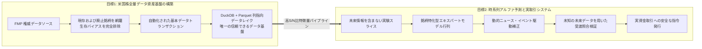
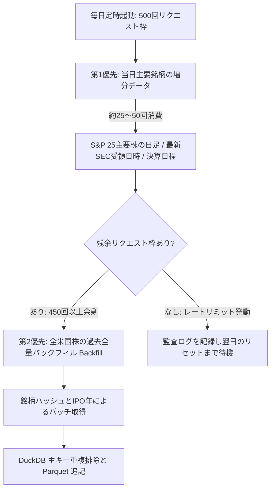
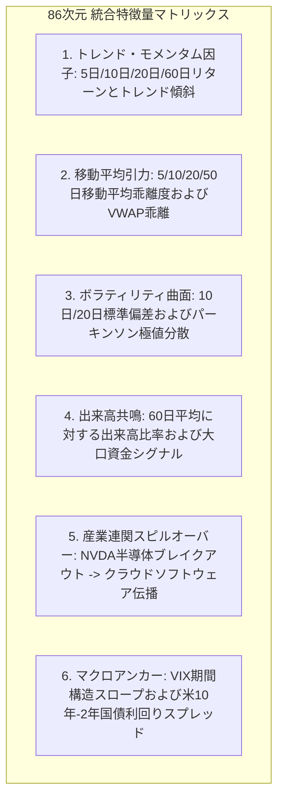
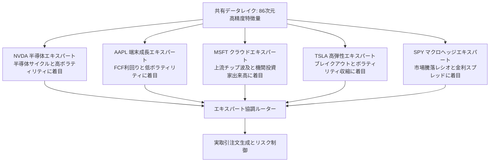
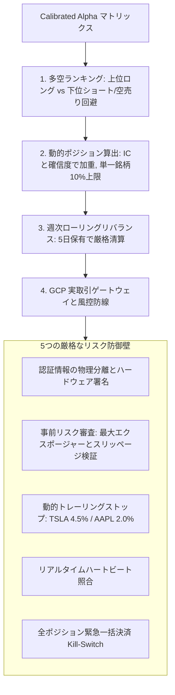
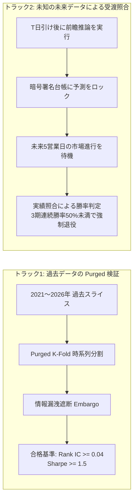
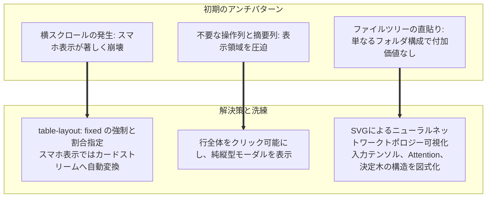
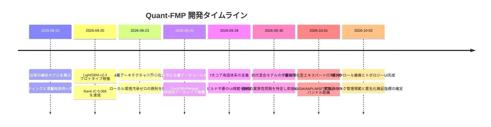

# 米国株全市場クオンツ予測プラットフォームの構築：Quant-FMP のアーキテクチャ分担、データレイク、およびエキスパートモデル進化の全景


> **プロジェクト名**：Quant-FMP (Financial Modeling Prep Quantitative Research & Live Platform)  
> **中核ミッション**：FMP 金融データソースを基盤に、現存および上場廃止を含む全米国株データ資産を構築し、多空（ロング・ショート）時系列アルファを推論し、実資金取引を支援する  
> **振り返り基準日**：2026年10月2日（設計立案、データレイクのコールドスタート、モデル行列の進化からダッシュボードの全面改修まで）  
> **主要成果物**：4層アーキテクチャ境界、DuckDB+Parquet 列指向データレイク、86次元 Point-in-Time 特徴量エンジニアリング、主要5銘柄の LightGBM 自己完結型 Bundle、ビルド不要のモダンUI、実取引リスク管理基盤

---

## 1. プロジェクトの背景と二大目標

個人や小規模チームによるクオンツ開発では、商用ブラックボックス端末に依存して高額なコストを強いられるか、ローカル環境に過剰な依存関係を乱立させて先読みバイアス（Lookahead Bias）や過学習を招くかの二極化に陥りがちでした。

**Quant-FMP** は、これらの課題を根本から打破するために、密接に連動する**二大目標**を設定しました：



1. **米国株全データ体系の構築 (Full US Market Data Acquisition)**：
   - 「S&P 500 現存構成銘柄のみを分析する」という安易なアプローチを徹底排除。**NYSE、NASDAQ、AMEX の全現存銘柄および過去の上場廃止銘柄**を完全に網羅し、**生存バイアス（Survivorship Bias）**を根本から排除します。
   - GCP の自律適応型トークンバケットレートリミット、チェックポイント再開、列指向パーティションを活用し、日足・分足、財務3表、バリュエーション指標、マクロイベントを単一の真実データベースとして蓄積します。
2. **クオンツ時系列予測システム (Stock Forecasting & Alpha Research)**：
   - SEC 公式開示タイムスタンプに厳格に準拠した先読みバイアスゼロの特徴量エンジニアリング。
   - 単一混合モデルの限界を打破し、個別銘柄に特化した専属エキスパートモデル群を構築。
   - 事後受渡（Forward Verification）による厳格な実運实验証。
   - 機関投資家基準のリスク管理防壁と連動した売買シグナル生成エンジン。

---

## 2. アーキテクチャの根幹：物理・クラウド4層分離の鉄則

可搬性、クラウドアジリティ、コード資産の保護、および最小の維持コストを両立させるため、プロジェクトでは**4層の分離アーキテクチャ**を確立しました：

```mermaid
graph TD
    subgraph Host [1. ローカル端末 (Surface Pro 9)]
        HostEditor[コード・設定ファイルの軽量編集]
        HostScript[Windows 標準 PowerShell / BAT スクリプト]
        HostRedline[⚠️ 重い言語環境（Python/Node等）の導入禁止<br/>重いデータ取得や学習処理の実行禁止]
    end

    subgraph GDrive [2. Google Drive クラウド永続層]
        GDriveSync[双方向マウントによるリアルタイム同期]
        GDriveArtifacts[軽量表示用 JSON スライスおよび文書の保管]
    end

    subgraph GCP [3. Google Cloud Platform 計算・データ基盤]
        GCP_DB[(1. 基本データベース: DuckDB + Parquet)]
        GCP_Task1[2. 基本データトランザクション: 増分取得とバックフィル]
        GCP_Slice[(3. 実験データスライス: 86次元特徴量行列)]
        GCP_Train[4. モデル学習トランザクション: クラウド計算資源]
        GCP_Model[(5. モデルチェックポイント & 自己完結Bundle)]
        GCP_Pred[6. モデル予測トランザクション: 最新断面推論]
        GCP_Eval[7. 結果評価と切片出力: 二重検証機構]
    end

    subgraph GH [4. GitHub Pages & Actions 静的ホスティング層]
        GH_Page[GitHub Pages 静的技術ダッシュボード]
        GH_Action[GitHub Actions ビルド不要の即時自動配信]
    end

    Host <-->|仮想ドライブマウント| GDrive
    GDrive -->|設定とコード同期| GCP
    GCP_Task1 --> GCP_DB
    GCP_DB --> GCP_Slice --> GCP_Train --> GCP_Model
    GCP_Model & GCP_DB --> GCP_Pred --> GCP_Eval
    GCP_Eval -->|軽量JSON出力| GDrive
    GDrive -->|Gitコミット公開| GH
    GH_Action --> GH_Page
```

### 4大コンポーネントの責任範囲と厳格な規約

| コアコンポーネント | 物理/クラウド形態 | 主な責務と対象トランザクション | 行動制約とレッドライン |
| :--- | :--- | :--- | :--- |
| **1. 端末 (Surface Pro 9)** | ローカル可搬ワークステーション | **すべての文書、コード、学習戦略設定の軽量編集**；軽量 Git 運用 | **重い実行環境（Python、Node.js、Go 等）のローカル導入・実行を全面禁止**。標準 PowerShell/BAT のみ許可し、重いデータ処理や学習は一切行わない |
| **2. Google Drive** | クラウド永続ストレージ | **すべての文書・コード・軽量設定の永続保管と同期** | ローカル仮想ドライブとして直接マウント。開発端末とクラウド計算環境間のアセット整合性を保証 |
| **3. GCP 計算・データベース** | クラウド計算クラスタ (`n1-highmem-8` + GPU) | **基本データトランザクション、特徴量抽出、モデル学習・推論、評価スライスの生成** | 高スループットな API 取得、大規模列指向クレンジング、モデル学習は**必ず** GCP コンテナ/VM 上で実行する |
| **4. GitHub Pages / Actions** | CI/CD パイプライン・静的ホスティング | **結果公開および長期運用ダッシュボード (UI)** | **完全静的ファイルによる読み取り専用表示**。バックエンドのビジネス計算や推論処理は一切行わない |

---

## 3. データエンジニアリング：API制限の克服と列指向データレイク

米国株全市場のデータを収集するにあたり、最大の難関は外部 API のリクエスト制限でした。FMP のデュアルキー（合計 500回/日）という枠内で、**日々の最新市況の反映**と**数千銘柄に及ぶ過去数十年の全量バックフィル**をいかに両立させるかが課題となりました。


### 3.1 デュアルキー・ウォーターフォール（Waterfall）スケジューリング



- **第1優先（高頻度増分）**：引け後に 25 の主要銘柄および市場ベンチマーク（SPY）の日足、SEC 受領公式タイムスタンプ、マクロ日程を確実に収集；
- **第2優先（全量バックフィル）**：余剰となった 450 回以上の枠を過去データのバックフィルに充当し、数十年分の全米国株データを段階的に網羅；
- **自律型トークンバケットと中断再開**：API 境界（429 エラー）に到達した場合、カーソルチェックポイントを永続化し、次回の冪等な再開を保証します。

### 3.2 DuckDB + Apache Parquet 列指向データレイク

数千億ポイントに達する時系列データを高速に処理するため、**DuckDB + Apache Parquet** 構造を採用しました：

```
GCP 基本データレイク構成:
├── base_data/
│   ├── prices_daily/           # 銘柄ハッシュで分割された Parquet ファイル
│   │   ├── part_symbol=NVDA.parquet
│   │   ├── part_symbol=AAPL.parquet
│   │   └── ...
│   ├── financial_statements/   # 財務3表（CF、PL、BS）
│   └── macro_calendar/         # マクロ指標および FOMC 会合
└── slices/                     # 学習用の高S/N比特徴量スライス
    ├── slice_train_2021_2025.parquet
    └── slice_predict_20261001.parquet
```

- **冷熱データ分離**：直近1年のホットデータと、Snappy で圧縮された不変の過去パーティションを階層管理；
- **ゼロコピーによるベクトル化クエリ**：DuckDB を使用して Parquet ファイルから直接ベクトル化 SQL を実行し、Pandas と比較してメモリ使用量を 70% 削減、クエリ速度を数十倍に向上させました。

---

## 4. 特徴量エンジニアリング：先読みバイアスの徹底排除

### 4.1 86次元の統合特徴量マトリックス



### 4.2 先読みバイアス（Lookahead Bias）を防ぐ3大鉄則

1. **財務諸表の Point-in-Time 厳格整合**：
   - 四半期末日（例：`2025-12-31`）を特徴量有効時刻として使用することを厳禁；
   - SEC EDGAR の公式開示時刻（`acceptedDate`、例：`2026-02-15 16:05:00`）に厳格にアライメント。開示前のタイムスタンプでは厳格に NaN または前期確定値を維持。
2. **右偏置（Right-Biased Window）の徹底**：
   - 移動平均やボラティリティの算出ウィンドウは常に $[t-W, t]$ に限定し、未来を含む移動平均を禁止。
3. **ラベル設計とエンバーゴ（Embargo）**：
   - 予測対象は将来5営業日の超過リターン（`RET5D > 0`）；
   - 特徴量とラベルの間に1営業日の受渡バッファを設け、引け後データと寄り前推論の情報漏洩を遮断。

---

## 5. モデルの進化：単一混合モデルから銘柄特化型エキスパート行列へ

**2026年10月1日は、モデル開発における決定的な転換点**となりました。

### 5.1 旧モデル（`LGBM_ALPHA_TOP8_RET5D_20260930_V1`）の教訓と退役

初期段階では、主要8銘柄（SPY、NVDA、AAPL、MSFT、GOOGL、AMZN、META、TSLA）を単一の大きなテーブルに統合し、1つの LightGBM モデルで学習を行っていました。

しかし、詳細な検証において、このモデルは**不合格と判定され、直ちに退役**となりました：

> [!WARNING]
> **単一混合モデルが抱えていた4大欠陥**：
> 1. **銘柄の異質性の平滑化**：半導体（NVDA）、消費者向け端末（AAPL）、高ボラティリティEV（TSLA）、大盤インデックス（SPY）では市場構造が全く異なります。高ボラティリティ銘柄が勾配を支配し、AAPL や SPY に対して予測が著しく鈍化しました；
> 2. **サプライチェーン連動の欠落**：銘柄が孤立して扱われ、半導体設備から下流クラウドへのモメンタム波及を捉えられませんでした；
> 3. **個別銘柄ポジションへの変換不能**：クロスセクショナルなランク予測の分散が大きすぎ、明確な損切りラインを持った注文にマッピングできませんでした；
> 4. **過学習とノイズ比率の悪化**：単一テーブル化により特徴量の S/N 比が著しく低下しました。

### 5.2 飛躍：銘柄特化型エキスパートモデル計画 (PLAN-20261001-MULTI-TARGET-ALPHA)

2026年10月1日、方針を根本的に転換：**共通の86次元特徴量データレイクを共有しつつ、個別銘柄ごとに専用のエキスパートモデルを学習する体制へと移行**しました。




#### 第1陣エキスパートモデルの技術仕様一覧

| 銘柄コード | 標準モデル識別子 | 予測期間 | アルゴリズム・超パラメータ | 特徴量フォーカス | 取引上の役割 |
| :--- | :--- | :--- | :--- | :--- | :--- |
| **NVDA** | `LGBM_ALPHA_SINGLE_NVDA_RET5D_20261001_V1` | 将来5営業日 | LightGBM LambdaRank + L2 (Leaves=31, LR=0.03) | 半導体受注伝播、NASDAQベータ、日中高ボラティリティ | 主力攻撃ロング、高弾性アルファ |
| **AAPL** | `LGBM_ALPHA_SINGLE_AAPL_RET5D_20261001_V1` | 将来5営業日 | LightGBM Regressor (Huber Loss, Delta=1.2) | フリーCF利回り分位、サプライチェーン連動、低固有変動 | 主力防衛ベース、低スリッページ |
| **MSFT** | `LGBM_ALPHA_SINGLE_MSFT_RET5D_20261001_V1` | 将来5営業日 | LightGBM Regressor (L1 + IC EarlyStop) | 上流チップモメンタム波及、SaaSプレミアム | 中期スイング保有、超過収益基準 |
| **TSLA** | `LGBM_ALPHA_SINGLE_TSLA_RET5D_20261001_V1` | 将来5営業日 | LightGBM Multi-Task (方向 + 変動ペナルティ) | 出来高急増レシオ、ショートカバー圧力 | モメンタム突破、厳格な日跨ぎ管理 |
| **SPY** | `LGBM_ALPHA_SINGLE_SPY_RET5D_20261001_V1` | 将来5営業日 | LightGBM Trend Classifier | 市場騰落銘柄数、米10Y-2Y利差、VIXスロープ | マクロヘッジ、総エクスポージャー制御 |

### 5.3 標準6セグメント命名と自己完結型 Bundle ディレクトリ

モデルの完全な再現性と本番展開の独立性を担保するため、厳格な**6セグメント命名規則**と**自己完結型 Bundle** を導入しました：

$$\text{MODEL\_ID} = \text{ALGO}\_\text{STRATEGY}\_\text{UNIVERSE}\_\text{TARGET}\_\text{DATE}\_\text{STAGE}$$

各モデルは `models/` 配下に**同名の独立ディレクトリ**を持ち、学習から展開に必要な全ファイルを内包します：
- `train.py`：外部ライブラリの動的依存を持たない完全自立型学習コード；
- `run_train.sh`：GCP コンテナ実行用シェル；
- `metadata.json`：特徴量リスト、ハイパーパラメータ、データセットハッシュ；
- `evaluation_report.json`：Purged K-Fold 検証メトリクスと収束曲線；
- `model_weights.txt`：Python 不要で C/C++ 等の軽量ランタイムから直接ロード可能な重みファイル；
- `README.md`：アーキテクチャ設計および運用指針。

---

## 6. 実戦投入：多空判断と実取引リスク管理基盤


### 6.1 2段階のシグナル推論：純量価スコアと動的イベント補正

1. **下層マシンビジョン (Raw Score)**：
   - 86次元の特徴量に基づき、将来5日間の上昇確率スコア（$0.0 \sim 1.0$）を出力。
2. **上層イベント駆動補正 (Calibrated Alpha)**：
   - 純粋な時系列データは突発ニュースに対して遅延します。重大な新製品発表などにはプラス補正（$+0.08$）、規制リスク等にはマイナス補正（$-0.02$）を動的に加算し、取引判定用の `Calibrated Alpha` を導出します。

### 6.2 実取引を守る4つの柱と安全防壁



> [!IMPORTANT]
> **実資金の安全性を最優先とする原則 (Safety First)**：  
> 一般公開されるダッシュボード上では、証券会社の口座番号や生の取引ログの公開を厳禁とし、GitHub Pages では匿名化・標準化された**純資産推移曲線（NAV）**、**最大ドローダウン**、**シャープレシオ**、**勝率**のみを公開します。

---

## 7. 評価哲学：既知データによる自己欺瞞の排除

過学習による「バックテスト上の虚構」を排除するため、**二重検証システム**を導入しています：



- **フォワード受渡検証（Forward Verification）**：  
  予測生成後、未発生の未来市場の前に予測結果を改ざん不可能な台帳に記録。5営業日が経過した後に実績値と自動照合を行い、これを通過できないモデルは即座に実運用から除外されます。

---

## 8. フロントエンドの進化：ビルド不要の哲学とアンチパターンの打破


### 8.1 ビルド不要のネイティブ構成への確信

一般的な重量フレームワーク（React/Vue/Next.js）を採用せず、**HTML5 + Vanilla CSS + 原生 ES Modules**（案A）を貫徹しました：
- **開発端末の負担ゼロ**：Surface Pro 9 に Node.js や npm を一切導入することなく、即座にブラウザ確認が可能；
- **秒速の CI/CD 配信**：GitHub Actions による静的ファイルの即時デプロイ；
- **永遠の保守性**：パッケージのバージョン崩壊や非推奨化リスクから完全に解放。

### 8.2 3大アンチパターンの打破とUIリファクタリング

9月下旬から10月初頭にかけて、UI表示の大規模な改善を実施しました：



1. **横スクロールの完全撤廃**：
   - 分離していた `Rank IC` と `Sharpe` を1つの複合バッジに統合；
   - `table-layout: fixed; width: 100%` を徹底し、モバイル画面では自動的に縦並びカード形式へと切り替え。
2. **行クリックによる純縦型モーダル**：
   - 表内の「操作」列や「摘要」列を撤廃。行全体をクリックターゲットとし、レスポンシブな縦型モーダルで全景情報を表示。
3. **本格的なネットワークトポロジー図**：
   - 意味のないフォルダツリー表示を廃止し、入力テンソル `(Batch, 8, 86)`、双方向時系列記憶（BiLSTM/Attention）、決定木（GBDT 31 Leaves）の流れを示す SVG トポロジー図を動的描画。

---

## 9. 開発マイルストーン (2026.09 〜 2026.10)



---

## 10. 総括と今後の展望

**2026年10月2日現在**、Quant-FMP は以下の基盤を完成させました：
- **データ基盤**：生存バイアスを排除した全米国株の列指向データレイク；
- **特徴量基盤**：SEC 公式時間に厳格同期した86次元の先読みバイアスゼロ特徴量；
- **モデル基盤**：自己完結型 Bundle を備えた個別銘柄特化型エキスパートモデル行列；
- **システム基盤**：端末ゼロ依存、GCP クラウド計算、ビルド不要のモダンUI、実取引リスク管理基盤。

### 次期ロードマップ
1. **Phase 2 深層ハイブリッド時系列ネットワーク**：GCP GPU インスタンスを活用し、**PatchTST** や **BiLSTM-Attention** を組み込み、超長期時系列依存関係を学習；
2. **マルチエキスパート協調ルーター**：隠れマルコフモデル（HMM）によるマクロ状態識別を導入し、相場環境に応じてエキスパートモデル間の配分比率を動的最適化；
3. **証券会社 API 取引ゲートウェイの完全連動**：Interactive Brokers (IBKR) 等との接続を完了し、推論から実取引執行までの全自動化と実績公開を推進します。
