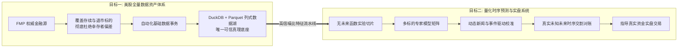
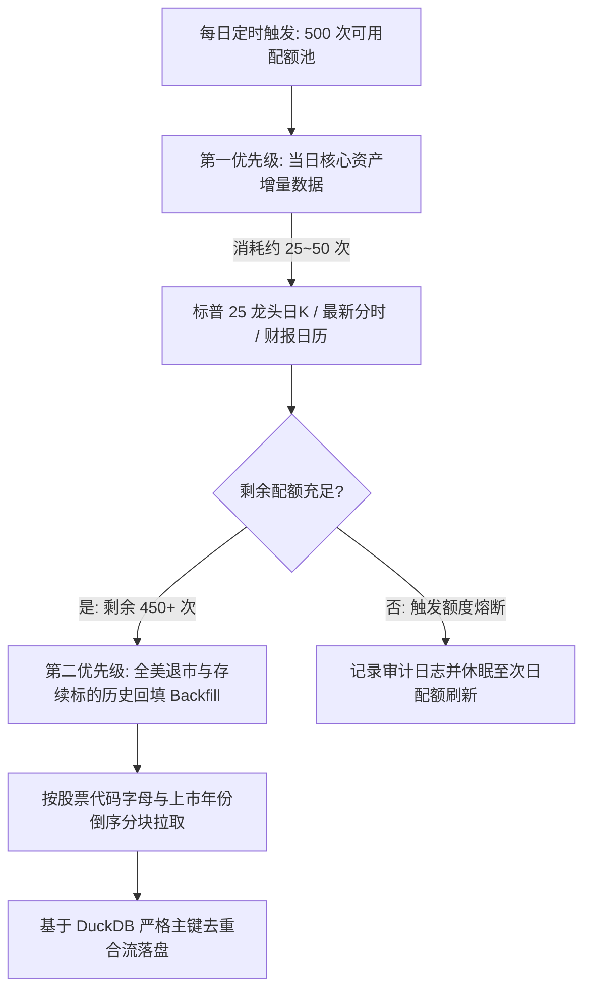
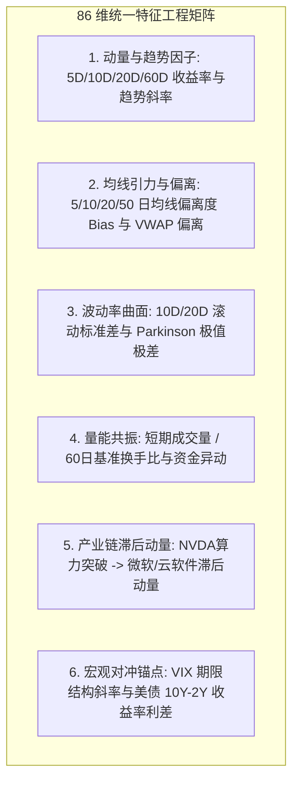
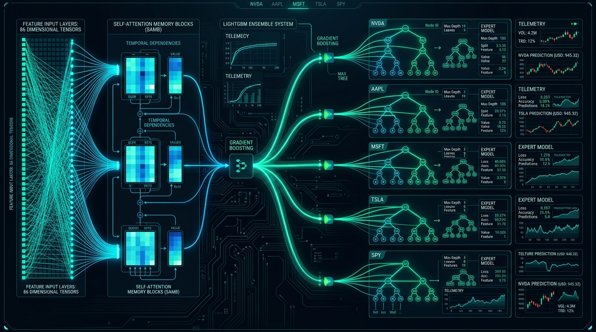
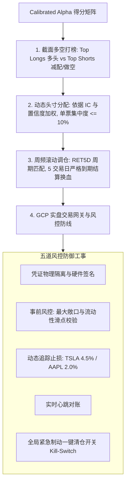
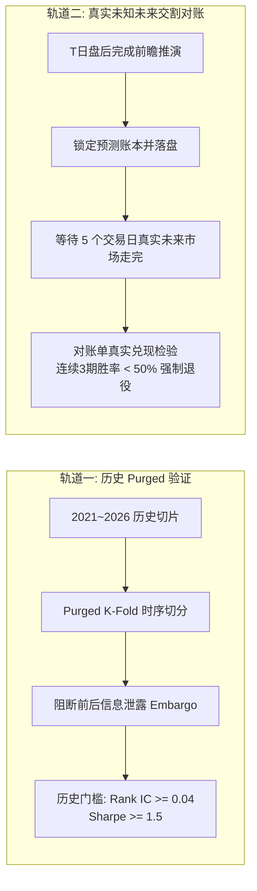
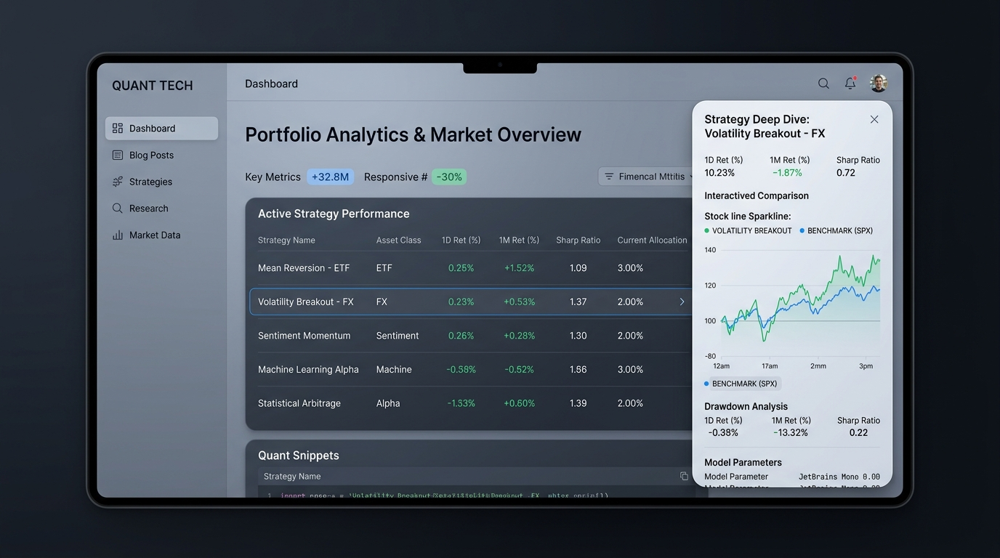
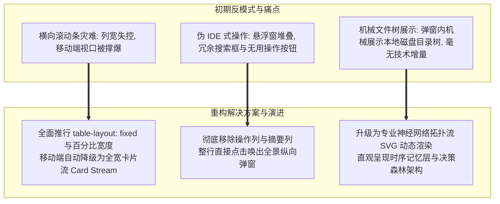
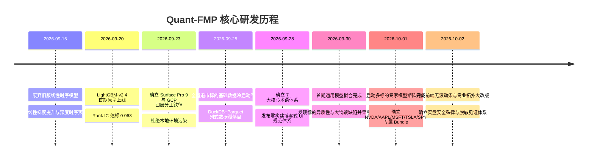

# 从零构建美股全市场量化预测平台：Quant-FMP 架构分工、数据湖构建与专家模型演进全景复盘


> **项目名称**：Quant-FMP (Financial Modeling Prep Quantitative Research & Live Platform)  
> **核心使命**：基于 FMP 权威数据源，构建覆盖美股存续与退市全量标的的数据资产底座，推演多空时序预测，赋能实盘交易决策  
> **复盘时间节点**：2026 年 10 月 2 日（涵盖从架构立项、数据湖冷启动、模型矩阵演化到前端看板重构的完整闭环）  
> **关键产出**：四层分工架构、DuckDB+Parquet 列式存储底座、86 维 Point-in-Time 特征工程、5 组核心单标的 LightGBM 专家模型自包含 Bundle、零构建现代前端看板与实盘安全防御铁律

---

## 1. 项目缘起与核心双目标

在传统个人或中小型量化研发中，开发者常常陷入两类极端：要么过度依赖商业量化终端（被黑盒数据与不可控成本绑架），要么在本地机器上堆叠臃肿的运行环境与临时脚本，导致数据前视偏差（Lookahead Bias）泛滥、过拟合严重，且无法承受真实资金的考验。

**Quant-FMP** 的诞生，旨在彻底打破上述桎梏，确立了相互咬合的**两大核心双目标**：



1. **美股全量数据体系构建 (Full US Market Data Acquisition)**：
   - 绝不妥协于“仅研究标普 500 现存成分股”的伪量化路径，必须完整收录 **NYSE、NASDAQ、AMEX 全量存续与历史退市标的**，从源头彻底杜绝**幸存者偏差（Survivorship Bias）**；
   - 依托 GCP 工业级自适应令牌桶限速、断点续传与列式存储，将高频行情、财务三张表、估值比率、宏观事件沉淀为唯一真实的基础数据库。
2. **量化与时序预测系统 (Stock Forecasting & Alpha Research)**：
   - 构建点对点对齐（Point-in-Time）的无未来函数特征工程；
   - 突破“多标的大锅饭拟合”的局限，打造单标的专属专家预测模型矩阵；
   - 执行前瞻推演并引入真实未知未来时序交割检验（Forward Verification）；
   - 建立高确定性多空头寸生成引擎与实盘安全防御铁律。

---

## 2. 架构基石：物理与云端的四大职责分工铁律

为了兼顾便携性、云端弹性算力、代码资产安全性与长期展示成本，项目确立了**四层物理/云端隔离架构**，并将其提升为不可动摇的研发红线：

```mermaid
graph TD
    subgraph Host [1. 本地宿主机 (Surface Pro 9)]
        HostEditor[代码与策略配置轻量编写]
        HostScript[原生 PowerShell / BAT 脚本]
        HostRedline[⚠️ 严禁本地安装 Python/Node 等重依赖<br/>不承担任何重度数据拉取与拟合计算]
    end

    subgraph GDrive [2. Google Drive 云端持久层]
        GDriveSync[实时全量挂载同步代码与策略]
        GDriveArtifacts[归档轻量级展示 JSON 切片与文档]
    end

    subgraph GCP [3. Google Cloud Platform 计算与数据中枢]
        GCP_DB[(1. 基础数据库: DuckDB + Parquet)]
        GCP_Task1[2. 基础数据事务: 批量增量与历史回填]
        GCP_Slice[(3. 实验数据切片: 86维特征宽表)]
        GCP_Train[4. 模型训练事务: 弹性算力拟合]
        GCP_Model[(5. 模型检查点与自包含 Bundle)]
        GCP_Pred[6. 模型预测事务: 最新截面推演]
        GCP_Eval[7. 结果评价与切片打包: 双轨制验证]
    end

    subgraph GH [4. GitHub Pages & Actions 静态展示层]
        GH_Page[GitHub Pages 纯静态技术看板]
        GH_Action[GitHub Actions 零构建秒级自动化发布]
    end

    Host <-->|文件系统挂载映射| GDrive
    GDrive -->|配置下发与代码同步| GCP
    GCP_Task1 --> GCP_DB
    GCP_DB --> GCP_Slice --> GCP_Train --> GCP_Model
    GCP_Model & GCP_DB --> GCP_Pred --> GCP_Eval
    GCP_Eval -->|输出轻量 JSON| GDrive
    GDrive -->|Git 提交发布| GH
    GH_Action --> GH_Page
```

### 四大组件职责边界与红线矩阵

| 核心组件 | 物理/云端形态 | 核心职责与对应事务 | 行为约束与红线 |
| :--- | :--- | :--- | :--- |
| **1. 宿主机 (Surface Pro 9)** | 本地便携工作站 (Windows) | **编辑所有文档、代码文件与模型训练策略配置**；轻量级 Git 操作 | **严禁安装与运行任何重度语言环境与依赖**（如本地 Python、Node.js、Go 等），仅允许原生 PowerShell / BAT，绝不承担数据拉取与拟合计算 |
| **2. Google Drive** | 云端硬盘持久化存储 | **持久化存储与双向同步所有文档与代码** | 直接挂载至宿主机本地虚拟盘符，保障宿主机与云端计算环境的跨端资产一致性 |
| **3. GCP 算力与数据库** | 云端计算集群与数据底座 (`n1-highmem-8` + GPU) | **执行基础数据事务、特征抽取、模型训练/预测事务与评价压缩** | 所有的 API 网络密集采集、大吞吐列式清洗、重度特征提取与模型训练**必须**在 GCP 云端容器/虚拟机内执行 |
| **4. GitHub Pages / Actions** | 自动化流水线与静态托管平台 | **结果发布与长期运行展示层 (UI)**：长期展示美股行情切片、训练日志与预测看板 | **纯静态文件与结果展示**，不负责执行任何预测推断或业务计算逻辑 |

---

## 3. 数据工程：从 API 额度危机到列式数据湖

在构建美股全市场基础数据的过程中，首要挑战是外部 API 的资源约束。FMP 提供的商业级接口功能全面，但在免费与进阶双 Key 配额下（合计 500 次/天），如何兼顾**每日最新行情入库**与**数千只股票跨度十余年的历史全量回填**？


### 3.1 双 Key 瀑布流（Waterfall）调度哲学

系统设计了极其精密的配额水位调度器：



- **第一优先级（高频增量）**：优先保证当日盘后对 25 只核心标的及大盘基准（SPY）的收盘日K、最新财务 Accepted 时戳、宏观日历执行拉取；
- **第二优先级（全量回填）**：每日剩余的 450+ 次配额，全额投入到历史数据回填池中，按批次靶向拉取历史数据，逐步实现近 20 年全美股的无缝冷启动覆盖；
- **自适应令牌桶与熔断保护**：一旦探测到 `429 Too Many Requests` 或每日配额耗尽，调度器立刻触发断点归档，记录断点游标（Cursor），确保下一批次 100% 幂等恢复。

### 3.2 DuckDB + Apache Parquet 列式数据湖架构

为了避免传统关系型数据库（如 MySQL/PostgreSQL）在处理百亿级时序数据时的 I/O 泥潭，系统全面转向 **DuckDB + Apache Parquet** 现代化列式数据湖架构：

```
GCP 基础数据库结构:
├── base_data/
│   ├── prices_daily/           # 按标的符号哈希分区的 Parquet 文件
│   │   ├── part_symbol=NVDA.parquet
│   │   ├── part_symbol=AAPL.parquet
│   │   └── ...
│   ├── financial_statements/   # 三大财务报表现金流/损益/资产负债
│   └── macro_calendar/         # 宏观事件与 FOMC 会议
└── slices/                     # 面向模型训练的高信噪比特征宽表切片
    ├── slice_train_2021_2025.parquet
    └── slice_predict_20261001.parquet
```

- **冷热数据分离**：频繁查询的当季与近 1 年日K维持在热存储区；历史深层归档数据以 Snappy 压缩算法持久化为不可变 Parquet 分区；
- **DuckDB 极速零拷贝查询**：在特征工程阶段，通过 DuckDB 直接在 Parquet 文件上执行向量化 SQL 查询，内存开销较 Pandas 降低 70%，查询吞吐提升数十倍。

---

## 4. 特征工程与防未来函数设计

金融时序预测的成败，70% 决定于特征工程的真实性与信噪比。

### 4.1 86 维统一高质量特征库

经过多轮特征重要度筛选与经济学逻辑交叉验证，系统最终构建起包含 86 个高精维度的统一特征矩阵：



### 4.2 防前视偏差（Lookahead Bias）的三大铁律

1. **财务报表 Point-in-Time 真实对齐**：
   - 彻底废除按财报所属季度末（如 `2025-12-31`）作为特征生效时间的粗暴做法；
   - 严格采用 SEC 官方实际对外披露时间戳（`acceptedDate`，如 `2026-02-15 16:05:00`）。在披露时刻之前的任何样本行，该期财报因子严格维持 NaN 或沿用上一期已知数值。
2. **时序偏置（Right-Biased Window）**：
   - 所有均线、波动率与极值统计，计算窗口严格封闭在 $[t-W, t]$ 区间内，禁止使用任何包含未来时刻 $t+k$ 的居中滑动窗口。
3. **标签构造与净化隔离**：
   - 训练 Target 严格定义为未来 5 个交易日的相对收益（`RET5D > 0`）；
   - 在特征集与标签之间设立至少 1 个交易日的结算交割缓冲（Embargo），防止盘后撮合数据与盘前推演发生信息泄露。

---

## 5. 模型体系演进：从大混杂模型到单标的专家矩阵

在项目的模型演进史上，**2026 年 10 月 1 日是一个决定性的分水岭**。

### 5.1 首期模型（`LGBM_ALPHA_TOP8_RET5D_20260930_V1`）的惨痛教训

在项目初期，系统遵循经典的多因子横截面选股范式，将 8 只核心标的（SPY、NVDA、AAPL、MSFT、GOOGL、AMZN、META、TSLA）合并在一张大表里拟合单一 LightGBM 模型。

然而，在后续的深度评估与实盘对账中，该模型被判定为**不合格并立即退役归档**，其致命痛点暴露无遗：

> [!WARNING]
> **“大锅饭”模型的四大原罪**：
> 1. **标的异质性被严重抹平**：半导体算力巨头（NVDA）、硬件终端霸主（AAPL）、高估值新能源（TSLA）与宏观大盘（SPY）的微观结构与资金博弈逻辑完全不同。单一树模型被高波动标的主导了分裂梯度，导致对 AAPL 或 SPY 出现系统性预测迟钝；
> 2. **孤立技术指标，缺乏产业链共振**：模型内部各股票彼此割裂，无法捕捉芯片产能利用率对下游软件云巨头的领先动量溢出；
> 3. **无法指导单票交易头寸**：模型输出的横截面 Rank 排序方差过大，无法映射出具备高确定性、明确止盈止损边界的个股交易指令；
> 4. **过拟合与特征冗余**：13 维初级因子在混合样本下信噪比极低。

### 5.2 蜕变：多标的专属专家模型矩阵 (PLAN-20261001-MULTI-TARGET-ALPHA)

为了彻底解决上述痛点，项目于 2026-10-01 正式实施多标的专家化模型计划：**基于共享的 86 维特征工程底座，为不同标的与行业龙头单独定制、单独拟合专属专家预测模型**。

```mermaid
graph TD
    UnifiedLake[共享数据湖: 86 维高精特征宽表] --> M_NVDA[NVDA 芯片专家模型<br/>聚焦半导体周期与日内已实现极值高波动]
    UnifiedLake --> M_AAPL[AAPL 终端成长专家模型<br/>聚焦自由现金流收益率与低特质波幅]
    UnifiedLake --> M_MSFT[MSFT 企业云软件专家模型<br/>聚焦产业链溢出动量与机构换手]
    UnifiedLake --> M_TSLA[TSLA 高弹性专家模型<br/>聚焦突破动量与短周期波动率挤压]
    UnifiedLake --> M_SPY[SPY 宏观大盘对冲专家模型<br/>聚焦全市场广度与美债利差]

    M_NVDA & M_AAPL & M_MSFT & M_TSLA & M_SPY --> EnsembleRouter[专家协同路由器 (Expert Router)]
    EnsembleRouter --> LiveEngine[实盘交易指令生成与风控熔断]
```



#### 第一梯队专家模型技术规格一览

| 标的代码 | 标准模型标识 | 预测周期 | 算法内核与超参 | 核心特征侧重 | 指导交易角色 |
| :--- | :--- | :--- | :--- | :--- | :--- |
| **NVDA** | `LGBM_ALPHA_SINGLE_NVDA_RET5D_20261001_V1` | 未来 5 交易日 | LightGBM LambdaRank + L2 (Leaves=31, LR=0.03) | 产业链订单传导、纳指 Beta、极值高波动 | 核心进攻多头，高弹性 Alpha |
| **AAPL** | `LGBM_ALPHA_SINGLE_AAPL_RET5D_20261001_V1` | 未来 5 交易日 | LightGBM Regressor (Huber Loss, Delta=1.2) | 自由现金流估值分位、供应链联动、低波幅 | 核心防守底仓，稳健低滑点 |
| **MSFT** | `LGBM_ALPHA_SINGLE_MSFT_RET5D_20261001_V1` | 未来 5 交易日 | LightGBM Regressor (L1 + IC EarlyStop) | 上游芯片溢出动量、SaaS 溢价、机构资金比 | 中期波段配置，超额收益标杆 |
| **TSLA** | `LGBM_ALPHA_SINGLE_TSLA_RET5D_20261001_V1` | 未来 5 交易日 | LightGBM Multi-Task (方向 + 波动惩罚) | 极值成交量爆发比、空头平仓压力、宏观油价 | 动量突破仓位，严控隔夜风险 |
| **SPY** | `LGBM_ALPHA_SINGLE_SPY_RET5D_20261001_V1` | 未来 5 交易日 | LightGBM Trend Classifier | 涨跌家数广度、美债 10Y-2Y 利差、VIX 斜率 | 宏观对冲锚点，控制整体仓位 |

### 5.3 标准六段式命名与同名自包含 Bundle 目录

为确保云端训练的绝对可重现性与投产隔离，项目推行了极其严格的**六段式命名规范**与**自包含 Bundle** 管理：

$$\text{MODEL\_ID} = \text{ALGO}\_\text{STRATEGY}\_\text{UNIVERSE}\_\text{TARGET}\_\text{DATE}\_\text{STAGE}$$

例如：`LGBM_ALPHA_SINGLE_NVDA_RET5D_20261001_V1`

每个模型在 `models/` 目录下均拥有一个**同名独立目录**，内嵌该模型全生命周期所需的所有代码与元数据：
- `train.py`：完全自包含的训练脚本，不依赖外部动态模块；
- `run_train.sh`：一键触发 GCP 容器执行的启动包装脚本；
- `metadata.json`：特征列表、超参数、数据版本与指纹哈希；
- `evaluation_report.json`：Purged K-Fold 历史回测指标与收敛曲线数据；
- `model_weights.txt`：拟合完成的模型权重文本，可脱离 Python 环境直接被轻量 C/C++ 运行时加载；
- `README.md`：模型架构原理与交易指导说明。

---

## 6. 实战落地：多空判断与真实实盘交易指导

在 Quant-FMP 体系中，预测模型绝非孤立的数字玩具，而是直面实盘资金的决策中枢。


### 6.1 两层递进推演：纯量价得分与事件驱动校准

1. **底层机器视觉（Raw Score）**：
   - 专家模型基于 86 维特征输出一个 $0.0 \sim 1.0$ 的技术面胜率概率分（Raw Score）。
2. **上层动态校准（Calibrated Alpha）**：
   - 面对突发新闻、财报超预期或宏观黑天鹅，纯时序量价存在不可避免的滞后。
   - 系统引入了事实新闻冲击量化校准：例如在识别到重大发布会预期或地缘利好时给予动量溢价补偿（$+0.08$）；在遭遇政策调查或销量下滑利空时执行惩罚扣分（$-0.02$）。
   - 最终合成指导交易的 `Calibrated Alpha`。

### 6.2 真实实盘交易四大防护工程



> [!IMPORTANT]
> **真实资金安全性高于一切 (Safety First)**：  
> 实盘交易系统公开展示模块严禁公开真实账户流水与底层交易凭据。对外仅通过 GitHub Pages 呈现经过脱敏处理的**标准化净值走势曲线**、**最大回撤**、**夏普比率**与**胜率见证指标**，在严守合规底线的同时保障策略逻辑的透明度。

---

## 7. 评估哲学：拒绝已知数据的自欺欺人

在量化金融界，“回测是条狗，想要什么有什么”。为了防止模型在过拟合的历史数据上自欺欺人，Quant-FMP 推行了严苛的**双轨制评价体系**：



- **真实未来交割对账（Forward Verification）**：  
  在每个周期的推演生成完毕后，系统将预测结果即时哈希签名并持久化到公开账本；在这未来 5 个交易日真实发生之前，任何人都无法修改账本。只有当未来 5 日的真实收盘价走完后，系统才执行自动对账，计算实现胜率与盈亏比。任何无法通过真实未来交割检验的模型，直接剥夺交易指导权。

---

## 8. 前端展示层演化：零构建原生哲学与反模式重构

前端看板托管于 GitHub Pages，是外界审视系统运行与模型状况的唯一窗口。



### 8.1 零构建原生架构的技术决断

在技术选型初期，团队面临使用现代前端框架（React / Vue / Next.js）还是原生方案的选择。最终，项目坚决采纳了 **原生 HTML5 + Vanilla CSS + 原生 ES Modules JS** 的零构建架构（方案 A）：
- **绝对契合宿主机铁律**：Surface Pro 9 宿主机无需安装 Node.js、npm 或任何打包工具链，代码双击即改、浏览器即看；
- **秒级 CI/CD 发布**：没有繁琐的 `npm install` 与 `webpack/vite build` 步骤，静态资源通过 GitHub Actions 秒级同步发布；
- **永久可维护性**：避免了依赖黑洞与版本兼容性崩塌，轻量透明。

### 8.2 踩坑复盘：前端三大反模式重构与蜕变

前端展示层在初期曾出现过严重的体验与性能问题，团队在 9 月下旬至 10 月初进行了多轮大刀阔斧的重构：



1. **消灭横向滚动条**：
   - 将割裂占用宽度的 `Rank IC` 与 `多空 Sharpe` 整合为单一紧凑的“综合评价”复合徽章；
   - 在桌面端强制实施 `table-layout: fixed; width: 100%;`，单元格文字自然换行；在移动端全面降级为轻量卡片流（Card Stream），彻底消除横向拉扯。
2. **整行点击交互与纯纵向弹窗**：
   - 彻底移除了占用空间的无用“操作”列与“执行摘要”列，用户点击表格任意一行，直接弹出全景纵向弹窗；
   - 移动端弹窗强制退化为纯纵向单列排版（`grid-template-columns: 1fr !important;`），实现 100% 拇指友好。
3. **专业网络拓扑图代替粗糙目录树**：
   - 在模型详情弹窗中，摒弃了毫无意义的本地目录树结构，升级为高阶神经网络拓扑图，直观展现从输入张量 `(Batch, 8, 86)` 到双向时序记忆（BiLSTM/Attention）、截面决策森林（GBDT 31 Leaves）再到预测头的完整流转。

---

## 9. 研发大事记时间轴 (Milestones: 2026.09 ~ 2026.10)



---

## 10. 总结与未来演进路线

截至 **2026 年 10 月 2 日**，Quant-FMP 已经完整建立了：
- **数据层面**：覆盖全美股的高效列式数据湖，冷热数据分离，零幸存者偏差；
- **特征层面**：86 维严格对齐 SEC 官方时间的防未来函数特征工程；
- **模型层面**：告别大锅饭，进入多标的单票专家模型矩阵时代，具备同名自包含 Bundle 投产能力；
- **工程层面**：坚守宿主机零依赖与 GCP 算力闭环，构建起零构建原生现代化展示看板与严密的实盘交易安全体系。

### 下一阶段核心攻坚方向

1. **Phase 2 深度混合时序网络 (Deep Hybrid Networks)**：
   - 在 LightGBM 专家矩阵的基础上，在 GCP GPU 集群上接入 **PatchTST (Patch Time Series Transformer)** 与 **BiLSTM-Attention** 深度时序架构，捕捉长程注意力与非线性时序记忆；
2. **多专家协同路由器 (Multi-Expert Router)**：
   - 开发基于宏观状态聚类（HMM）的动态加权路由器，根据市场波动率状态自适应调整不同标的专家模型的仓位敞口；
3. **合规券商 API 交易网关无缝串接**：
   - 完成与 Interactive Brokers (IBKR) 等合规券商 API 的生产级无缝对接，开启从云端模型推演到实盘自动化交易执行的全闭环见证。
