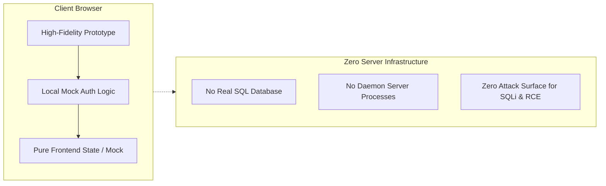

# High-Fidelity Static Interactive Prototypes and Zero-Exposure Security Gateway Specification

In traditional enterprise deliverable reviews, engineering teams face a dilemma: static Markdown text and PDF reports fail to communicate dynamic user flows, while hosting a full-fledged staging server connected to real databases introduces steep infrastructure costs, API token leakage, and SQL injection risks.

To overcome this, **Vanguard** established a frontend engineering paradigm combining **"High-Fidelity Design Showcases + Zero-Exposure Security Gateways"**. This paradigm delivers interactive prototype experiences completely decoupled from backend servers, while building strict compliance and privacy firewalls.

---

## 1. Pure Static Design Showcase System

Rather than relying on plain documentation dumps, Vanguard crafts production-grade static portals using Vanilla HTML5, modern CSS, and native JavaScript:

- **Self-Contained & Zero-Bundler**: Completely free from Webpack or Vite compilation; files open instantly offline across all modern browsers.
- **Modern Design Tokens**: Implements deep dark palettes, fine gradients, backdrop-filter glassmorphism, and subtle micro-animations.
- **Vectorized SVG Visualizations**: Replaces heavy charting libraries with lightweight inline SVG and CSS animations to display architectural topologies and lifecycle metrics.

---

## 2. Three-Tier Lifecycle Data Sanitization

To ensure architectural concepts can be demonstrated publicly without leaking confidential client information, the platform enforces three strict sanitization rules:

```
                    ┌───────────────────────────────┐
                    │  Three-Tier Sanitization Gate │
                    └───────────────┬───────────────┘
                                    │
         ┌──────────────────────────┼──────────────────────────┐
         ▼                          ▼                          ▼
 [Entity Virtualization]   [Metric Benchmarking]    [Zero-Hardcoded Secrets]
 Real names replaced with   Confidential financials   No raw API keys or tokens;
 synthetic persona labels    mapped to industry norms  injected via local env only
```

1. **Entity Virtualization**: All personal identities, private contacts, and specific business names are replaced with synthetic, context-aware mock personas.
2. **Metric Benchmarking**: Proprietary margin rates or financial models are fitted to benchmark industry standards. Raw contracts and sensitive documents are forbidden from the `site/` distribution tree.
3. **Zero-Hardcoded Credentials**: No third-party tokens, database connection strings, or private keys exist anywhere within the public static source.

---

## 3. Frontend Security Gateway & Safeguards

To balance authorized expert review with anti-crawling protections, Vanguard embeds cryptographic gates and domain guards directly on the client side:

### 3.1 Web Crypto SHA-256 Gateway Mask
For specification reading interfaces, the portal mounts a lightweight gate overlay before DOM rendering:
- Computes SHA-256 hashes using browser-native Web Cryptography API (`crypto.subtle.digest`);
- Validates the hash against a predetermined signature, storing transient session tokens in `sessionStorage` and `SameSite=Lax` cookies;
- Creates a focused review boundary without requiring any backend auth server.

```javascript
// Native browser Web Crypto SHA-256 comparison
async function verifyPasscode(input) {
  const enc = new TextEncoder();
  const hashBuffer = await crypto.subtle.digest('SHA-256', enc.encode(input));
  const hashArray = Array.from(new Uint8Array(hashBuffer));
  const hashHex = hashArray.map(b => b.toString(16).padStart(2, '0')).join('');
  return hashHex === EXPECTED_SHA256_HASH;
}
```

### 3.2 Domain Guard
A compact host checker sits at the head of every page. If unauthorized mirrors or unauthorized hostnames are detected, it automatically redirects visitors to the legitimate custom subdomain.

---

## 4. Pure Frontend Business Software Simulation

When prototyping target software components (workbenches, dashboards, authentication portals), Vanguard adheres to key simulation rules:



1. **Pure Static Zero Backend**: All transitions, authentication simulations, and data grids are driven entirely by client-side JavaScript. This completely eliminates remote code execution (RCE) and SQL injection vulnerabilities.
2. **Realistic Feedback**: The prototype delivers authentic feedback—including validation alerts and unlocking animations—matching the feel of live commercial software.
3. **Non-Blocking Navigation**: Because prototypes are review assets, global blocking guards are avoided, enabling reviewers to jump straight into specific modules via deep links.
4. **Responsive Mobile Anti-Overflow**: On small screens ($\le 640\text{px}$), buttons condense to iconographic glyphs, while tables enable contained horizontal scrolling to prevent layout breakage.

This disciplined approach allows Vanguard to deliver world-class software demonstrations without leaking a shred of confidential business data or spinning up a single backend server.
