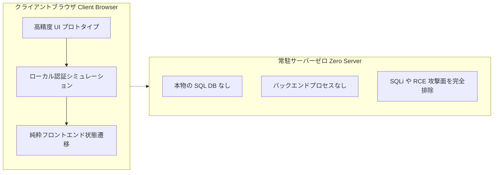

# 高精度インタラクティブ静的プロトタイプとゼロ露出セキュリティゲートウェイ規約

従来型のプロジェクト成果物レビューにおいて、開発チームはジレンマに直面します。単なるテキストや PDF ドキュメントでは複雑なインタラクションや業務フローを直感的に伝えることが難しく、かといって本番同等のサーバーやデータベースを構築すれば、運用コストの増大や機密情報漏洩、SQL インジェクション等のセキュリティリスクが発生します。

最先端デプロイ基盤 **Vanguard** は、**「純粋静的デザインショーケース (Design Showcase) ＋ ゼロ露出セキュリティゲートウェイ (Zero-Exposure Gateway)」**という先駆的なフロントエンドエンジニアリング規範を確立しました。この手法により、常駐サーバーやデータベースに一切依存することなく、極めて没入感の高いインタラクティブプロトタイプを提供しつつ、厳格なコンプライアンス防壁を構築できます。

---

## 1. 純粋静的 Design Showcase システム

粗雑な仕様書配布から脱却し、Vanguard は Vanilla HTML5、モダン CSS、ネイティブ JavaScript のみを用いて商用製品クラスの静的ポータルを構築します：

- **ビルドツール不要の自己完結性 (Self-Contained & Zero-Bundler)**：Webpack や Vite によるビルドを必要とせず、あらゆるモダンブラウザでローカルから即座に動作。
- **現代的デザインシステム (Modern Tokens)**：深みのあるダークテーマ、微細なグラデーション、すりガラス効果（Backdrop-Filter）、そして滑らかなマイクロインタラクション。
- **軽量ベクター可視化 (SVG Visualization)**：重厚なサードパーティチャートライブラリを排除し、インライン SVG と CSS アニメーションでアーキテクチャ図やメトリクスを表現。

---

## 2. ライフサイクル全般における三重データマスキング

技術的な成果物を広く安全に提示するため、公開前に厳格な3つの脱敏（マスキング）原則を適用します：

```
                    ┌───────────────────────────────┐
                    │    三重マスキング審査プロセス │
                    └───────────────┬───────────────┘
                                    │
         ┌──────────────────────────┼──────────────────────────┐
         ▼                          ▼                          ▼
  【法人・個人名の仮想化】     【財務指標のベンチマーク化】  【認証情報のゼロ露出】
  実名・連絡先を完全に排除     機密利益率などを標準値へ置換   APIキー・DB接続文字列の
  架空の事業体名へ統一         原本契約書は静的公開禁止       ハードコードを一切禁止
```

1. **法人・個人名の仮想化**：すべての個人情報や機密企業名を、文脈に沿った仮想のモック名称へ置き換えます。
2. **財務指標のベンチマーク化**：独自の財務マージンや借入金利などの機密数値を業界標準のモデル値へ変換し、機密原本が静的ディレクトリに紛れ込むのを防ぎます。
3. **認証情報のゼロ露出**：静的ソースコード内にサードパーティ API トークンや秘密鍵を一切埋め込まず、ローカル環境変数のみで管理します。

---

## 3. フロントエンド・セキュリティゲートウェイと防衛策

承認されたレビュー担当者の体験を守りつつ不正なクローラーを遮断するため、クライアントサイドで暗号技術を活用したゲートを設置します：

### 3.1 Web Crypto SHA-256 ゲートウェイマスク
機密仕様書の閲覧画面において、DOM 描画前にフロントエンド遮蔽レイヤーを展開します：
- ブラウザ標準の Web Cryptography API (`crypto.subtle.digest`) を呼び出し、入力パスコードの SHA-256 ハッシュを計算；
- 保持された正解ハッシュと一致した場合のみセッションストレージと Cookie を発行；
- バックエンドの認証サーバーを一切立てることなく、制御された閲覧体験を実現。

```javascript
// ブラウザ標準 Web Crypto API によるハッシュ照合
async function verifyPasscode(input) {
  const enc = new TextEncoder();
  const hashBuffer = await crypto.subtle.digest('SHA-256', enc.encode(input));
  const hashArray = Array.from(new Uint8Array(hashBuffer));
  const hashHex = hashArray.map(b => b.toString(16).padStart(2, '0')).join('');
  return hashHex === EXPECTED_SHA256_HASH;
}
```

### 3.2 独自ドメイン防護 (Domain Guard)
非公認のミラーサイトや外部からの直リンクによる無秩序なインデックスを防ぐため、ページ先頭でホスト名を検知し、正規のサブドメインへ自動リダイレクトします。

---

## 4. プロダクト画面プロトタイプの純粋エミュレーション規約

業務管理画面やダッシュボードのプロトタイプを作成するにあたり、以下の厳格なルールを遵守します：



1. **バックエンド完全ゼロ**：すべての画面遷移やデータ操作はクライアントサイド JavaScript でシミュレーション。SQL インジェクションやリモートコード実行の脆弱性が原理的に存在しません。
2. **リアルなインタラクション**：入力エラー時の警告やロック解除演出など、商用製品と遜色ない上質さを担保。
3. **ノンブロッキング設計**：レビュー担当者がディープリンクから任意の特定モジュールを直接検証できるよう、過度なルーティング強制遮断を避けます。
4. **モバイル対応とオーバーフロー防止**：狭い画面幅（$\le 640\text{px}$）ではボタンをアイコン化し、表は局所スクロールに対応させてレイアウト崩れを防止。

この体系により、Vanguard は**一切の機密情報を漏洩させず、一切のバックエンドを起動することなく**、最高品質の成果物デリバリーを実現しています。
