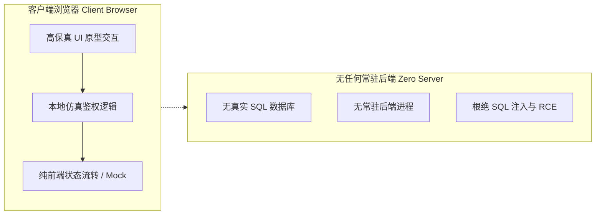

# 高水准纯静态交互原型与零暴露安全门禁规范

在传统企业级项目的成果展示与方案评审中，团队往往面临一个两难困境：一方面，仅凭枯燥的 Markdown 文本或 PDF 报告难以生动传达复杂交互与业务流转；另一方面，直接部署一套连带真实业务逻辑与数据库的测试系统，不仅部署成本高昂，而且面临敏感数据泄露、API 密钥暴露以及 SQL 注入攻击的风险。

前沿部署平台 **Vanguard** 提出了一整套**“纯静态高质感展示系统 (Design Showcase) + 零暴露安全门禁 (Zero-Exposure Gateway)”**的前端工程范式。该范式能够在完全脱离后端服务与真实数据库的前提下，打造高沉浸感的交互原型，同时构筑坚不可摧的合规安全屏障。

---

## 1. 纯静态 Design Showcase 体系

Vanguard 的交付产物摒弃了简单粗糙的文档堆砌，通过纯粹的 Vanilla HTML5、现代 CSS 与原生 JavaScript，构建达到商用软件品质的原型展示站点：

- **自包含零构建 (Self-Contained & Zero-Bundler)**：无需通过 Webpack 或 Vite 编译打包，产物直接开箱即用，支持离线在任何现代浏览器中双击查阅。
- **现代化设计系统 (Modern Tokens)**：采用暗色深邃基调、高对比度微渐变、毛玻璃质感（Backdrop-Filter）与流畅的微交互动效。
- **动态矢量化图表 (SVG Visualization)**：摒弃庞大的第三方图表库，采用轻量内联 SVG 与纯原生 CSS 动画展示技术架构拓扑与指标推演。

---

## 2. 三重全周期数据脱敏规范

为确保技术架构与交互成果能够公开展出，平台在内容发布前执行严格的三重脱敏法则：

```
                    ┌───────────────────────────────┐
                    │      三重脱敏审查过滤体系     │
                    └───────────────┬───────────────┘
                                    │
         ┌──────────────────────────┼──────────────────────────┐
         ▼                          ▼                          ▼
  【实体身份虚拟化】          【商业指标标杆化】          【凭据零硬编码】
 真实个人/法人信息脱敏      核心财务数据基准模拟       严禁硬编码任何 API 密钥
 统一采用虚拟业务标识      杜绝真实合同文件外泄       仅允许本地环境变量注入
```

1. **实体身份虚拟化**：所有涉及自然人身份、私人联系方式或涉密客户名称的信息，一律转换为符合业务语境的标准化虚拟标识。
2. **商业指标标杆化**：涉及底层利润率、财务借贷测算等敏感机密指标，展示时统一映射为经数学拟合的行业标准基准值，原始商业机密文件绝对禁止拷贝至静态分发目录。
3. **凭据零硬编码**：静态代码中绝对不包含任何第三方 Token、数据库连接串或加密私钥。

---

## 3. 前端安全门禁与合规守卫

为了兼顾“特定受众授权评审”与“防范爬虫无序索引”，Vanguard 在前端引入了轻量级密码学门禁与域名守卫机制：

### 3.1 Web Crypto SHA-256 门禁遮罩 (Gateway Auth)
针对涉及机密评审的规格书页面，系统在 DOM 渲染前挂载前端遮罩层：
- 用户输入通行口令后，调用浏览器原生 Web Cryptography API (`crypto.subtle.digest`) 计算 SHA-256 散列；
- 与预置的安全散列比对，校验通过后将临时状态写入 `sessionStorage` 与 `SameSite=Lax` Cookie；
- 既保障了受控评审的仪式感与合规界限，又无需架设任何后端鉴权服务器。

```javascript
// 基于原生 Web Crypto API 的安全散列比对
async function verifyPasscode(input) {
  const enc = new TextEncoder();
  const hashBuffer = await crypto.subtle.digest('SHA-256', enc.encode(input));
  const hashArray = Array.from(new Uint8Array(hashBuffer));
  const hashHex = hashArray.map(b => b.toString(16).padStart(2, '0')).join('');
  return hashHex === EXPECTED_SHA256_HASH;
}
```

### 3.2 域名白名单与反盗链守卫 (Domain Guard)
为防止静态站点被第三方克隆镜像或通过未经授权的链接直接索引，页面首部内嵌轻量级 Host 守卫。当检测到当前域名不在受信任的白名单中时，系统会自动重定向至合法的专属二级域名。

---

## 4. 业务软件原型的纯前端仿真铁律

在呈现目标系统原型（如业务工作台、管理大屏、认证入口）时，Vanguard 坚持以下纯前端设计铁律：



1. **纯静态零后端**：原型中所有的登录跳转、数据展示、工作流流转均由客户端 JavaScript 驱动与仿真模拟。彻底根绝了服务端代码执行（RCE）和 SQL 注入漏洞的发生空间。
2. **真实交互反馈**：虽然是无后端仿真，但交互细节毫不妥协——包含输入错误实时提示、合规密码解锁动画，提供与真实系统毫无二致的高质感体验。
3. **免路由强制阻断原则**：静态原型本质是评审与展示素材，严禁编写强制全局拦截路由，确保专家可直接通过深层链接访问特定子模块进行专项评审。
4. **移动端响应式与防溢出设计**：在小屏视口（$\le 640\text{px}$）下，操作控件自动切换为紧凑符号化图标，表格支持局部横向滑动，消灭破版与溢出。

通过这套规范，Vanguard 成功实现了在**不泄露任何商业机密、不启动任何常驻服务**的前提下，交付具备极致工业品质的现代化软件成果。
