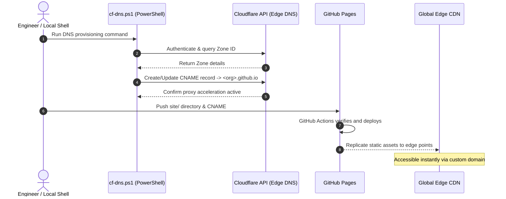

# Two-Tier Physical Repository Segregation and Automated Edge Delivery Pipeline

In modern frontier software engineering, a primary architectural dilemma is how to reconcile the **continuous evolution of generic platform tooling** with the **autonomous lifecycle of discrete delivery artifacts**. Stuffing everything into a bloated Monorepo inevitably creates blast radius concerns, cross-project coupling, and blurred privacy boundaries.

The **Vanguard** platform pioneered the **Two-Tier Repository Architecture**, establishing an automated pipeline powered by **Windows native PowerShell, Cloudflare Edge DNS, and GitHub Pages** for seamless global delivery.

---

## 1. Two-Tier Physical Repository Design

To prevent asset contamination and enforce boundary isolation at the root, Vanguard decouples repositories into two tiers:

```
       ┌────────────────────────────────────────────────────────┐
       │             Main Platform Repo Vanguard (Private)      │
       │   - Generic platform specs (docs/platform/)            │
       │   - Standard template library (docs/templates/)        │
       │   - Native automation scripts (scripts/*.ps1)          │
       │   - Local exclusion: cases/* (.gitignore)              │
       └──────────────────────────┬─────────────────────────────┘
                                  │ Scaffolding / Rule Injection
                                  ▼
       ┌────────────────────────────────────────────────────────┐
       │     Independent Delivery Repo Vanguard-<Project> (Pub) │
       │   - Structured delivery docs (docs/)                   │
       │   - Self-contained static showcase (site/)             │
       │   - Dedicated CI/CD workflow (.github/workflows/)      │
       │   - Custom domain declaration (site/CNAME)             │
       └────────────────────────────────────────────────────────┘
```

### 1.1 Main Platform Repository
- **Role**: Serves as the central design authority. Hosts design tokens, technical specifications, and reusable PowerShell scripts.
- **Access Boundary**: Strict `.gitignore` rules prevent client-specific or local artifacts from polluting version history, ensuring the core platform remains clean and auditable.

### 1.2 Independent Delivery Repositories
- **Role**: Each discrete project or research module lives in its own dedicated repository (`Vanguard-<Name>`).
- **Autonomy**: Possesses independent commit histories, scoped CI/CD secrets, and custom subdomains, enabling clean archiving or handover without platform entanglement.

---

## 2. Edge Gateway & Automated DNS Orchestration

Static artifact hosting requires elastic scalability, minimal latency, and zero-touch operations. Vanguard marries **GitHub Pages with Cloudflare Edge CDN**, orchestrating the infrastructure entirely through native PowerShell:



### 2.1 Native PowerShell DNS Automation
Using platform automation scripts (`cf-dns.ps1`), engineers manage DNS entries directly from the terminal:
- Safely reads API tokens from local environment variables;
- Dynamically retrieves target Zone IDs;
- Idempotently creates or updates `CNAME` records pointing to GitHub Pages;
- Enforces Cloudflare Full SSL/TLS encryption and Brotli compression by default.

### 2.2 CI/CD Deployment Workflow
The workflow file triggers automatically on main branch updates, publishing the `site/` directory without Node.js or build-step dependencies.

---

## 3. Operational Advantages

1. **Sub-Minute Turnaround**: Pushes propagate from local commits to global edge nodes in under 30 seconds without manual console interaction.
2. **Zero Maintenance**: Because artifacts are pure static text, teams eliminate server crashes, database deadlocks, and container restarts.
3. **Audit Resilience**: Physical decoupling guarantees clean boundaries and risk containment.
