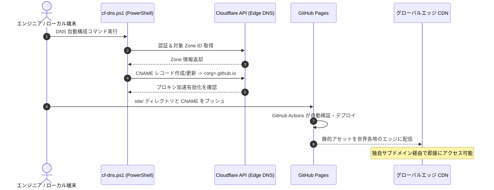

# リポジトリ物理二層分離アーキテクチャと自動化エッジデリバリーパイプライン

多様なデリバリー要件が求められる最先端エンジニアリングにおいて、**「汎用ツール・共通仕様の継続的進化」**と**「特定プロジェクト成果物の個別ライフサイクル管理」**をいかに両立させるかは重要な設計課題です。すべての成果物を単一の巨大リポジトリ（Monorepo）に混在させると、影響範囲の拡大や機密データの境界線が曖昧になるリスクを招きます。

最先端デプロイ基盤 **Vanguard** は、**リポジトリ物理二層分離モデル (Two-Tier Repository Architecture)** を採用し、**Windows ネイティブ PowerShell、Cloudflare Edge DNS、GitHub Pages** を連携させたグローバル即時デリバリーパイプラインを確立しました。

---

## 1. リポジトリ物理二層分離設計

クロスコンタミネーション（資産汚染）を防ぎ、明確な境界を維持するため、Vanguard はリポジトリを2つのレイヤーに分離しています：

```
       ┌────────────────────────────────────────────────────────┐
       │             基盤リポジトリ Vanguard (Private)          │
       │   - プラットフォーム共通仕様 (docs/platform/)          │
       │   - 標準テンプレート集 (docs/templates/)              │
       │   - ネイティブ運用スクリプト群 (scripts/*.ps1)         │
       │   - ローカル除外: cases/* (.gitignore)                 │
       └──────────────────────────┬─────────────────────────────┘
                                  │ スキャフォールド派生 / 規約注入
                                  ▼
       ┌────────────────────────────────────────────────────────┐
       │     成果物個別リポジトリ Vanguard-<ProjectName> (Pub)  │
       │   - 構造化デリバリードキュメント (docs/)               │
       │   - 自己完結型静的デザインショーケース (site/)         │
       │   - 独立 CI/CD ワークフロー (.github/workflows/)       │
       │   - 専用サブドメイン定義 (site/CNAME)                  │
       └────────────────────────────────────────────────────────┘
```

### 1.1 基盤メインリポジトリ (Main Platform Repo)
- **役割**：プラットフォームの中枢として機能。デザインシステムトークン、技術仕様書、汎用 PowerShell 運用ツールを管理。
- **境界制御**：厳格な `.gitignore` ルールにより、特定の業務データがコミットされることを物理的に遮断します。

### 1.2 成果物個別リポジトリ (Independent Delivery Repo)
- **役割**：個々のプロジェクトや検証成果物ごとに独立した同名リポジトリ（`Vanguard-<Name>`）を開設。
- **完全な自律性**：独立したコミット履歴、専用の GitHub Actions シークレット、独立したサブドメインを持ち、プラットフォーム本体から切り離して安全に移管・アーカイブが可能です。

---

## 2. エッジゲートウェイと DNS 自動化オーケストレーション

静的成果物のホスティングには、弾力的なスケーラビリティ、低遅延、完全自動化が不可欠です。Vanguard は **GitHub Pages ＋ Cloudflare Edge CDN** を組み合わせ、純粋な PowerShell スクリプトのみでインフラ連携を自動化しています：



### 2.1 ネイティブ PowerShell による DNS 自動化
プラットフォーム内蔵の `cf-dns.ps1` により、管理画面を手動操作することなく、ターミナルから一発で DNS レコードの更新、Zone ID の取得、Full SSL/TLS 適用を完結します。

### 2.2 CI/CD デプロイ自動化
メインブランチへのプッシュを契機に、GitHub Actions が余計なビルドステップなしで `site/` 内の静的ファイルを直接 GitHub Pages へ高速デプロイします。

---

## 3. 運用のメリット

1. **瞬時のデリバリー**：ローカルの編集から世界中のエッジノードへの反映まで30秒以内で完了。
2. **保守ゼロの堅牢性**：純粋な静的ファイル配信のため、サーバーダウンやメモリリークの心配が皆無。
3. **監査とセキュリティの明確化**：物理的に分離されたリポジトリ構成により、機密情報漏洩リスクを最小化。
