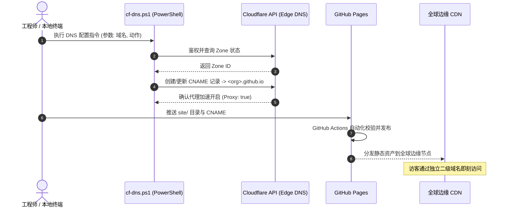

# 主从双层物理隔离与自动化边缘交付流水线

在面向多样化交付场景的前沿工程体系中，如何兼顾**“通用基建工具的开源演进”**与**“特定交付成果的独立生命周期管理”**，是平台设计的一道关键考题。如果将所有成果混杂在一个巨型单体仓库（Monorepo）中，不仅版本更新容易互相干扰，而且极易导致数据边界模糊。

前沿部署平台 **Vanguard** 提出并实践了**主从双层仓库物理隔离模型 (Two-Tier Repository Architecture)**，并在此基础上构建了结合 **Windows 原生 PowerShell 脚本、Cloudflare 边缘 DNS 自动化与 GitHub Pages** 的全球即时交付流水线。

---

## 1. 主从双层仓库物理隔离设计

为了在架构根源上杜绝资产交叉污染并保护敏感边界，Vanguard 将代码与文档库明确拆分为两个物理独立的层级：

```
       ┌────────────────────────────────────────────────────────┐
       │             主平台仓库 Vanguard (Private)              │
       │   - 通用架构规约 (docs/platform/)                      │
       │   - 标准模板库 (docs/templates/)                       │
       │   - 原生自动化运维工具链 (scripts/*.ps1)               │
       │   - 本地阻断: cases/* (.gitignore)                     │
       └──────────────────────────┬─────────────────────────────┘
                                  │ 脚手架派生 / 规则注入
                                  ▼
       ┌────────────────────────────────────────────────────────┐
       │           交付独立仓库 Vanguard-<ProjectName> (Public) │
       │   - 结构化业务交付文档 (docs/)                         │
       │   - 自包含纯静态设计展示站点 (site/)                   │
       │   - 独立自动化发布工作流 (.github/workflows/)          │
       │   - 独立二级域名声明 (site/CNAME)                      │
       └────────────────────────────────────────────────────────┘
```

### 1.1 主平台仓库 (Main Platform Repo)
- **职责定位**：作为整个平台的“大脑”与通用资产中心。维护设计系统 Token、技术白皮书、通用脚本及代码模版。
- **边界控制**：通过严密的 Git 规则在版本库层面阻断任何具体业务成果入库，确保主平台代码随时可以公开且零冗余。

### 1.2 交付独立同名仓库 (Independent Delivery Repo)
- **职责定位**：每个具体的交付工程或技术评测单元单独成立同名代码仓库（例如 `Vanguard-<Name>`）。
- **完全自治**：每个仓库拥有独立的 Commit 历史、专属的 GitHub Actions CI/CD 流水线，以及独立的访问权限配置，支持灵活归档与独立移交。

---

## 2. 边缘网关与自动化 DNS 编排

静态产物的托管需要具备高并发承受力、低网络延迟以及自动化配置能力。Vanguard 采用 **GitHub Pages 托管静态产物 + Cloudflare 边缘代理** 的组合，并完全通过原生 PowerShell 脚本消除手动控制台配置的繁琐。



### 2.1 原生 PowerShell DNS 自动化
借助平台内置的 Windows 原生脚本（如 `cf-dns.ps1`），工程师可在本地终端内一键完成域名解析与边缘生效验证：
- 自动读取本地安全环境变量中的 API 凭证，杜绝硬编码泄漏；
- 动态获取指定顶级域的 Zone ID；
- 幂等性创建或修改 `CNAME` 记录，自动将专属二级域名（如 `project.evotensor.dev`）解析至 GitHub Pages 托管节点；
- 默认启用 Cloudflare Full SSL/TLS 加密与 Brotli 静态压缩。

### 2.2 自动化 CI/CD 流水线
交付仓库中的 `.github/workflows/deploy-portal.yml` 在主分支触发后，执行轻量无依赖的自动化发布：
```yaml
name: Deploy Delivery Portal
on:
  push:
    branches: [main]
permissions:
  contents: read
  pages: write
  id-token: write
concurrency:
  group: "pages"
  cancel-in-progress: false
jobs:
  deploy:
    environment:
      name: github-pages
      url: ${{ steps.deployment.outputs.page_url }}
    runs-on: ubuntu-latest
    steps:
      - name: Checkout Source
        uses: actions/checkout@v4
      - name: Setup Pages
        uses: actions/configure-pages@v4
      - name: Upload Static Artifacts
        uses: actions/upload-pages-artifact@v3
        with:
          path: 'site'
      - name: Deploy to GitHub Pages
        id: deployment
        uses: actions/deploy-pages@v4
```

---

## 3. 架构优势与工程收益

1. **秒级交付与零停机更新**：从本地编辑完成到全球 CDN 节点生效，整条链路在 30 秒内完成，且完全无需工程师登录云厂商后台。
2. **高容灾与免维护**：由于产物本质上是静态纯文本，无需担忧服务端内存泄露、数据库死锁或容器崩溃，高并发下依然稳如磐石。
3. **权责清晰与审计友好**：主平台与各个子项目物理隔离，极大降低了项目管理混乱与非受控变更的风险。
