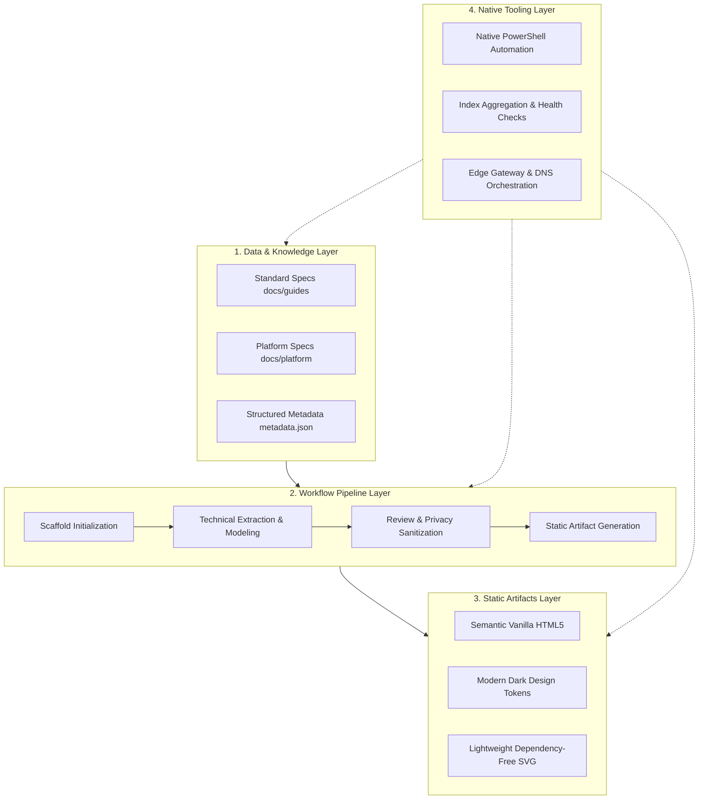

# From Heavy Services to Local-First: Vanguard Zero-Runtime Architecture Evolution

In modern software engineering, enterprise or analytical platforms typically lean toward heavy server-side architectures. A standard pipeline usually involves cloud container clusters (e.g., Cloud Run, Kubernetes), microservice gateways, relational or vector databases, and heterogeneous multi-language runtimes spanning Python, Node.js, and Rust.

However, when engineering research and artifact delivery pivot toward **high-velocity single-engineer agility, permanent knowledge retention, and ultra-lightweight deliverables**, traditional heavyweight architectures reveal severe operational friction. In this context, the frontier deployment platform **Vanguard** underwent a fundamental paradigm transformation: shifting entirely from daemon-dependent cloud services to a **"Local-First Document-Driven + High-Fidelity Static Artifacts"** methodology.

---

## 1. The Cost of Heavy Architecture & The Paradigm Shift

During early exploration, engineering workflows encountered three recurring friction points:

1. **Runtime & Environmental Overhead**: Local systems became cluttered with multiple interpreter versions, package manager conflicts (`pip`, `npm`), and background daemon processes, making disaster recovery and machine migration fragile.
2. **Knowledge Fragmentation**: Critical architectural insights, benchmark metrics, and design blueprints were scattered across proprietary cloud databases or third-party SaaS tools, failing to live as clean plaintext tracked directly via Git.
3. **Fragile Delivery Chains**: Presenting artifacts to stakeholders required reverse proxy configurations, staging environments, and database synchronization, introducing high maintenance costs and link degradation over time.

To resolve these challenges, Vanguard established an uncompromising architectural principle: **eliminate permanent server daemons both locally and remotely, treat the local filesystem as the absolute Single Source of Truth, and build self-contained deliverables.**

---

## 2. Core Architectural Philosophy

Vanguard is anchored on four foundational pillars:

```
           ┌──────────────────────────────────────────────┐
           │          Vanguard Core Philosophy            │
           └──────────────────────┬───────────────────────┘
                                  │
         ┌────────────────────────┼────────────────────────┐
         ▼                        ▼                        ▼
    [Local-First]          [Self-Contained]          [Zero-Runtime]
Filesystem as Truth      Offline-ready artifacts   PowerShell & browser only
```

- **No-Server Dependency**: Zero local Node.js/Python server daemons, and zero stateful cloud backends.
- **Local-First**: All engineering specifications, architecture documents, and metadata reside directly in the local filesystem, ensuring full offline capability for editing and reviewing.
- **Self-Contained Artifacts**: Every delivery artifact bundles semantic Vanilla HTML, modular CSS, and vanilla JavaScript into autonomous bundles that open instantly in any browser without build tooling.
- **Zero-Runtime Constraint**: Strictly enforcing zero extra local language runtimes. Scaffolding, indexing, and pipeline tasks run natively via built-in Windows **PowerShell** and batch scripts.

---

## 3. Four-Layer Platform Architecture

Vanguard organizes its capabilities into a clean four-tier hierarchy:



### 3.1 Data & Knowledge Layer
Maintains structured Markdown specifications and JSON Schema definitions. It ensures all documentation and metadata remain easily parseable by human engineers and native scripts alike.

### 3.2 Workflow Pipeline Layer
Governs the lifecycle from problem definition to deep research, data sanitization, and static compilation. Every stage adheres to strict input/output boundaries.

### 3.3 Static Artifacts Layer
Replaces complex modern bundlers (Webpack, Vite) with native CSS Custom Properties, modern flex/grid layouts, and native ES modules, delivering sleek dark-mode aesthetics with zero compilation lag.

### 3.4 Native Tooling Layer
Capitalizes on Windows native capabilities. Utilizing pure PowerShell scripts, the platform provisions scaffold folders, aggregates global index catalogues, and orchestrates edge delivery.

---

## 4. Key Takeaways

The transition from a heavy server framework to Vanguard's zero-runtime model illustrates that architectural restraint fosters resilience:

| Dimension | Heavy Server-Side Stack | Vanguard Zero-Runtime Model |
| :--- | :--- | :--- |
| **Maintenance & Cloud Cost** | High (containers, DBs, cloud bills) | **Zero (static distribution via edge CDN)** |
| **Local Dependencies** | Complex (Node/Python/Docker versions) | **Pure (Windows native PowerShell & browser)** |
| **Knowledge Longevity** | Vulnerable to service sunsetting | **Permanent (Git plain text files)** |
| **Delivery Friction** | Requires staging hosts and VPNs | **Instant (double-click local file or edge link)** |

Vanguard demonstrates that true engineering agility is unlocked when unnecessary layers of complexity are systematically stripped away.
