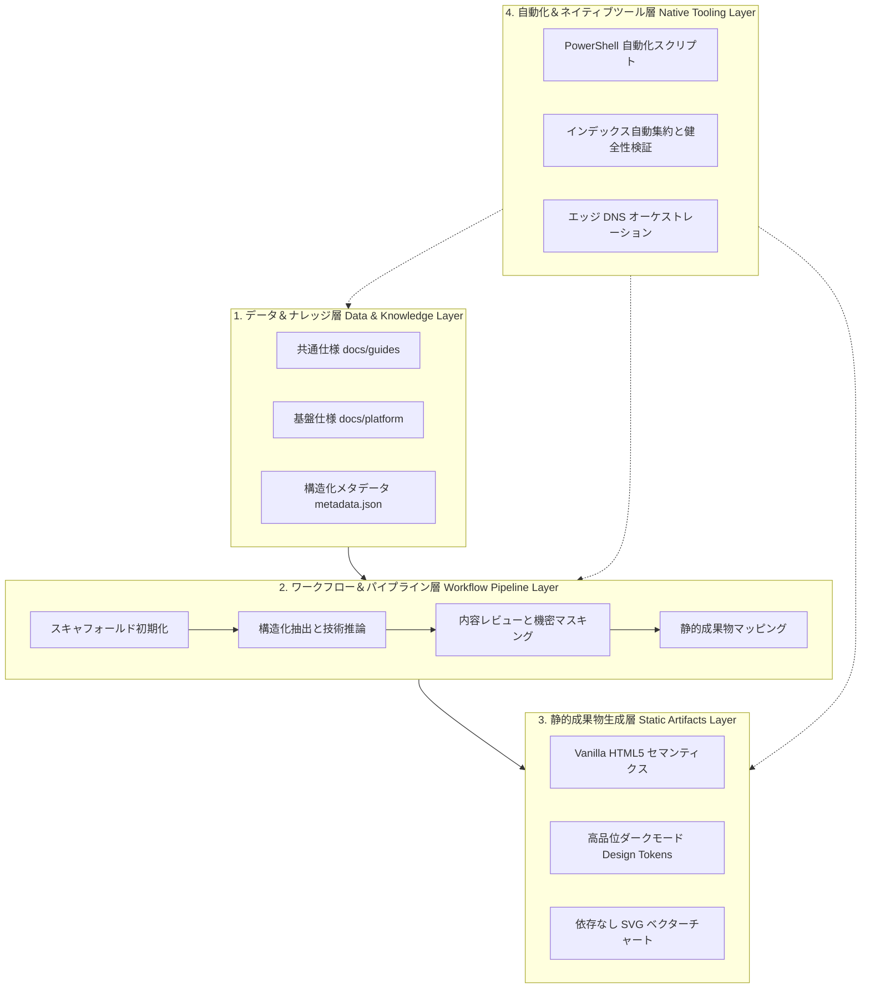

# 重厚なサーバーからローカルファーストへ：Vanguard ゼロランタイム設計の進化史

現代のソフトウェアエンジニアリングにおいて、エンタープライズや分析系プラットフォームは重量級のサーバーサイド構成（Server-Side）を採用する傾向があります。クラウドコンテナ（Cloud Run、Kubernetes 等）、マイクロサービスゲートウェイ、リレーショナル／ベクトルデータベース、そして Python、Node.js、Rust など複数言語のランタイムが常駐する構成が一般的です。

しかし、技術調査や成果物デリバリーが**高機動な単兵作戦、知識資産の恒久保存、そしてデリバリー成果物の極限までの軽量化**へと舵を切るにつれ、従来の重厚なアーキテクチャはメンテナンス上の大きな摩擦を生み出します。この課題に対し、最先端デプロイ開発プラットフォーム **Vanguard** は設計哲学を根本から見直し、常駐プロセス依存から**「純粋ローカルドキュメント駆動 ＋ 高品位静的プロダクト」**へと全面転換を遂げました。

---

## 1. 従来型構成の課題とパラダイムの転換

初期の模索過程において、直面した3つのボトルネックがありました：

1. **実行環境とランタイムの運用負担 (Runtime Burden)**：ローカル環境が複数のインタープリタ、パッケージマネージャの競合（`pip` や `npm` の依存関係問題）、バックグラウンド常駐デーモンで煩雑化し、マシン移行時の再現性が低下。
2. **知識資産の断片化 (Asset Fragmentation)**：設計仕様や知見データがクラウド上の独自データベースや SaaS サービスに分散し、プレーンテキストとして Git で一元管理できない問題。
3. **成果物提示プロセスの脆弱性 (Brittle Delivery)**：プロトタイプや成果物を第三者に共有するたびにリバースプロキシや環境設定が必要となり、長期的なリンク維持が困難。

Vanguard はこれらの根本原因を解決するため、**「ローカルおよびクラウド上の常駐サーバーを完全に撤廃し、ローカルファイルシステムを絶対的な信頼できる唯一の情報源（Single Source of Truth）とする」**方針を確立しました。

---

## 2. Vanguard の中核設計思想

Vanguard は次の4つの基本原則に基づいています：

```
           ┌──────────────────────────────────────────────┐
           │            Vanguard 設計哲学                 │
           └──────────────────────┬───────────────────────┘
                                  │
         ┌────────────────────────┼────────────────────────┐
         ▼                        ▼                        ▼
  【ローカルファースト】       【自己完結型資産】        【ゼロランタイム制約】
  ファイルシステムが基盤      オフライン即時閲覧可能     PowerShell とブラウザのみ
```

- **サーバー不要 (No-Server)**：ローカルで常駐サーバーを起動せず、クラウドにも常駐バックエンドを置かない。
- **ローカルファースト (Local-First)**：すべての設計仕様書、知見資産、メタデータをローカルストレージに保持し、完全なオフライン状態でも執筆・閲覧が可能。
- **自己完結型資産 (Self-Contained Artifacts)**：セマンティックな Vanilla HTML、モジュール化された CSS、軽量なネイティブ JavaScript を一体化し、ローカルブラウザでダブルクリックするだけで即座に動作する成果物を構築。
- **ゼロランタイム制約 (Zero-Runtime Constraint)**：外部の言語実行環境を不要とし、スキャフォールディングや目次自動生成などは Windows 標準内蔵の **PowerShell** とバッチスクリプトのみで完結。

---

## 3. 4層プラットフォーム構造モデル

Vanguard はその機能を明確な4つのレイヤーに体系化しています：



### 3.1 データ＆ナレッジ層 (Data & Knowledge Layer)
Markdown 仕様書と JSON Schema 定義を管理し、人間にとってもスクリプトにとっても極めて可読性の高い状態を維持します。

### 3.2 ワークフロー＆パイプライン層 (Workflow Pipeline Layer)
課題定義から技術抽出、セキュリティマスキング、静的コンパイルに至る明確なライフサイクルを規約化しています。

### 3.3 静的成果物生成層 (Static Artifacts Layer)
Webpack などの複雑なビルドツールを排し、ネイティブ CSS 変数や Flex/Grid 構文を用いて、洗練されたダークテーマとマイクロインタラクションを実現します。

### 3.4 自動化＆ネイティブツール層 (Native Tooling Layer)
Windows ネイティブの PowerShell を活用し、ディレクトリ生成やプロジェクト索引の自動構築を瞬時に行います。

---

## 4. 総括

Vanguard が実証したのは、複雑な依存関係を削ぎ落とすことこそが、エンジニアリングにおける最高の敏捷性と長期的な堅牢性をもたらすという事実です。
