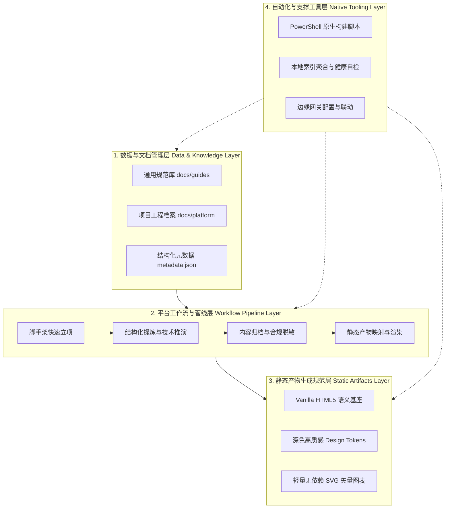

# 从重型服务到本地优先：Vanguard 零运行时架构的演进之路

在现代软件工程实践中，企业级或技术分析型平台通常倾向于采用重型服务端（Server-Side）架构。一套标准的生产管线往往挂载着云端容器（如 Cloud Run、Kubernetes）、微服务网关、关系型/向量数据库，以及包含 Python、Node.js、Rust 等在内的多语言交叉运行时。

然而，当技术研发与成果交付下沉到**单兵高敏捷作战、知识资产长效留存以及对交付产物极致轻量化**的场景时，传统重型架构的弊端逐渐显现。前沿部署开发平台 **Vanguard** 在此背景下经历了一场彻底的架构哲学重塑：从依赖常驻进程的云端基础设施，全面转向**“纯本地文档驱动 + 高质感静态化产物”**的轻量体系。

---

## 1. 传统架构的沉重代价与范式重塑

在架构演化初期，团队常面临三个不可回避的工程痛点：

1. **环境与运行时的运维重负 (Runtime Burden)**：本地环境常常充斥着不同版本的解释器、包依赖冲突（如 `pip` / `npm` 幽灵依赖）以及后台驻留守护进程。这种复杂的环境在跨设备迁移或系统重装时脆弱不堪。
2. **知识资产的流动性割裂 (Asset Fragmentation)**：大量业务洞察、架构图谱与评测指标散落在云端专有数据库或 SaaS 平台中，无法以纯净的文件系统形式直接通过 Git 进行严格的版本回溯和本地纯文本索引。
3. **交付链路冗长与脆弱 (Brittle Delivery)**：每次对外展示方案或交付成果，都需要配置服务器反向代理、环境鉴权与前后端联调，不仅成本高昂，且难以抵御长期的维护失效风险。

针对这些挑战，Vanguard 确立了全新的顶层技术方针：**彻底剔除对本地与远端常驻 Server 服务的强依赖，以文件系统为绝对单一事实源（Single Source of Truth），实现极致的原生化与自包含。**

---

## 2. Vanguard 核心设计哲学

Vanguard 的技术底座建立在四大核心原则之上：

```
           ┌──────────────────────────────────────────────┐
           │            Vanguard 核心设计哲学              │
           └──────────────────────┬───────────────────────┘
                                  │
         ┌────────────────────────┼────────────────────────┐
         ▼                        ▼                        ▼
  【本地优先 Local-First】  【资产自包含 Self-Contained】  【原生轻量 Zero-Runtime】
   文件系统为最终持久源       产物离线可运行、即开即用        仅依赖原生浏览器与 PowerShell
```

- **无 Server 依赖 (No-Server)**：本地不运行任何 Node.js/Python HTTP 服务，云端不常驻无状态后端。
- **本地优先 (Local-First)**：所有数据资产、架构文档与设计标准严格保存在本地硬盘中，离线状态下具备完整的知识沉淀与产物查阅能力。
- **资产自包含 (Self-Contained Artifacts)**：每个交付产物均将语义结构（Vanilla HTML）、视觉系统（CSS）与交互流转（原生 JS）打包为独立自治的前端单元，支持本地浏览器双击即开即用。
- **原生轻量约束 (Zero-Runtime Constraint)**：严格执行本地零额外运行时的约束，所有脚手架初始化、批量索引生成与部署运维，完全依托 Windows 原生内置的 **PowerShell** 与批处理脚本完成。

---

## 3. 四层平台架构模型

为了将上述哲学转化为可落地、高内聚的工程实体，Vanguard 构建了清晰的四层分层模型：



### 3.1 数据与文档管理层 (Data & Knowledge Layer)
基于 Markdown 文本与结构化 JSON Schema 定义规范。核心资产包括架构演进指引、交互设计规范，以及统一标注生命周期状态与技术维度的元数据清单，确保文档在编辑器和脚本层面均具备高可解析性。

### 3.2 平台工作流与管线层 (Workflow Pipeline Layer)
定义从“技术定义”到“深度推演”，再到“合规脱敏”，最后到“静态网页编译与归档”的闭环流转标准。任何阶段都具备清晰的输入、输出边界，杜绝半成品在仓库中无序堆积。

### 3.3 静态产物生成规范层 (Static Artifacts Layer)
杜绝依赖复杂前端打包工具链（如 Webpack、Vite）。基于现代 CSS 变量、Flexbox/Grid 布局与原生 ES Module，直接构建具有现代化深色拟态、毛玻璃微动效和高对比度阅读体验的纯静态交互应用。

### 3.4 自动化与支撑工具层 (Native Tooling Layer)
充分利用 Windows 系统原生能力。无需安装 Node 或 Python，通过优雅的 PowerShell 脚本实现工程自动化。脚本负责从零生成标准化目录结构、解析提取 Markdown 摘要与构建全平台聚合索引页面。

---

## 4. 架构转型的收益与启示

从重型服务端向 Vanguard 零运行时体系的演进，带来了显著的工程质变：

| 维度 | 传统 Server-Side 架构 | Vanguard 零运行时架构 |
| :--- | :--- | :--- |
| **部署与维护成本** | 高（容器常驻、数据库维护、云账单） | **零（纯静态分发、边缘 CDN 托管）** |
| **本地依赖环境** | 复杂（Node/Python/Docker 版本冲突） | **纯净（仅系统原生 PowerShell 与浏览器）** |
| **知识资产持久性** | 弱（依赖云厂商数据库格式与状态） | **永恒（本地 Git 纯文本与自包含产物）** |
| **产物交付体验** | 需配置内网穿透或反代认证 | **即开即用（双击文件或极速边缘访问）** |

Vanguard 的演进证明：在追求工程极致与敏捷交付的道路上，**“少即是多”并非一句口号，而是一套经受严苛工程约束检验的架构范式。**
