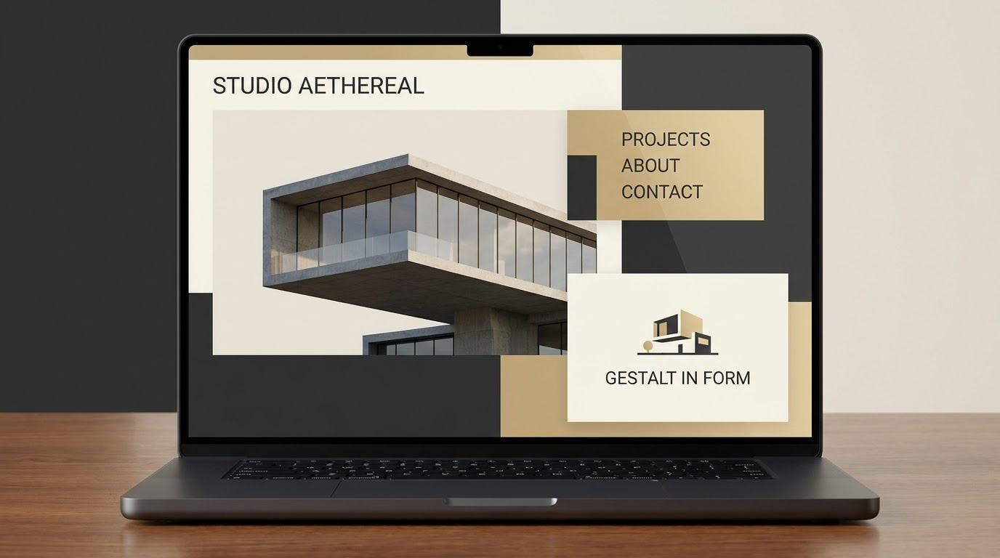

本モジュールは、ダウンロードされた画像アセットと組み合わせて、デジタル製品におけるゲシュタルト原則とデザイン構成を多次元的にデコンストラクション（解体）します。

---

## 1. 余白と近接の法則の応用 (Whitespace & Proximity)

### 1.1 ケースのビジュアル提示

### 1.2 学術的詳細デコンストラクション
*   **視覚心理学 (Proximity)**：
    このインターフェース設計では、離散的な情報カードやテキスト項目は、生硬な暗色の太線による強制的な遮断に依存していません。そうではなく、「カード間」の垂直/水平方向の余白を精密に広げ、「カード内部のサブ要素間」の余白よりも大幅に大きくしています。人間の脳の視覚システムは、自動的に近接の法則を起動し、余白の小さいサブ要素を関連する一つの「機能グループ」と判定します。
*   **平面構成 (点・線・面と骨組みグリッド)**：
    これはデザイン構成における「ソフト分割」の手法に属します。グリッド（骨組み）を使用して各モジュールの境界を拘束します。非表示のグリッドラインはレイアウトの呼吸感と通気性を維持し、情報量が満載であっても画面を軽快に保ち、流線型の視覚チャネルを形成します。
*   **ITエンジニアリング計画 (モジュールの高凝集)**：
    これは、ソフトウェアエンジニアリングにおける「高凝集」がインターフェース上にマッピングされたものと同型です。「発見」リストの単一モジュールのような、同じビジネスロジックエンティティに属するすべての底層データが、局所的な物理空間に密接に集められ、論理的にも視覚的にも独立した自治ユニット（高凝集モジュール）を形成しています。

---

## 2. カードグリッドと類似性メカニズム (Card Grid & Similarity)

### 2.1 ケースのビジュアル提示

### 2.2 学術的詳細デコンストラクション
*   **視覚心理学 (Similarity & Common Fate)**：
    ユーザーが複数のカードで構成されたダッシュボードやリストを閲覧するとき、眼脳システムは一瞬にしてこれらの異質なデータを極めて高速に分類できます。これは、各カードスロットが形状、背景色、文字サイズ、およびアイコンの整列において高度に一貫しているためです。類似した視覚的特徴により、脳はカード間の物理的な隙間を自動的にフィルタリングし、それらを一つの「カードフロー」全体として知覚します。
*   **色彩と立体構成 (明度対比と被写界深度)**：
    カードは、軽微なドロップシャドウ (Box Shadow) と微光半透明ボーダーを通じて、暗い背景の上に浮かび上がる「立体的な被写界深度感」を作り出します。これは図と地の共生関係を利用し、データコンテンツを「図」として暗い「地」の上に浮き上がらせるもので、色彩構成における明度調和の原則を体現しています。
*   **ITエンジニアリング計画 (コンポーネント化とオブジェクト指向 OOD)**：
    これはオブジェクト指向設計における「クラス (Class)」と「インスタンス (Instance)」の関係と完璧に同型です。フロントエンドエンジニアリングでは、この統一されたカードスタイルを再利用可能な `CardComponent` として抽象化しカプセル化します。システムの開発ライフサイクルを通じて、高度に再利用可能な類似性の高いカードは、コードの冗長性を大幅に削減するだけでなく、システムの保守性を劇的に向上させ、開発効率と視覚的美しさの高度な統一を実現します。

---

## 3. Web総合体験と「形態は機能に従う」 (Web Integration & Form Follows Function)

### 3.1 ケースのビジュアル提示

### 3.2 学術的詳細デコンストラクション
*   **哲学的美学 (理念の感性的顕現とフロー)**：
    ヘーゲルの芸術哲学は、美は無限の理念が感性的な形式を通じて自己顕現することであると指摘しています。このWebインターフェースでは、複雑なシステム底層のビジネスプロセス（理念）が科学的に設計され、直感的な動的コンソールと多感覚的な視覚整列（感性的形式）を通じてユーザーに完璧に投影されます。人間の眼脳の知覚傾向に高度に一致したレイアウトの中で、ユーザーは完璧な精神的・感覚的愉悦と、人間とマシンの協調における完璧な「フロー」体験を得ることができます。
*   **視覚心理学 (図と地 ＆ 連続の法則)**：
    この事例は、図と地の制御法則を深く実践しています。重要なポップアップやコア制御領域がアクティブになると、底層の背景が自動的にフェードアウトまたはぼかされ、ユーザーの注意エネルギーが重要なインタラクションに完全に集中するようにします。視線は完璧な水平/垂直の整列経路に沿ってスムーズにスキャンされ、情報密度の高い環境におけるユーザーの視覚的圧力と認知負荷を大幅に軽減します。
*   **ITエンジニアリング計画 (SDLCの非機能的設計)**：
    ソフトウェアライフサイクルの要件と分析段階において、IT計画は美育評価と認知負荷軽減の指標を導入しなければなりません。この事例は、高品質なシステム計画が単なるコードの積み重ねではなく、「インターフェースのスムーズさと認知負荷軽減指標」を非機能要件アーキテクチャに深く統合し、精密なエンジニアリング秩序と感性的な美学的高さを兼ね備えたデジタル傑作を生み出すことを示しています。
