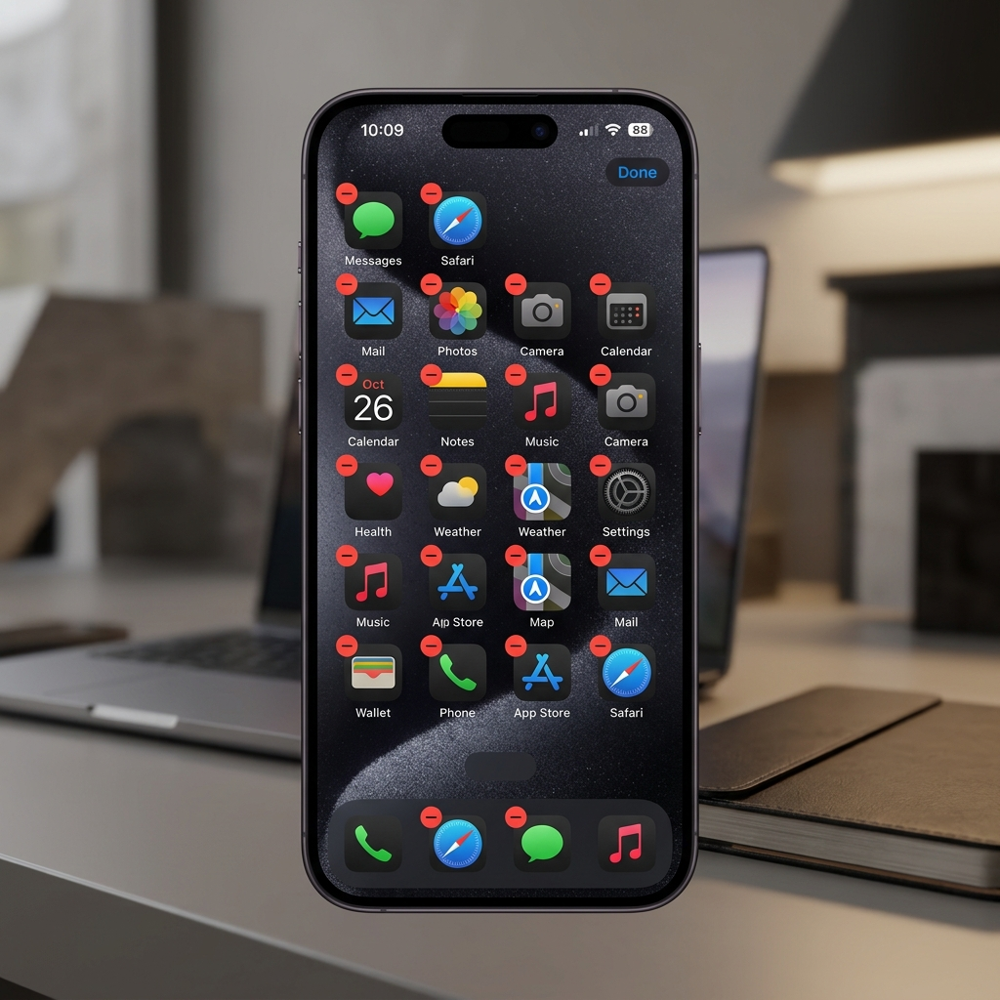
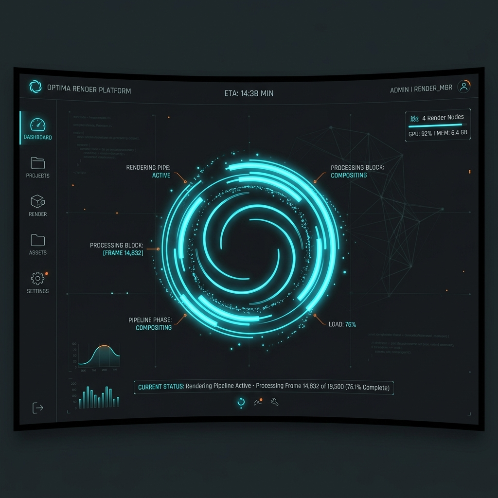
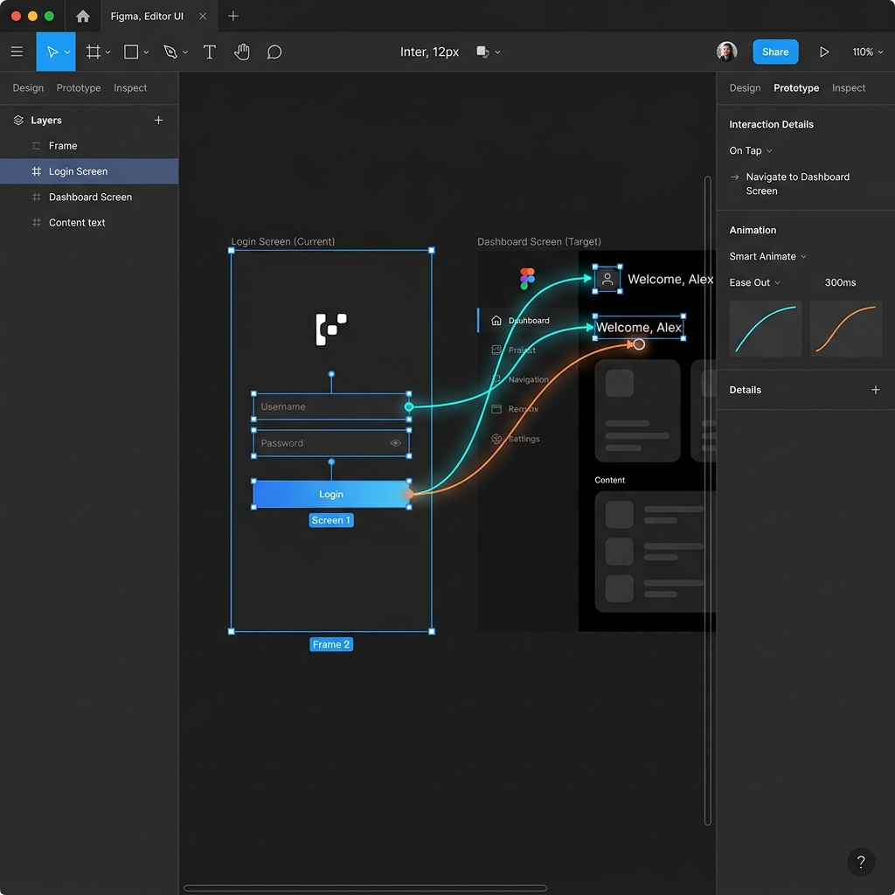
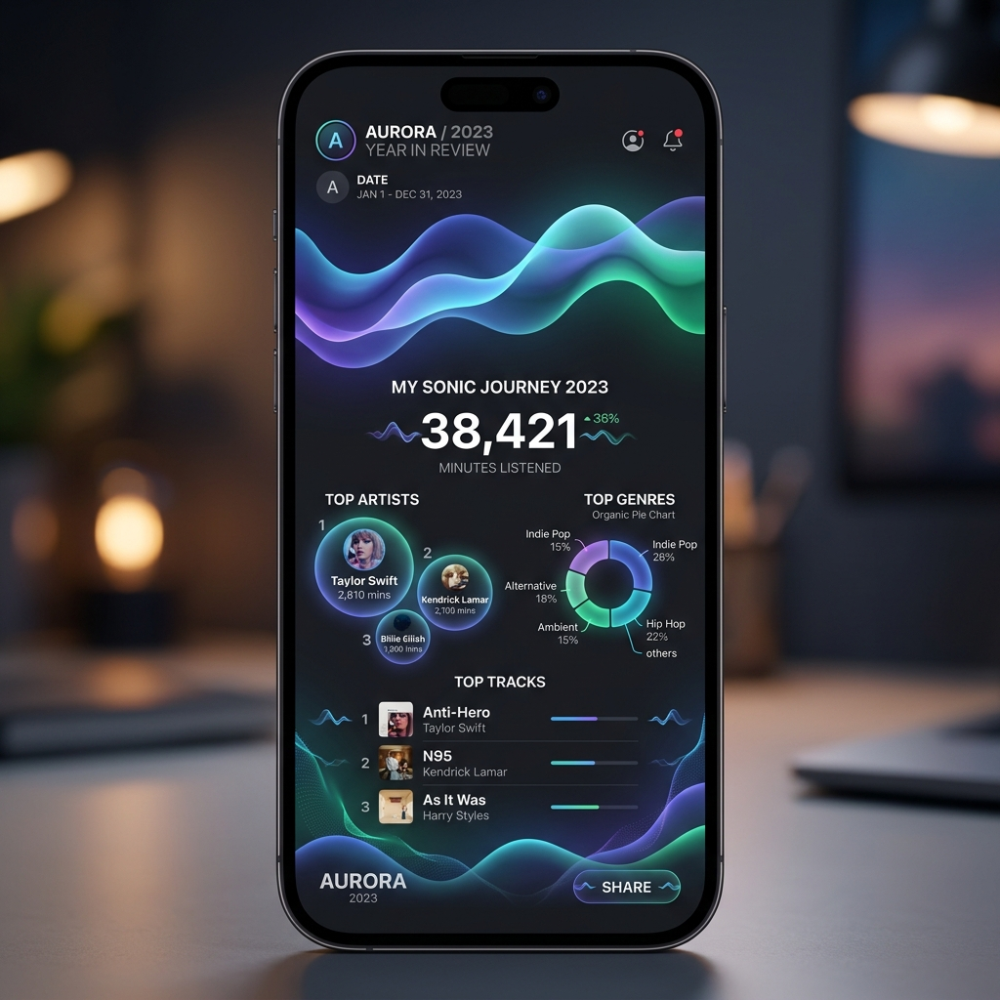

本モジュールは、ダウンロードされた画像アセットと組み合わせて、デジタル製品におけるゲシュタルト原則とデザイン構成を多次元的にデコンストラクション（解体）します。

---

## 1. 余白と近接の法則の応用 (Whitespace & Proximity)

### 1.1 ケースのビジュアル提示

### 1.2 学術的詳細デコンストラクション
*   **視覚心理学 (Proximity)**：
    このインターフェース設計では、離散的な情報カードやテキスト項目は、生硬な暗色の太線による強制的な遮断に依存していません。そうではなく、「カード間」の垂直/水平方向の余白を精密に広げ、「カード内部のサブ要素間」の余白よりも大幅に大きくしています。人間の脳の視覚システムは、自動的に近接の法則を起動し、余白の小さいサブ要素を関連する一つの「機能グループ」と判定します。
*   **平面構成 (点・線・面と骨組みグリッド)**：
    これはデザイン構成における「ソフト分割」の手法に属します。グリッド（骨組み）を使用して各モジュールの境界を拘束します。非表示のグリッドラインはレイアウトの呼吸感と通気性を維持し、情報量が満載であっても画面を軽快に保ち、流線型の視覚チャネルを形成します。
*   **ITエンジニアリング計画 (モジュールの高凝集)**：
    これは、ソフトウェアエンジニアリングにおける「高凝集」がインターフェース上にマッピングされたものと同型です。「発見」リストの単一モジュールのような、同じビジネスロジックエンティティに属するすべての底層データが、局所的な物理空間に密接に集められ、論理的にも視覚的にも独立した自治ユニット（高凝集モジュール）を形成しています。

---

## 2. カードグリッドと類似性メカニズム (Card Grid & Similarity)

### 2.1 ケースのビジュアル提示

### 2.2 学術的詳細デコンストラクション
*   **視覚心理学 (Similarity & Common Fate)**：
    ユーザーが複数のカードで構成されたダッシュボードやリストを閲覧するとき、眼脳システムは一瞬にしてこれらの異質なデータを極めて高速に分類できます。これは、各カードスロットが形状、背景色、文字サイズ、およびアイコンの整列において高度に一貫しているためです。類似した視覚的特徴により、脳はカード間の物理的な隙間を自動的にフィルタリングし、それらを一つの「カードフロー」全体として知覚します。
*   **色彩と立体構成 (明度対比と被写界深度)**：
    カードは、軽微なドロップシャドウ (Box Shadow) と微光半透明ボーダーを通じて、暗い背景の上に浮かび上がる「立体的な被写界深度感」を作り出します。これは図と地の共生関係を利用し、データコンテンツを「図」として暗い「地」の上に浮き上がらせるもので、色彩構成における明度調和の原則を体現しています。
*   **ITエンジニアリング計画 (コンポーネント化とオブジェクト指向 OOD)**：
    これはオブジェクト指向設計における「クラス (Class)」と「インスタンス (Instance)」の関係と完璧に同型です。フロントエンドエンジニアリングでは、この統一されたカードスタイルを再利用可能な `CardComponent` として抽象化しカプセル化します。システムの開発ライフサイクルを通じて、高度に再利用可能な類似性の高いカードは、コードの冗長性を大幅に削減するだけでなく、システムの保守性を劇的に向上させ、開発効率と視覚的美しさの高度な統一を実現します。

---

## 3. Web総合体験と「形態は機能に従う」 (Web Integration & Form Follows Function)

### 3.1 ケースのビジュアル提示

### 3.2 学術的詳細デコンストラクション
*   **哲学的美学 (理念の感性的顕現とフロー)**：
    ヘーゲルの芸術哲学は、美は無限の理念が感性的な形式を通じて自己顕現することであると指摘しています。このWebインターフェースでは、複雑なシステム底層のビジネスプロセス（理念）が科学的に設計され、直感的な動的コンソールと多感覚的な視覚整列（感性的形式）を通じてユーザーに完璧に投影されます。人間の眼脳の知覚傾向に高度に一致したレイアウトの中で、ユーザーは完璧な精神的・感覚的愉悦と、人間とマシンの協調における完璧な「フロー」体験を得ることができます。
*   **視覚心理学 (図と地 ＆ 連続の法則)**：
    この事例は、図と地の制御法則を深く実践しています。重要なポップアップやコア制御領域がアクティブになると、底層の背景が自動的にフェードアウトまたはぼかされ、ユーザーの注意エネルギーが重要なインタラクションに完全に集中するようにします。視線は完璧な水平/垂直の整列経路に沿ってスムーズにスキャンされ、情報密度の高い環境におけるユーザーの視覚的圧力と認知負荷を大幅に軽減します。
*   **ITエンジニアリング計画 (SDLCの非機能的設計)**：
    ソフトウェアライフサイクルの要件と分析段階において、IT計画は美育評価と認知負荷軽減の指標を導入しなければなりません。この事例は、高品質なシステム計画が単なるコードの積み重ねではなく、「インターフェースのスムーズさと認知負荷軽減指標」を非機能要件アーキテクチャに深く統合し、精密なエンジニアリング秩序と感性的な美学的高さを兼ね備えたデジタル傑作を生み出すことを示しています。

---

## 4. Apple (iOS) デスクトップ揺れる削除ジェスチャーと共同運命メカニズム (App Icon Shaking & Common Fate)

### 4.1 ケースのビジュアル提示

### 4.2 学術的詳細デコンストラクション
*   **視覚心理学 (Common Fate)**：
    静的画面では、デスクトップのアプリアイコンは通常のグリッド上に整列しており、高度な近接性と類似性を示している。しかし、長押しジェスチャーによって「編集モード」が起動されると、デスクトップ上のすべてのアイコンが同期して微小に揺れ始める。この方向、振幅、速度が完全に一致した動的な傾向は、ゲシュタルト心理学における**共同運命の原則 (Common Fate)**を瞬間的にトリガーする。これは物理空間の障壁を越えて、これらのアイコンを同一の「操作可能状態」に強固にグループ化し、直感的な知覚によって状態の分類を完了させる。
*   **画面と運動デザイン (ディズニーの基本原則とマイクロインタラクション)**：
    この事例は、ディズニーの12のアニメーション原則から「物理的な慣性と重なり動作 (Overlapping Action)」を導入している。軽微な周期的な揺れは、物理世界における有機的な振動フィードバックをシミュレートし、コンピュータの論理インターフェースの冷酷さを和らげ、ユーザーに強い「コントロール感とゲーム感覚の楽しさ」を与える。これはシラーの「ゲーム衝動」に基づく美育実践に完璧に合致している。
*   **ITエンジニアリング計画 (状態遷移と GPU 合成チャネル)**：
    これは、ソフトウェア実行時における「コンポーネント状態マシン (State Machine)」の制御に対応している。各アイコンはコード内で独立した UI コンポーネントとしてカプセル化されており、その状態（静的状態 vs 編集状態）は親コンテナの状態によって統一的に駆動される。性能面において、揺れのアニメーションは CSS の `transform: rotate()` の制御に厳格に制限されており、ブラウザの Composite-only（図層合成のみ）のハードウェア加速を利用することで、コストの高い DOM リフロー (Reflow) やリペイント (Repaint) を回避している。CPU がバックエンドで大量のソースを読み込んでいる最中でも、GPU は揺れのアニメーションをフルフレームレートで滑らかにレンダリングし続け、知覚的な継続性を保護する。

---

## 5. ローディングスピナーと高性能 GPU 合成 (Loading Spinner & Composite-only)

### 5.1 ケースのビジュアル提示

### 5.2 学術的詳細デコンストラクション
*   **視覚心理学 (Phi Phenomenon)**：
    物理的には、円形ローディングアニメーションはタイムライン上で順番に輝度を変える不連続な灰白のブロックの集合にすぎない。しかし、マックス・ヴェルトハイマーが発見した**仮現象 (Phi Phenomenon)** の原理に基づき、人間の眼と脳は時間と空間の物理的な隙間を自動的に埋め、滑らかに回転する単一のリング（完形）を知覚する。これにより、待機時間中におけるユーザーの心理的負担を大幅に軽減し、知覚されるパフォーマンス（UPP）を向上させている。
*   **画間の時間制御 (運動リズム美学)**：
    インジケータのフェードインと回転速度の曲線は、非線形な cubic-bezier イージングとして構成されている。これにより、回転の始動時の加速と終了時の減速がスムーズに行われ、日常の物理世界で培われた重力や摩擦力に関するユーザーのメンタルモデルに合致するようになっている。
*   **ITエンジニアリング計画 (メインスレッドの保護と知覚パフォーマンス)**：
    この事例は、ユーザー知覚パフォーマンス（UPP）管理の典型例である。もしアニメーションが `top` や `margin`、`width` などのレイアウト属性を変更すると、ブラウザは毎フレームごとにリフロー計算を実行せざるを得ず、16.7ms のフレーム予算を使い果たす危険が生じる。システムがデータを重くロードしている際、CPU が満載されるとスピナーがフリーズまたは消失し、ユーザーに「システムフリーズ」の誤った視覚的シグナルを送信してしまう。エンジニアリング基準では、回転を CSS の `transform: rotate()` のみで駆動することを強制している。このプロパティはレイアウトツリーから完全に切り離されているため、ブラウザはレンダリングを GPU ハードウェア合成レイヤーに完全に委託できる。CPU が 100% 満載されていても、GPU はスピナーを滑らかに回転させ続け、システムが依然として動作しているという知覚的な完形を強固に守る。

---

## 6. Figma スマートアニメーションと運動連続性メカニズム (Figma Smart Animate & Continuity)

### 6.1 ケースのビジュアル提示

### 6.2 学術的詳細デコンストラクション
*   **視覚心理学 (Continuity & Similarity)**：
    Figma の「スマートアニメーション（Smart Animate）」機能は、2つのデザイン画面間のトランジションをレンダリングする際、両画面内の名前が完全に同一であるベクトルレイヤーを検出することで機能する（類似性の原則）。状態遷移の際、システムは硬質なジャンプを避ける。代わりに、イージング曲線に従って位置、サイズ、角度の運動軌跡を自動的にレンダリングする。これは、平滑なパスを好む人間の眼脳の**連続性原則 (Continuity)** に適合し、空間移動時の「カメラ運動連続感受」をスムーズに提供し、視覚的な断絶や認知ストレスを排除している。
*   **画間の時間制御 (運動設計骨組み)**：
    このツールは、イージング曲線エディタを通じて、16.7ms のフレーム予算内で要素のトランジションに厳格な速度制限を設けている。Smart Animate は実質的に時間軸上に動的なアライメント骨組みを引っ張っており、複雑なインターフェース要素がマルチ状態の遷移時にも一貫した重力メタファーと運動リズムに従うように保証している。
*   **ITエンジニアリング計画 (宣言型属性補間とフルフレーム合成レンダリング)**：
    これはソフトウェア設計における、属性状態に基づく「宣言型マッピング（Declarative Mapping）」に対応している。底層のアニメーションエンジンは初期ノードと目標ノードを宣言するだけでよく、補間アルゴリズムが実行時にすべての中間フレームを動的に計算する。フルフレームの視覚的持続性を保証するため、エンジンは CSS の `transform` と `opacity` のみを変更し（宣言型 Composite-only）、コストの高いレイアウトリフローを回避し、開発ツールチェーンの高度な効率とスムーズさを保証している。

---

## 7. 年間音楽レポートのパーソナライズされたデータ可視化と日常生活の美学化 (Annual Music Report & Emergence)

### 7.1 ケースのビジュアル提示

### 7.2 学術的詳細デコンストラクション
*   **哲学的美学 (日常生活の美学化と人生境地の向上)**：
    年間音楽レポート（Spotify Wrapped や網易雲音楽年間レポートなど）は、「データ審美化」の典型例である。それはバックエンドにある生の離散的なリスニングログ（Listen Logs）を、色彩構成と優雅なグラデーションチャート（感性的形式）で再パッケージし、感情的共鳴を呼び起こす「音楽の旅のイメージ（意象）」に変換する。これはヘーゲルの「美は理念の感性的顕現」と葉朗の「意象完形」説を完璧に体現している。データの単なる提示を超え、ユーザーの精神的生活を高めることに寄与している。
*   **視覚心理学と画面デザイン (Stagger による創発)**：
    レポートのカードロード中、React/Vue のレンダリングは一斉表示を避けている。代わりに、Stagger（差時遅延）制御を利用し、データ指標、アルバムジャケット、および芸術的なビジュアル言語を順次フェードインさせる。この重なり動作は時間の視覚的リズムを構築し、「時間接近性」と「同期性」の原則を利用して視覚フォーカスを誘導し、大量の無機質なデータからシステムレベルの美を動的に創発させ、読み取り負荷を軽減している。
*   **ITエンジニアリング計画 (SDLCパフォーマンス予算とデータ抽象化)**：
    この事例は、IT計画におけるデータ層とプレゼンテーション層の高度な分離（MVC / OOD トポロジー）を示している。システムは数十億件のリスニングデータを高度に抽象化して集計（MapReduce などのビッグデータアーキテクチャ）し、フロントエンドのフレーム描画フェーズでは、極めてタイトなフレーム予算内で SVG/Canvas の波形を描画する。これは、高品質なシステムのライフサイクル計画が、物理的処理（ビッグデータ処理）と情緒の表現（感性的体験）を両立させ、技術と芸術の終極の共鳴を実現しなければならないことを示している。
