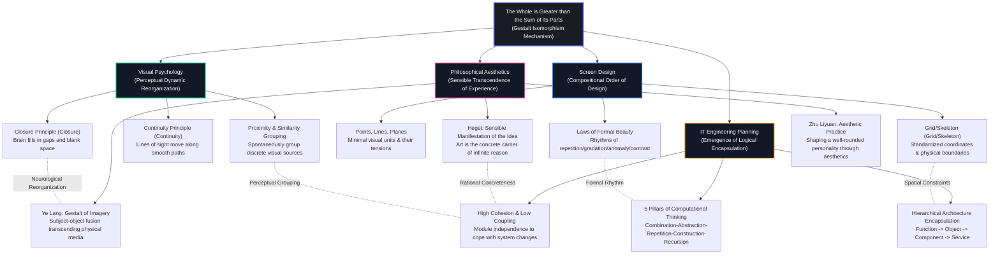
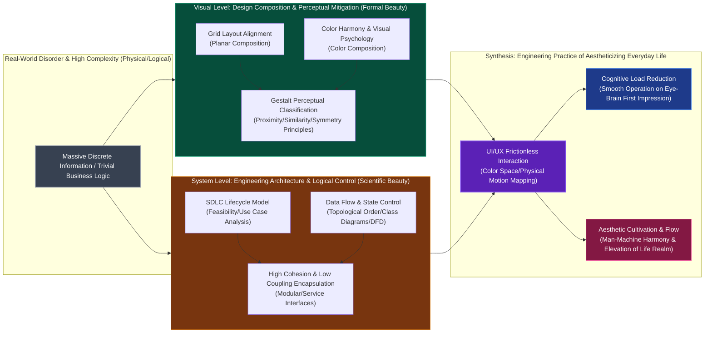

This file presents the underlying mapping and resonance mechanisms among **aesthetics, visual psychology, screen design (design composition), and IT engineering planning (SDLC / computational thinking)** through intuitive Mermaid charts.

---

## 1. The "Whole is Greater than the Sum of its Parts" Gestalt Isomorphism Relations Map

This chart illustrates how a holistic instinct transcending the sum of parts spontaneously emerges in various domains when discrete sub-elements are combined.

---

## 2. The "Form Follows Function, Technology Blends with Art" Information Cybernetics Relations Map

This flowchart demonstrates how systems and interfaces combine physical design with logical architecture to achieve frictionless user experiences during "information control and cognitive load reduction."

---

## 3. Cross-Boundary Concept Comparison Table

For quick reference, the following table provides a scientific semantic mapping of isomorphic concepts across the four domains:

| Mapping Concept | Aesthetics (Aesthetics) | Visual Psychology (Gestalt) | Screen Design (Design) | IT Engineering Planning (IT Planning) |
| :--- | :--- | :--- | :--- | :--- |
| **Elementary Unit** | Aesthetic Qualia / Brushstroke | Visual Stimulus Point / Pixel | **Point** | Single Instruction / Metadata |
| **Local Combination** | Artistic Symbol / Formal Vocabulary | Perceptual Organization (Grouping) | **Line & Plane** | Function / Object / Database Table |
| **Constrained Architecture** | Imagery Structure / Artistic Boundary | Field Figure-Ground | **Skeleton/Grid** | System Hierarchy / Module Partition / Class Diagram |
| **Dynamic Control** | Evolution of Aesthetic Experience / Drama | Common Fate | Composition Laws (Gradation/Anomaly) | Control Flow / State Machine / Message Queue |
| **Ultimate Emergence** | Aesthetic Realm | **Gestalt** | Visual Rhythm | **Highly Cohesive System-level Capability** |
| **Practical Pursuit** | Elevating Life Realm / Shaping Personality | Perceptual Ease / Intuitive Identification | Cognitive Load Reduction / Visual Rhythm | System High Reliability / Agile Iteration / Maintainability |
