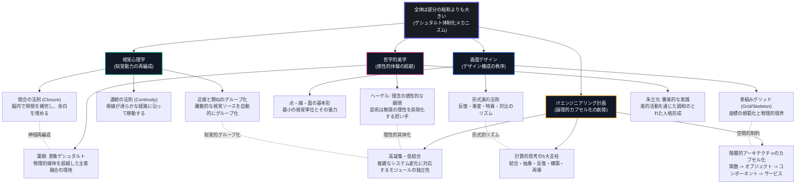
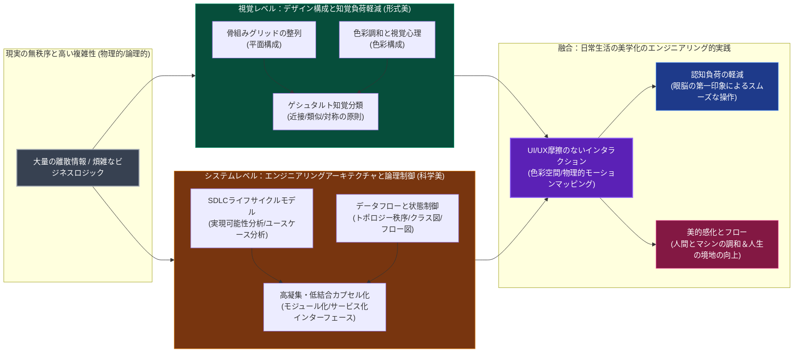

本ファイルは、直感的な Mermaid トポロジー図を通じて、**美学、視覚心理学、画面デザイン（デザイン構成）、および IT エンジニアリング計画（SDLC / 計算的思考）**の底層におけるマッピングと共鳴メカニズムを系統的に示します。

---

## 1. 「全体は部分の総和よりも大きい」ゲシュタルト同型マッピング図

このマッピング図は、離散的なサブ要素が組み合わされたとき、各学問分野において「局所の総和を超越した全体的本能」がどのように創発するかを示しています。

---

## 2. 「形態は機能に従い、技術は芸術と融合する」情報制御マッピング図

このトポロジー図は、システムとインターフェースが「情報制御と認知負荷の軽減」を行う際に、物理的な設計と論理的アーキテクチャをどのように有機的に結合し、完璧なユーザー体験を実現するかを示しています。

---

## 3. 分野横断的概念比較表

迅速な参照のために、4つの分野の同型概念を系統的なセマンティックマッピング対比として以下に整理します。

| マッピング概念 | 美学 (Aesthetics) | 視覚心理学 (Gestalt) | 画面デザイン (Design) | ITエンジニアリング計画 (IT Planning) |
| :--- | :--- | :--- | :--- | :--- |
| **エレメント単位** | 美的クオリア (Qualia) / 筆跡 | 視覚刺激点 / 画素点（ピクセル） | **点 (Point)** | 単一の命令 / メタデータ |
| **局所的な結合** | 芸術的シンボル / 形式語彙 | 知覚の体制化 (Grouping) | **線 (Line) と面 (Plane)** | 関数 / オブジェクト / データベース表 |
| **拘束アーキテクチャ** | 意象構造 / 芸術的境界 | 視野の図と地 (Figure-Ground) | **骨組みグリッド (Grid)** | システム階層 / モジュール分割 / クラス図 |
| **動的な制御** | 美的体験の進化 / 劇的葛藤 | 共同運命 (Common Fate) | 構成法 (漸変/特異/放射) | 制御フロー / 状態遷移マシン / メッセージキュー |
| **究極の創発** | 芸術的境地 (Aesthetic Realm) | **ゲシュタルト (Gestalt)** | 画面形式のリズム (Rhythm) | **高凝集システムレベルの機能的創発** |
| **実践的追求** | 人生の境地の向上 / 人格形成 | 知覚の無圧 / 直感的な識別 | 認知負荷の軽減 / 視覚的リズム | システムの高信頼性 / アジャイル反復 / 保守性 |
