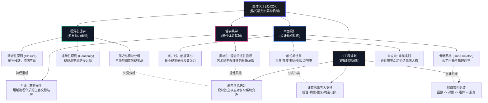
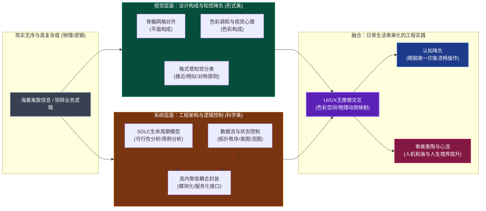

本文件通过直观的 Mermaid 拓扑图，系统展现**美学、视觉心理学、画面设计（设计构成）与 IT工程规划（SDLC / 计算思维）**在底层的映射与共鸣机制。

---

## 1. “整体大于部分之和”完形同构映射

这一图谱展示了当离散的子元素组合在一起时，在各个学科领域中是如何涌现出“超越局部之和的整体本能”的。

---

## 2. “形式服从功能，技术交融艺术”信息控制映射

该图谱展示了系统与界面在进行“信息控制与认知降负”时，如何将物理设计与逻辑架构有机结合，从而实现完美的用户体验。

---

## 3. 跨界概念对照表

为了方便快速查阅，以下将四大领域的同构概念进行了科学的语义映射对照：

| 映射概念 | 美学 (Aesthetics) | 视觉心理学 (Gestalt) | 画面设计 (Design) | IT工程规划 (IT Planning) |
| :--- | :--- | :--- | :--- | :--- |
| **元子单位** | 审美感质 (Qualia) / 笔触 | 视觉刺激点 / 像素点 | **点 (Point)** | 单行指令 / 元数据 |
| **局部组合** | 艺术符号 / 形式语汇 | 知觉组织 (Grouping) | **线 (Line) 与面 (Plane)** | 函数 / 对象 / 数据库表 |
| **约束架构** | 意象结构 / 艺术边界 | 视野背景 (Figure-Ground) | **骨骼网络 (Grid)** | 系统层级 / 模块划分 / 类图 |
| **动态控制** | 审美体验演进 / 戏剧冲突 | 共同命运 (Common Fate) | 构成法 (渐变/特异/发射) | 控制流 / 状态机 / 消息队列 |
| **终极涌现** | 艺术境界 (Aesthetic Realm) | **完形 (Gestalt)** | 画面形式韵律 (Rhythm) | **高内聚系统级功能能力** |
| **实践追求** | 提升人生境界 / 完满人格 | 知觉无压/直觉辨识 | 认知减负 / 视觉节奏 | 系统高可靠 / 敏捷迭代 / 可维护 |
