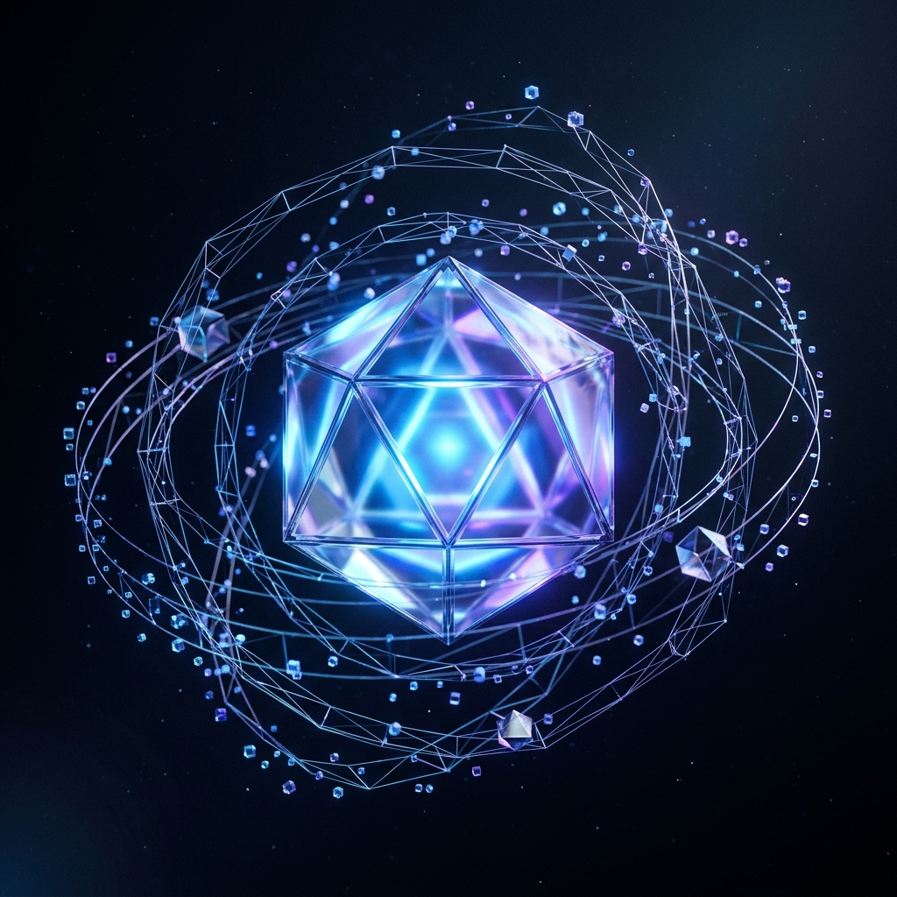

# 3D 交互场景模型规范 (project-scene-base.glb)

*图 1: 3D 场景核心概念视觉原型 (Concept Render)*

由于 Dark Lattice 的研究项目详情页 (`research/single.html`) 计划包含一个复杂的 3D 交互场景，且该模型无法由 AI 图像模型直接生成，特设立本文档对 `project-scene-base.glb` 文件的制作与技术规格进行详细规定。本规范可供 3D 设计师（例如使用 Blender）作为制作指南。

## 1. 核心定位
- **文件格式**: `.glb` (GL Transmission Format, Binary)
- **用途**: 作为技术专题研究页面的首屏（Hero Section）视觉锚点，通过 Three.js 或类似 WebGL 库进行加载和实时渲染，支持鼠标随动、平滑滚动视差等交互效果。
- **预估大小**: 严格控制在 `< 2MB`。

## 2. 视觉美学 (Aesthetics)
- **风格**: 赛博极简 (Cyber-Minimalist), 低多边形 (Low-Poly), 抽象几何 (Abstract Geometry)。
- **色彩参考** (Nightfield 设计系统):
  - 材质主色应偏向深色，通过灯光系统激发色彩。
  - 高光与自发光 (Emission) 区域采用核心色：科技蓝 (`#3B82F6`) 以及少量点缀色神秘紫 (`#8B5CF6`)。
- **材质 (Materials)**:
  - 主要采用**物理基础渲染材质 (PBR)**。
  - 需要一种带有高粗糙度（Roughness）和一定金属度（Metallic）的深色基础材质。
  - 需要具备**玻璃拟态 (Glass / Transmission)** 材质，折射率 (IOR) 设置应贴近玻璃或水晶。

## 3. 模型结构与几何要求
模型不应是一个单一的实心物体，而应是由多个抽象几何体组合而成的复合结构，以展现“格阵 (Lattice)”的主题：
- **核心体 (Core)**: 位于中心的发光多面体（如二十面体或截角几何体）。
- **外环/轨道 (Orbitals)**: 环绕核心的纤细光环或线框结构，可用于在 WebGL 中赋予自转代码。
- **悬浮粒子 (Particles/Nodes)**: 散落在核心周围的小型节点（球体或正方体），代表数据点。
- **几何复杂度**: 顶点数 (Vertices) 建议控制在 10,000 以内，以确保在移动端设备和低性能浏览器上的流畅运行。

## 4. 技术规范

### 4.1 坐标与缩放
- **原点 (Origin)**: 模型原点应设定在几何中心 `(0,0,0)`。这对于 WebGL 中的中心旋转交互至关重要。
- **统一缩放 (Scale)**: 所有对象的缩放必须在导出前应用 (Apply Scale to 1.0)。

### 4.2 材质与纹理
- 尽可能使用顶点色 (Vertex Colors) 或程序化材质，**避免使用高分辨率的外部纹理贴图**，以节省文件体积。
- 如果必须使用纹理，需经过强力压缩，合并为尽量少的贴图集 (Texture Atlases)。
- 烘焙 (Baking): 建议将复杂的环境光遮蔽 (Ambient Occlusion) 烘焙到顶点色或低分辨率的次级贴图上。

### 4.3 动画 (可选)
- 虽然主要是通过代码 (JavaScript/Three.js) 驱动交互，但可以在 `.glb` 文件中内置一层基础的闲置动画 (Idle Animation)，例如极其缓慢的上下浮动，以增加生命力。

## 5. 导出设置 (基于 Blender)
- 勾选 `Apply Modifiers`（应用修改器）。
- 勾选 `Y Up`。
- 格式选择 `glTF Binary (.glb)`。
- 对于材质，确保使用 `Principled BSDF` 并在导出设置中正确处理材质选项。

## 6. 在项目中的集成方式

该模型最终将通过前端脚本导入，大致工作流如下：
1. 模型存放入 `static/models/project-scene-base.glb`。
2. 在 `layouts/research/single.html` 中引入 Three.js 环境。
3. 创建一个没有背景的 WebGL Canvas，将其叠加于 `_base.scss` 提供的带有 `background-grid.png` 和 CSS 微光的暗系背景之上。
4. 加入响应鼠标移动视区 (Mouse Move Parallax) 的交互脚本。
