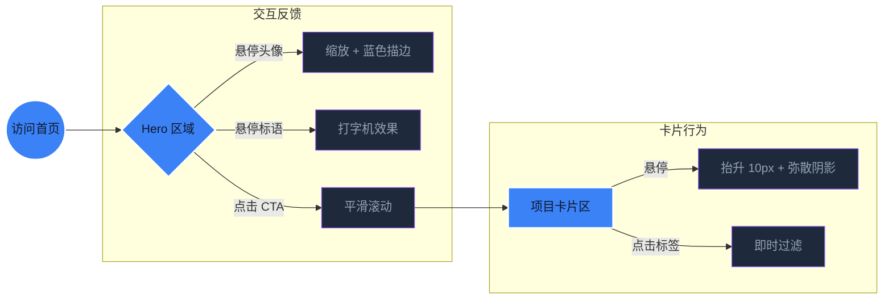

# 博客首页设计文档 (Home Page Design)

## 1. 核心布局：Hero 区域设计
首页的核心在于建立瞬间的“连接感”。采用 **左图右文** 的典型研究者主页布局，但加入科技感装饰。

---

## 2. 交互流程 (Interaction Flow)

---

## 3. 内容细节

### 3.1 项目卡片 (Project Cards)
每个卡片包含：
- **封面图**：低饱和度展示，Hover 时恢复彩色。
- **技术栈标签 (Pills)**：采用辅助色 `#8B5CF6`（神秘紫）。
- **链接组**：GitHub 图标、Demo 链接、论文 PDF 图标。

### 3.2 多层格阵雷达 (Lattice Radar: Technical Matrix)
- **定位**：反映博主的深度技术倾向与研究矩阵，与文章内容高度关联。
- **设计特性**：
  - **格阵结构**：采用多层嵌套的六边形网格，呼应 Dark Lattice 的“格阵”主题。
  - **视觉特效**：
    - **渐变填充**：覆盖区域采用 `rgba(59, 130, 246, 0.4)` 到透明的径向渐变。
    - **发光顶点**：每个数据顶点添加 `drop-shadow` 滤镜，产生科技感荧光。
    - **呼吸动效**：网格背景随页面滚动产生微弱的缩放呼吸感。
- **核心维度 (Dimensions)**：
  1. **智能体逻辑 (Agent Logic)**：Aura 引擎、状态机、自主决策。
  2. **工业视觉 (Vision AI)**：缺陷检测、CV 落地、边缘计算。
  3. **前端艺术 (Frontend UX)**：Three.js 交互、沉浸式设计、动画艺术。
  4. **工程稳定性 (Stability)**：Saga 模式、不可变架构、并发处理。
  5. **持续进化 (Evolution)**：EWC、持续学习、算法自愈。
  6. **知识图谱 (Knowledge)**：图数据库、知识注入、逻辑关联。

---

## 4. 配色与风格引用
*注：详细规范请参考 [DESIGN_OVERVIEW.md](./DESIGN_OVERVIEW.md)*

| 比例 | 角色 | 色值 |
| :--- | :--- | :--- |
| 60% | 背景 | `#0F172A` |
| 30% | 强调 | `#3B82F6` |
| 10% | 辅助 | `#8B5CF6` |

---

## 5. SEO 策略
- **Title**: `[姓名] | Dark Lattice - Researcher & Developer`
- **Description**: 探索深度学习、工业视觉与极致网页设计的交汇点。
- **Keywords**: AI Research, Web Engineering, Dark Mode Design, Hugo Blog.

---

## 6. 界面装饰与工程细节

### 6.1 毛玻璃导航栏 (Frosted Glass Header)
- **效果**：`backdrop-filter: blur(12px);`
- **背景色**：`rgba(15, 23, 42, 0.8)`，确保背景透出但文字可读。
- **吸附行为**：向下滑动 100px 后自动缩小高度并降低边影。

### 6.2 页脚 (Footer) 规范
- **内容布局**：
  - 左侧：版权声明 (© 2024 Dark Lattice)
  - 中间：站点构建描述 (Built with Hugo & Nightfield Theme)
  - 右侧：社交媒体链接组 (Twitter, GitHub, ORCID)
- **微标应用**：展示 GitHub Repo 的 Star 数或 CI 构建状态微标。

---

## 相关文档
- [设计概览](./DESIGN_OVERVIEW.md)
- [品牌 LOGO 设计](./LOGO_DESIGN.md)
- [项目结构规范](./PROJECT_STRUCTURE.md)

*更新时间：2026-04-29*