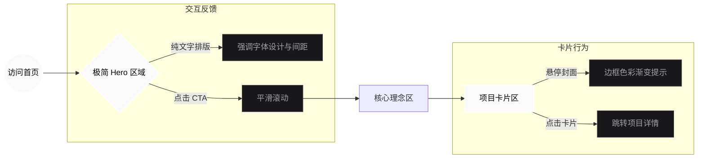

# 博客首页设计文档 (Home Page Design)

## 1. 核心布局：Hero 区域设计

首页的核心在于建立瞬间的“连接感”。采用 **左图右文** 的典型研究者主页布局，但加入科技感装饰。

---

## 2. 交互流程 (Interaction Flow)

```mermaid
graph LR
    %% 样式定义
    classDef primary fill:#09090B,stroke:#FAFAFA,stroke-width:2px,color:#fff;
    classDef secondary fill:#18181B,stroke:#3F3F46,stroke-width:1px,color:#A1A1AA;
    classDef highlight fill:#FAFAFA,stroke:#fff,stroke-width:2px,color:#09090B;

    Start((访问首页)) --> Hero{极简 Hero 区域}

    subgraph Interaction [交互反馈]
        Hero -- 纯文字排版 --> Typography[强调字体设计与间距]
        Hero -- 点击 CTA --> Scroll[平滑滚动]
    end

    Scroll --> Manifesto[核心理念区]
    Manifesto --> Projects[项目卡片区]

    subgraph Cards [卡片行为]
        Projects -- 悬停封面 --> BorderFade[边框色彩渐变提示]
        Projects -- 点击卡片 --> Link[跳转项目详情]
    end

    class Start,Hero,Projects highlight;
    class Typography,Scroll,BorderFade,Link secondary;
```

---

## 3. 内容细节

### 3.1 核心理念区 (Manifesto Section)

取代原本花哨的多层格阵雷达图，采用三列极简文字排版，直接呈现研究重心：

- **Agent Logic**：探索基于状态机与多模态大模型的自主演化系统。
- **Vision AI**：深耕工业级视觉检测。
- **Frontend UX**：坚持极简主义的设计美学，用最纯净的代码构建体验。

### 3.2 项目卡片 (Project Cards)

去繁就简，移除弥散阴影和夸张的缩放，强调内容呈现：

- **封面图**：使用 16:9 比例，暗色系背景底色。
- **排版结构**：左对齐，去除卡片外层容器的背景色，完全融入页面底层。
- **交互**：仅在 Hover 时微调边框颜色 (`#3f3f46`)，提供低调的反馈。
- **技术栈标签 (Pills)**：简化为纯文本列表，统一灰阶颜色 (`#71717a`)。

---

## 4. 配色与风格引用

_注：详细规范请参考 [DESIGN_OVERVIEW.md](./DESIGN_OVERVIEW.md)_

| 比例 | 角色 | 色值      |
| :--- | :--- | :-------- |
| 60%  | 背景 | `#09090B` |
| 30%  | 强调 | `#FAFAFA` |
| 10%  | 辅助 | `#A1A1AA` |

---

## 5. SEO 策略

- **Title**: `[姓名] | Dark Lattice - Researcher & Developer`
- **Description**: 探索深度学习、工业视觉与极致网页设计的交汇点。
- **Keywords**: AI Research, Web Engineering, Dark Mode Design, Hugo Blog.

---

## 6. 界面装饰与工程细节

### 6.1 极简导航栏 (Minimal Header)

- **效果**：`backdrop-filter: blur(8px);`
- **背景色**：`rgba(9, 9, 11, 0.8)`。
- **吸附行为**：向下滑动 50px 后，底部增加一条细微边框 (`#27272a`)，去掉原来的深色阴影。

### 6.2 页脚 (Footer) 规范

- **内容布局**：
  - 左侧：版权声明 (© 2024 Dark Lattice)
  - 右侧：社交媒体链接组 (Twitter, GitHub, ORCID)
  - **精简**：去掉任何微标与构建信息，保持版面最纯净的状态。

---

## 7. HTML

@import "./html/home_page.html"

## 相关文档

- [设计概览](./DESIGN_OVERVIEW.md)
- [品牌 LOGO 设计](./LOGO_DESIGN.md)
- [项目结构规范](./PROJECT_STRUCTURE.md)

_更新时间：2026-04-29_
