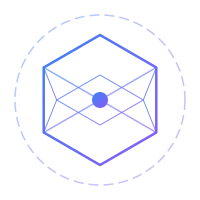
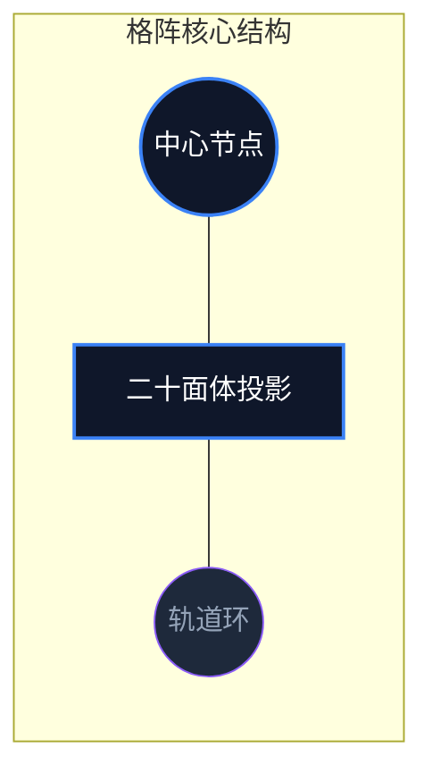

# LOGO 设计方案 (Logo Design)

## 1. 核心概念：格阵核心 (Lattice Core)

**Dark Lattice** 的 LOGO 核心元素从“莫比乌斯环”升级为**格阵核心**。

### 1.1 视觉原型
LOGO 设计灵感直接来源于项目的 3D 交互场景原型（二十面体几何体）。它代表了高度结构化、多维度的知识体系与研究深度。

### 1.2 寓意与哲学
- **结构化深度 (Structured Depth)**：二十面体是最高级的正多面体，象征研究者对复杂问题的系统性建模与解构。
- **动态互联 (Dynamic Connectivity)**：外围的轨道环代表知识在格阵中的流动与连接，寓意理论与实践的实时反馈。
- **极客秩序**：精准的几何线条体现了工程师的逻辑严密性与对秩序的追求。

---

## 2. 视觉表现规范

### 2.1 构筑形式
- **几何骨架**：采用极简的二十面体 2D 投影线框。
- **轨道环 (Orbital)**：细微的虚线/实线圆环，增加空间感。
- **核心节点 (Core Node)**：中心的发光点，代表灵感的源泉与真理的中心。

### 2.2 色彩应用
- **渐变色值**：
  - **起始色**：科技蓝 (`#3B82F6`)
  - **终止色**：神秘紫 (`#8B5CF6`)
- **效果**：采用线性渐变，并在关键节点添加微弱辉光 (Glow)，模拟高维空间的投影效果。

---

## 3. 设计结构

---

## 4. 不同场景下的应用

| 场景 | 表现形式 | 规范 |
| :--- | :--- | :--- |
| **Website Header** | LOGO + "Dark Lattice" 文本 | 使用完整版 SVG，配合 `Inter` 字体 |
| **Favicon** | 简化版二十面体 | 去掉轨道环，加粗核心线条，确保 16px 下清晰 |
| **Loading Anim** | 脉冲动效核心 | 核心节点伴随呼吸感缩放，线条依次亮起 |

---

## 5. 导出规范
- **所有场景强制使用 SVG**，以确保在任何分辨率下（尤其是 4K/8K 屏幕）的完美呈现。

---

## 相关文档设计图
- [3D 场景规范](./3D_MODEL_SPEC.md)
- [素材清单](./ASSET_LIST.md)

*更新时间：2026-04-18*
