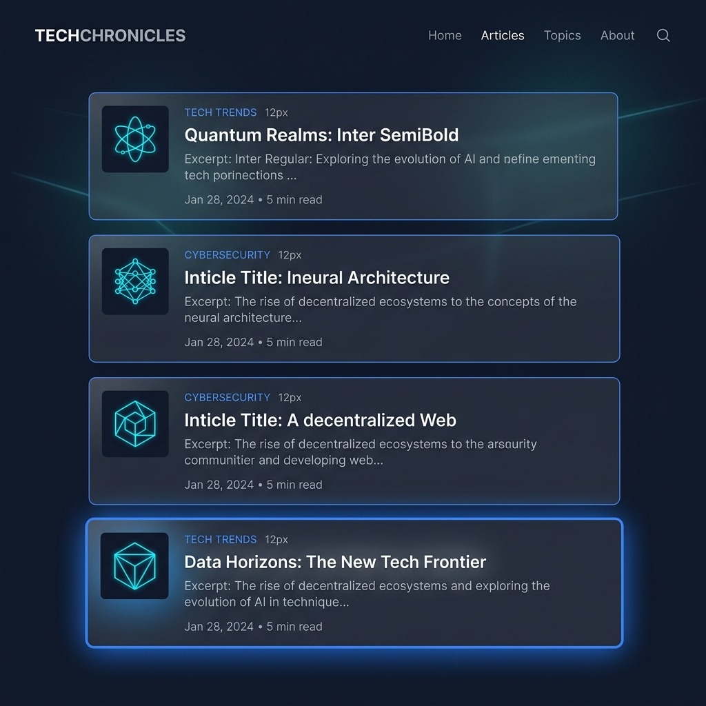
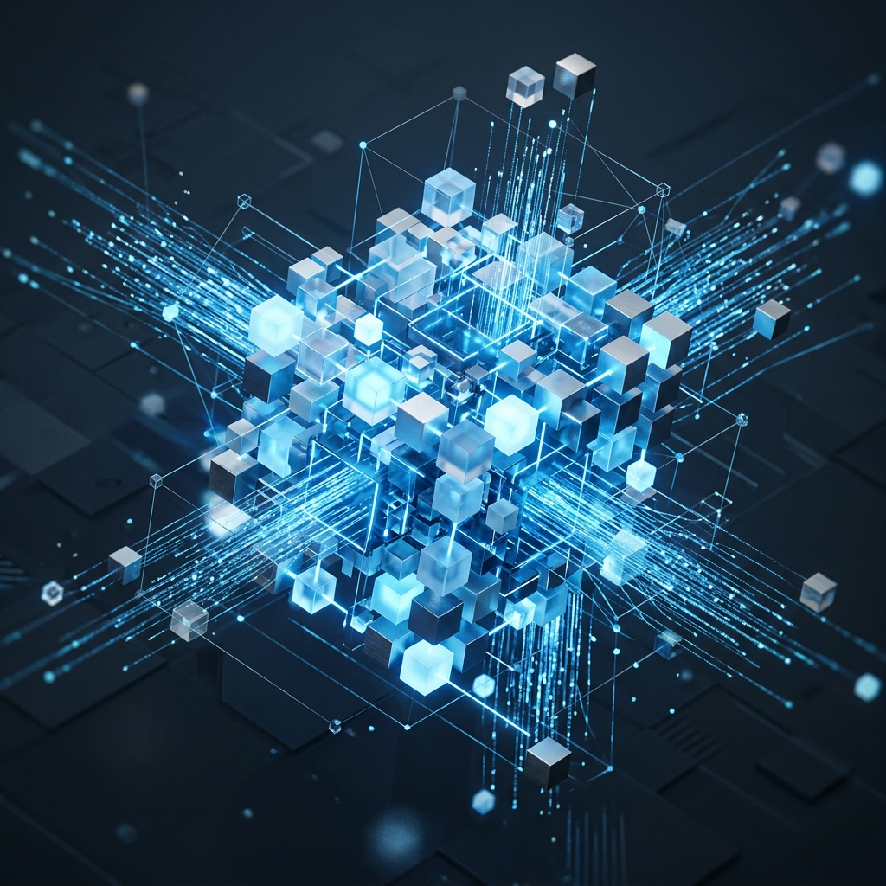
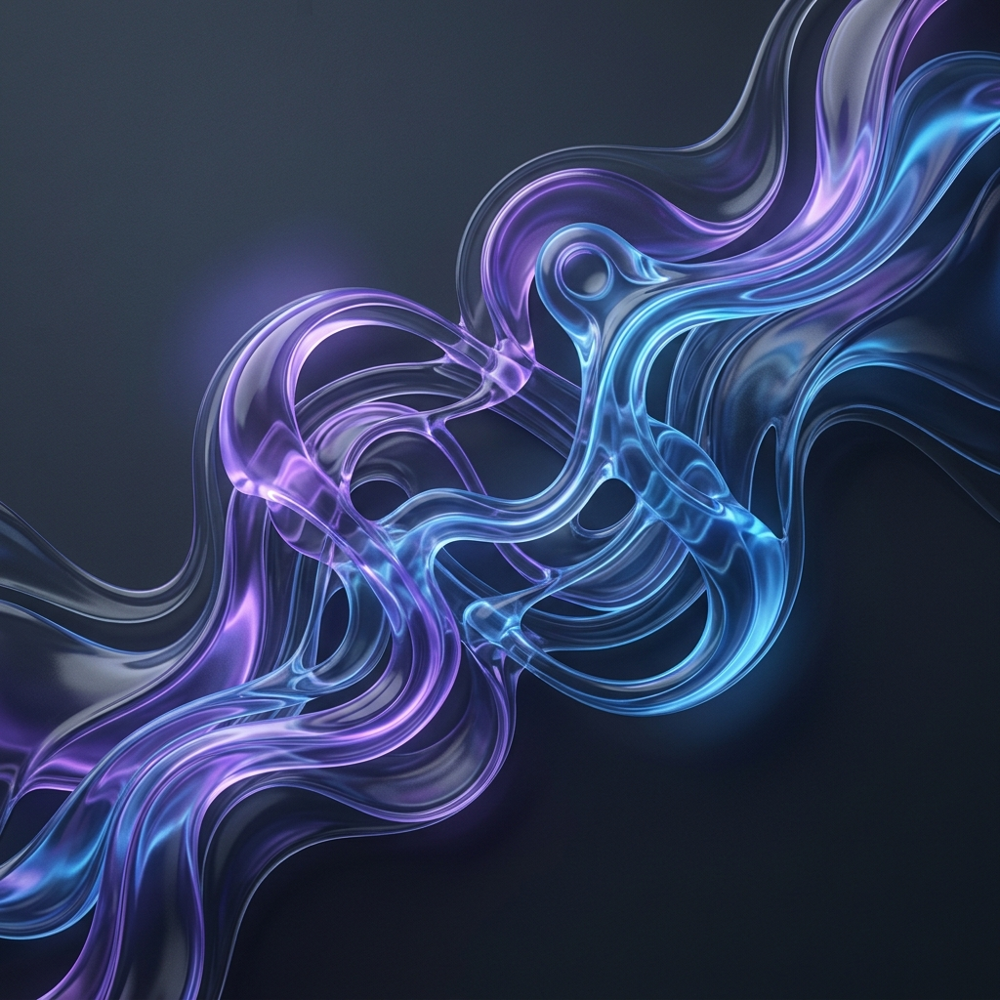

# Dark Lattice 画面设计规范 (Screen Design Specifications)

本文档定义了 Dark Lattice 博客的视觉表现层规范，旨在通过高级感的清单布局和动效系统提升用户体验。

## 1. 核心美学定位 (Core Aesthetic)

*   **视觉风格**：Cyber-Minimalist (赛博极简).
*   **氛围感**：深邃、冷峻、高对比度。
*   **交互准则**：精准的反馈，流畅的物理性动效。

## 2. 列表页设计规范 (List Page Design)

### 2.1 博客卡片 (Post Card)
每个内容条目不再是简单的链接，而是一个具有视觉层级的卡片。

*   **布局结构**：
    *   **左侧 (Desktop)**：大型日期数字或分类抽象图标，使用中灰色 `#64748B`。
    *   **主体 (Central)**：
        *   标题：`font-size: 1.25rem`, `font-weight: 700`, 白色。
        *   摘要：`font-size: 0.875rem`, 颜色 `#94A3B8`, 最大显示 2 行。
        *   元数据：标签组、阅读时长、更新日期。
*   **视觉样式**：
    *   背景：`rgba(30, 41, 59, 0.4)`。
    *   模糊：`backdrop-filter: blur(8px)`。
    *   框线：`1px solid rgba(59, 130, 246, 0.1)`, 仅底部或全框。

### 2.2 研究列表 3D 渲染 (Research 3D Rendering)

研究板块采用更加复杂的 3D 动态模板，增强其学术与科技的深度感。

*   **专题清单 (Topic List)**：
    *   **风格图片**：每个专题（如 Technology, Interaction）配备一张独特风格的 3D 渲染图。
        *   **Technology**: 
        *   **Interaction**: 
    *   **材质标准**：使用半透明玻璃材质、发光边缘（Emissive Edges）以及符合 Nightfield 主色的粒子背景。
*   **课题清单 (Project List)**：
    *   **3D 场景动画**：每个课题条目对应一个微型 3D 交互场景。
    *   **滚动反馈**：当用户滚动列表时，三维模型产生轴向旋转（Tilt）或进场缩放（Zoom-in）。
    *   **搜索联动**：
        *   执行搜索动作时，3D 背景格阵产生扰动（Disturbance）。
        *   匹配成功的课题项通过高亮光晕（Glow）与平滑的景深（DOF）切换进行强调。

### 2.3 响应式策略
*   **移动端**：卡片堆叠显示，移去左侧日期装饰，将日期置于标题上方。对于 3D 渲染，在移动端自动切换为低功耗的静态图或简化的 Canvas 粒子效果。
*   **间距**：列表项之间保持 `32px` 的呼吸感间距。

## 3. 动效系统 (Animation System)

为了营造“高级感”，动效必须克制且连贯。

### 3.1 进入动画 (Entrance)
*   **Staggered Fade-In-Up**：
    *   效果：卡片从下方 `20px` 处平滑升起并淡入。
    *   延迟：每个 item 增加 `50ms * index` 的延迟。
    *   曲线：`cubic-bezier(0.22, 1, 0.36, 1)` (Quintic Out).

### 3.2 悬停反馈 (Hover)
*   **抬升感**：`transform: translateY(-4px)`。
*   **光效**：边框颜色变为 `Cyber Blue (#3B82F6)`，且卡片底部产生微弱的蓝色弥散阴影。
*   **缩放**：整体轻微缩放 `1.01` 倍。

## 4. 色彩与材质 (Color & Texture)

*   **深色背景**：`#0F172A` (Slate 900).
*   **强调色**：`#3B82F6` (Cyber Blue).
*   **辅助色**：`#8B5CF6` (Mystic Purple), 用于标签。
*   **材质**：磨砂玻璃效果，强调光影在深色界面上的折射。

## 5. 视觉素材汇总 (Visual Assets)

| 素材名称 | 路径 | 描述 |
| :--- | :--- | :--- |
| Blog List UI | `../static/images/design/blog-list-ui-mockup.png` | 列表页 UI 原型 |
| Tech 3D | `../static/images/design/research-tech-3d.png` | 技术专题 3D 背景 |
| Interaction 3D | `../static/images/design/research-interaction-3d.png` | 交互专题 3D 背景 |

## 6. 无障碍设计 (Accessibility)

*   **Focus 状态**：所有可交互元素在获得焦点时必须显示 `2px solid #3B82F6` 的轮廓，并带有 `4px` 的外偏移（Offset）。
*   **对比度**：正文文字与背景对比度应满足 WCAG AA 标准（至少 4.5:1）。
*   **减弱动画**：系统开启“减少动态效果”时，应自动禁用 CSS Transform 位移，仅保留极简的 Fade 效果。

---
*更新日期：2026-04-17*
